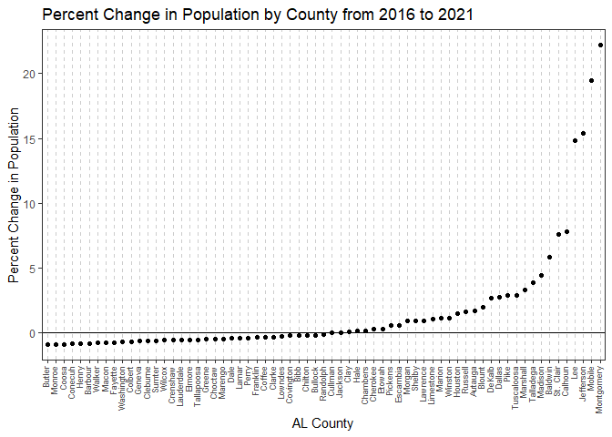

# U.S. Census Data API in R

by Adam M. Nguyen

These recipe examples were tested on March 24, 2023.

- **Documentation**
  - [censusapi Package Documentation (PDF)](https://cran.r-project.org/web/packages/censusapi/censusapi.pdf)
  - [U.S. Census API Documentation](https://www.census.gov/data/developers/about.html)
  - [U.S. Census Data Discovery Tool](https://api.census.gov/data.html)

- **Terms**
  - See also the [U.S. Census API Terms of Service](https://www.census.gov/data/developers/about.html#terms)

- **Attribution**
  - This tutorial uses the Census Bureau Data API but is not endorsed or certified by the Census Bureau.

- **Tutorial License**
  - This tutorial uses the **censusapi** R library which is licensed as **GPL-3**.  
  - As a result, this tutorial code is also licensed as **GPL-3**:  
    [License Details](https://github.com/UA-Libraries-Research-Data-Services/UALIB_ScholarlyAPI_Cookbook/blob/main/LICENSE_selected_R_tutorials)

## Setup

### API Key Information   

While an API key is not required to use the U.S. Census Data API, you may consider registering for an API key as the API is limited to 500 calls a day without a key. Sign up can be found here: https://api.census.gov/data/key_signup.html.    

If using this code, make sure to access your key below.

Here we use 'Sys.getenv()' to retrieve our API key from the environment variables. You can either do this by creating an [.Renviron file and storing your API Key](https://docs.posit.co/how-to-guides/pre-tasks/api-keys-renv/) or simply replacing "Sys.getenv('USCensusAPIKey')" with your API Key.

```r
# Access .Renviron to get PubMed API Key
user_key = Sys.getenv('USCensusAPIKey')#use Sys.getenv() to access .Renviron
```

### Setup censusapi Package
The package, censusapi, allows users to easily access U.S. Census data and metadata, including datasets such as the Decennial Census, American Community Survey, Small Area Health Insurance Estimates, Small Area Income and Poverty Estimates, Population Estimates and Projections, and more. In this tutorial, we will be using this censusapi.

If you haven't already, run "install.packages('censusapi')" in your R Console to install the US Census API package we will be using for this tutorial.

First let us set up the required library, "censusapi".

```r
library(censusapi) # Access censusapi library
```
## 1. Get Population Estimates of Counties by State    

Our primary means of accessing the U.S. Census API will be through the function "getCensus". In this example we give specific comments as to each line of code that should clarify each line.

In the following example we use arguments including 'name' and 'vars', to access comprehensive lists of each see the censusapi documentation located at the top of the article for further documentation on the functions 'listCensusApis()' and 'makeVarlist()'.

```r
your_state_code = '01' # Alabama FIPS Code

# Retrieve county population estimates by state

pop_estimates <- getCensus(name = "acs/acs5/subject", #The programmatic name of your dataset,See 'listCensusApis()' for options
                           vars = c("NAME", "S0101_C01_001E"), #list of variables to get
                           region = "county:*", #geography to get
                           vintage = "2021",#year
                           key=user_key#API key
                           )
head(pop_estimates,n=10) #Display first entries of 'pop_estimates'
```

```
##    state county                     NAME S0101_C01_001E
## 1     01    001  Autauga County, Alabama          58239
## 2     01    003  Baldwin County, Alabama         227131
## 3     01    005  Barbour County, Alabama          25259
## 4     01    007     Bibb County, Alabama          22412
## 5     01    009   Blount County, Alabama          58884
## 6     01    011  Bullock County, Alabama          10386
## 7     01    013   Butler County, Alabama          19181
## 8     01    015  Calhoun County, Alabama         116425
## 9     01    017 Chambers County, Alabama          34834
## 10    01    019 Cherokee County, Alabama          24975
```

The previous dataframe 'pop_estimates' gives counties from every state, given the wildcard, '*', in the 'region' argument. Now we want to filter the dataset so we are left with only Alabama. Additionally, the US Census API  utilizes codes for variables. To search for variables use the function 'makeVarlist()'; additional information on the usage can be found in the censusapi package documentation pdf file.


```r
# Filter
alabama_counties <- pop_estimates[pop_estimates$state == your_state_code,]

# Extract population
alabama_counties_populations <- data.frame(County = alabama_counties$NAME, Population = alabama_counties$S0101_C01_001E)

# Print population
head(alabama_counties_populations,n=10) #Display first entries of 'alabama_counties_populations'
```

```
##                      County Population
## 1   Autauga County, Alabama      58239
## 2   Baldwin County, Alabama     227131
## 3   Barbour County, Alabama      25259
## 4      Bibb County, Alabama      22412
## 5    Blount County, Alabama      58884
## 6   Bullock County, Alabama      10386
## 7    Butler County, Alabama      19181
## 8   Calhoun County, Alabama     116425
## 9  Chambers County, Alabama      34834
## 10 Cherokee County, Alabama      24975
```

Now we have successfully used the U.S. Census API to store population estimates from Alabama counties in the variable 'alabama_counties_populations'.


## 2. Get Population Estiamtes Over a Range of Years   

We can use similar code as before, but we will loop through the different population estimate datasets by year.

```r
# Define the range of years
years <- c(2016:2021)

# Create an empty data frame to store the population estimates
pop_estimates_all <- data.frame()

# Loop over the years
for (year in years) {
  # Retrieve population estimates for Tuscaloosa County
  pop_estimates <- getCensus(name = "acs/acs5/subject", 
                             vars = c("NAME", "S0101_C01_001E"), 
                             region = "county:*", 
                             vintage = as.character(year), 
                             key= user_key)
  alabama <- pop_estimates[pop_estimates$state == your_state_code,]

  
  # Add the population estimate and year to the data frame
  pop_estimates_all <- rbind(pop_estimates_all, data.frame(Year = year, Population = alabama$S0101_C01_001E,Name= alabama$NAME))
}

# Print the resulting data frame
head(pop_estimates_all,n=10)
```

```
##    Year Population                      Name
## 1  2016      21975    Monroe County, Alabama
## 2  2016      33433  Lawrence County, Alabama
## 3  2016     153947       Lee County, Alabama
## 4  2016      30239    Marion County, Alabama
## 5  2016      20042   Pickens County, Alabama
## 6  2016      13285    Sumter County, Alabama
## 7  2016     659096 Jefferson County, Alabama
## 8  2016      13287   Choctaw County, Alabama
## 9  2016      31573  Franklin County, Alabama
## 10 2016      20066   Marengo County, Alabama
```

## 3. Plot Population Change

We will use the data we retrieved in example 2 and then calculate and graph the percent change in population per county.

```r
# Filter for the population in 2016
pop_2016 <- pop_estimates_all[pop_estimates_all$Year == 2016, ]

# Filter for the population in 2021
pop_2021 <- pop_estimates_all[pop_estimates_all$Year == 2021, ]

# Calculate the percent change in population
pop_pct_change <- data.frame(County=pop_2021$Name,Pct_Change =round(((as.numeric( pop_2021$Population)-as.numeric(pop_2016$Population))/as.numeric(pop_2016$Population)),4)) # (pop_2021-pop_2016)/pop_2016 rounded to 5 digits

# Next we're going to remove the 'County, Alabama' because it is repetitive.
pop_pct_change[]<-lapply(pop_pct_change,function(x) (sub(' County, Alabama','',x)))

head(pop_pct_change,n=10)
```

```
##      County Pct_Change
## 1   Autauga     1.6502
## 2   Baldwin     5.7936
## 3   Barbour    -0.8359
## 4      Bibb    -0.2588
## 5    Blount      1.938
## 6   Bullock    -0.2182
## 7    Butler    -0.9709
## 8   Calhoun     7.7623
## 9  Chambers     0.1033
## 10 Cherokee     0.2446
```
Next we will create a plot of the percent change in population by county in Alabama from the years 2016 to 2021 using the package ggplot2.

```r
library(ggplot2) #library for creating graphics
options(repr.plot.width = 100, repr.plot.height =2)
ggplot(pop_pct_change, aes(x = reorder(pop_pct_change$County, as.numeric(pop_pct_change$Pct_Change)), y = as.numeric(pop_pct_change$Pct_Change))) +
  geom_point(orientation = 'y') +
  ylab("Percent Change in Population") +
  xlab("AL County") +
  theme_bw()+
  theme(
    panel.grid.major.y = element_blank(),
    panel.grid.minor.y = element_blank(),
    panel.grid.major.x = element_line(colour = "grey80", linetype = "dashed"),
    axis.text.x = element_text(angle = 90, hjust = 1, vjust=.2, size= 7 )
  )+
  geom_hline(yintercept=0)+ 
  ggtitle("Percent Change in Population by County from 2016 to 2021")
```

<!-- -->
