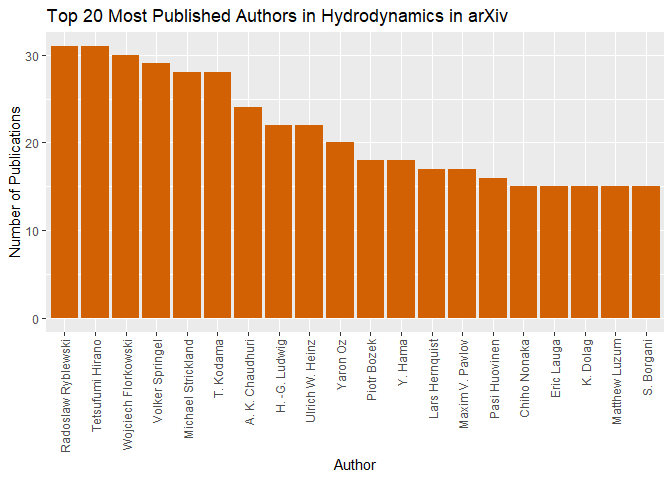
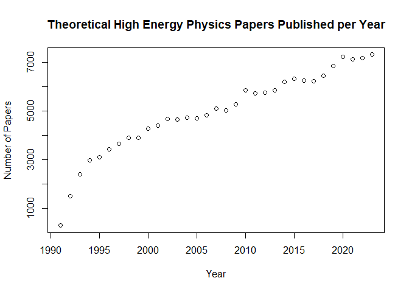

by Adam M. Nguyen

Hosted and maintained by Cornell University, arXiv is an open-access and free distribution service containing nearly 2.5 million scholarly articles in fields including physics, mathematics, computer science, quantitative biology, quantitative finance, statistics, electrical engineering and systems science and economics at the time of writing. In this tutorial we will introduce how to use the API with some examples, but for larger bulk downloads of data from arXiv, we recommend <a href="https://www.kaggle.com/datasets/Cornell-University/arxiv/data" target="_blank">Kaggle's arXiv Dataset</a>, which is updated monthly with the full arXiv data set and metadata.

Please see the following resources for more information on API usage:

-   Documentation
    -   <a href="https://arxiv.org/" target="_blank">arXiv</a>
    -   <a href="https://info.arxiv.org/help/api/index.html" target="_blank">arXiv API Access</a>
    -   <a href="https://cran.r-project.org/web/packages/aRxiv/index.html" target="_blank">aRxiv: Interface to the arXiv API</a>
-   Terms
    -   <a href="https://info.arxiv.org/help/api/tou.html" target="_blank">arXiv Terms of Use</a>
-   Data Reuse
    -   <a href="https://info.arxiv.org/help/license/reuse.html" target="_blank">arXiv Permissions and Reuse</a>

*Acknowledgment: Thank you to arXiv for use of its open access interoperability.*

*These recipe examples were tested on October 20, 2025.*

## Setup

The following packages libraries need to be installed into your environment to run the code examples in this tutorial. These packages can be installed with `install.packages()`.

- <a href="https://cran.r-project.org/web/packages/aRxiv/index.html" target="_blank">arXiv: Interface to the arXiv API</a>
- <a href="https://cran.r-project.org/web/packages/ggplot2/index.html" target="_blank">ggplot2: Create Elegant Data Visualisations Using the Grammar of Graphics</a>


``` r
library(aRxiv)
library(ggplot2)
```

### Retrieving Categories

Before we get started, a useful function provided by the `aRxiv` package is `arxiv_cats`. This returns arXiv subject classification's abbreviation and corresponding description. Categories are especially important in forming queries to the API so we mention them here first.


``` r
# Here are the first 10 categories to showcase the function
head(arxiv_cats[c("category", "field", "short_description")], n=10)
```

```
##    category            field                               short_description
## 1     cs.AI Computer Science                         Artificial Intelligence
## 2     cs.AR Computer Science                           Hardware Architecture
## 3     cs.CC Computer Science                        Computational Complexity
## 4     cs.CE Computer Science Computational Engineering, Finance, and Science
## 5     cs.CG Computer Science                          Computational Geometry
## 6     cs.CL Computer Science                        Computation and Language
## 7     cs.CR Computer Science                       Cryptography and Security
## 8     cs.CV Computer Science         Computer Vision and Pattern Recognition
## 9     cs.CY Computer Science                           Computers and Society
## 10    cs.DB Computer Science                                       Databases
```

## 1. Basic Search

Possibly the function of most utility in the package is `arxiv_search()`. The search allows for the programmatic searching of the arXiv repository returning 15 columns of information including `id`, `title`, `summary`, and more. We will showcase the use of this function by searching for papers with the term "Hydrodynamics" in the title and then extract authors and see who is has the most publications.


``` r
# Search for Hydrodynamics papers
hydrodynamic_search <- arxiv_search('ti:Hydrodynamics', batchsize =410, limit=10000, force = TRUE)
```

```
## retrieved batch 1
```

```
## retrieved batch 2
```

```
## retrieved batch 3
```

```
## retrieved batch 4
```

```
## retrieved batch 5
```

```
## retrieved batch 6
```

```
## retrieved batch 7
```

```
## retrieved batch 8
```

```
## retrieved batch 9
```

```
## retrieved batch 10
```

``` r
# Extract out the authors
authors <- hydrodynamic_search[, c('title', 'authors')]

# Show first few entries
head(authors)
```

```
##                                                                                                 title
## 1                                               A finite model of two-dimensional ideal hydrodynamics
## 2              Hydrodynamic Stability Analysis of Burning Bubbles in Electroweak Theory\n  and in QCD
## 3                                                             Hydrodynamics of Relativistic Fireballs
## 4 Comparison of Spectral Method and Lattice Boltzmann Simulations of\n  Two-Dimensional Hydrodynamics
## 5                Classical differential geometry and integrability of systems of\n  hydrodynamic type
## 6                       Hydrodynamic Spinodal Decomposition: Growth Kinetics and Scaling\n  Functions
##                                                   authors
## 1                                  J. S. Dowker|A. Wolski
## 2  P. Huet|K. Kajantie|R. G. Leigh|B. -H. Liu|L. McLerran
## 3                   Tsvi Piran|Amotz Shemi|Ramesh Narayan
## 4 D. O. Martinez|W. H. Matthaeus|S. Chen|D. C. Montgomery
## 5                                            S. P. Tsarev
## 6                    F. J. Alexander|S. Chen|D. W. Grunau
```

``` r
# Split the 'authors' column in a list of individuals
author_lists <- strsplit(authors[,'authors'], split = "|", fixed = TRUE)

# List Frequency of Author Occurrences 
co_freq <- table(unlist(author_lists))

# Order and Format as Data frame
ordered_cofreq <- as.data.frame(co_freq[order(co_freq, decreasing = TRUE)])

# Here are the first highest publishers in Hydrodynamics as available by the arXiv repository
head(ordered_cofreq)
```

```
##                  Var1 Freq
## 1  Radoslaw Ryblewski   31
## 2    Tetsufumi Hirano   31
## 3 Wojciech Florkowski   30
## 4     Volker Springel   29
## 5  Michael Strickland   28
## 6           T. Kodama   28
```

### Visualization

Additionally, we can create a visualization using the `ggplot2` library. See the following code to see how to do so and what is produced.


``` r
# Visualize the top 20 highest publishers
ggplot(head(ordered_cofreq,n=20), aes(x = Var1, y = Freq)) +
  geom_bar(stat = "identity", fill = "#D16103") +
  labs(title = "Top 20 Most Published Authors in Hydrodynamics in arXiv",
       x = "Author",
       y = "Number of Publications") +
  # Rotate x-axis labels for readability
  theme(axis.text.x = element_text(angle = 90, hjust = 1, vjust = .5))
```

<!-- -->

## 2. Retrieving Number of Query Results

Using the `aRxiv` package you can also retrieve counts of papers given some query. For example, we can see how many papers our previous "Hydrodynamics" query returns.


``` r
# How many papers titles contain hydrodynamics?
arxiv_count('ti:"hydrodynamics"')
```

```
## [1] 7272
```

We can also see how many HEP-th papers there are.


``` r
# How many papers fall under the HEP-th category?
arxiv_count("cat: HEP-th")
```

```
## [1] 177084
```

And finally we can see how many HEP-th papers have been published throughout the years.


``` r
# Create a vector of years we are interested in, 1991:2023
years <- 1991:2023

# Create empty vector for annual counts
counts <- c()

# Loop through years to create list of counts per year
for(year in years){
  counts <- c(counts, arxiv_count(paste0('cat:HEP-th AND submittedDate:[',year,' TO ',year+1,']')))
}
counts_df <- as.data.frame(cbind(1991:2023,counts))
# Simple base R plot of the data
plot(counts_df,
     main = 'Theoretical High Energy Physics Papers Published per Year',
     xlab = 'Year',
     ylab='Number of Papers')
```

<!-- -->

## 3. Proportion of Preprints in Hydrodynamics Papers

arXiv's repository contains both electronic preprints and and links to post print (e.g. version of record DOI). We will explore the proportion of preprints in the previous "Hydrodynamics" query. This is possible as the `doi` column returned in the query is empty for those articles that do not have doi, i.e. preprints.


``` r
# Count the number of preprints by looking for empty 'doi' columns
hydrodynamic_preprint_count <- sum(hydrodynamic_search$doi == "")

# Calculate a percentage of preprints
percentage_preprints <- (hydrodynamic_preprint_count / nrow(hydrodynamic_search)) * 100

paste0('The percentage of preprints is ',round(percentage_preprints, digits = 2),'%.')
```

```
## [1] "The percentage of preprints is 23.93%."
```
