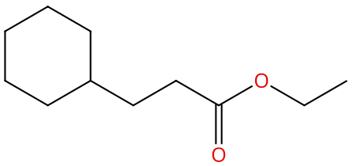
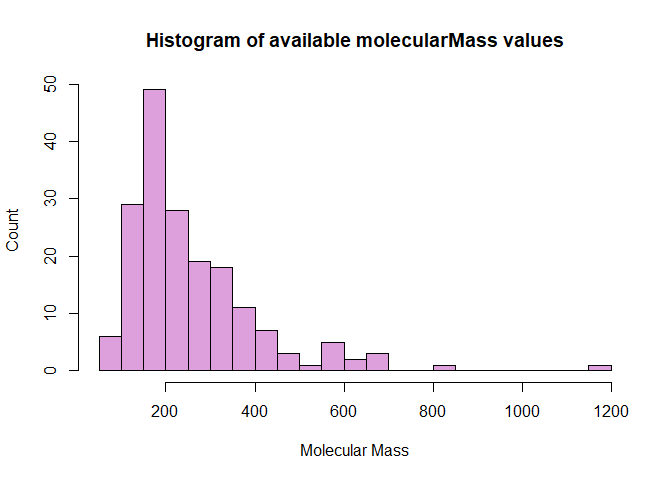
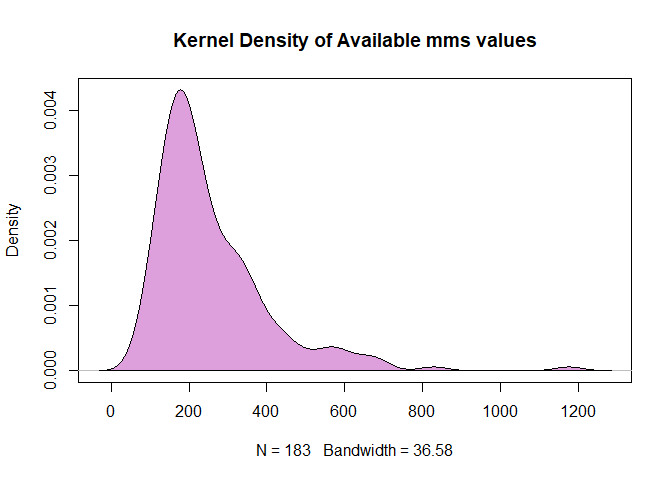

# CAS Common Chemistry API in R

by Adam M. Nguyen and Michael T. Moen

The CAS Common Chemistry API provides programmatic access to a curated subset, offering information on nearly 500,000 chemical substances.

Please see the following resources for more information on API usage:

- Documentation
    - <a href="https://commonchemistry.cas.org/" target="_blank">CAS Common Chemistry</a>
    - <a href="https://commonchemistry.cas.org/api-overview" target="_blank">CAS Common Chemistry API Overview</a>
- Terms
    - <a href="https://www.cas.org/legal" target="_blank">CAS Policies</a>
- Data Reuse
    - CAS Common Chemistry is provided under the <a href="https://creativecommons.org/licenses/by-nc/4.0/" target="_blank">Creative Commons CC BY-NC 4.0 license</a>

*These recipe examples were tested on October 27, 2025.*

## Setup

### Load Libraries

The following packages need to be installed into your environment to run the code examples in this tutorial. These packages can be installed with `install.packages()`.

- <a href="https://cran.r-project.org/web/packages/httr/index.html" target="_blank">httr: Tools for Working with URLs and HTTP</a>
- <a href="https://cran.r-project.org/web/packages/jsonlite/index.html" target="_blank">jsonlite: A Simple and Robust JSON Parser and Generator for R</a>
- <a href="https://cran.r-project.org/web/packages/magick/index.html" target="_blank">magick: Advanced Graphics and Image-Processing in R</a>

We load the libraries used in this tutorial below:


``` r
library(httr)
library(jsonlite)
library(magick)
```

### Import API Key

An API key is required to access the CAS Common Chemistry API. You can sign up for one at the <a href="https://www.cas.org/services/commonchemistry-api" target="_blank">Request API Access for CAS Common Chemistry</a> page.

We keep our token in a `.Renviron` file that is stored in the working directory and use `Sys.getenv()` to access it. The `.Renviron` should have an entry like the one below.

```text
CAS_API_KEY="PUT_YOUR_API_KEY_HERE"
```

Below, we can test to whether the key was successfully imported.


``` r
if (nzchar(Sys.getenv("CAS_API_KEY"))) {
  print("API key successfully loaded.")
} else {
  warning("API key not found or is empty.")
}
```

```
## [1] "API key successfully loaded."
```

## 1. Common Chemistry Record Detail Retrieval

Common Chemistry is an extremely useful open community resource for accessing chemical information for nearly 500,000 chemical chemistry from the CAS registry. In this example, we detail the steps for accessing a simple example chemical substance, ethyl cyclohexanepropionate.

### API Parameter Setup   

First, let's setup the API parameters for Common Chemistry. Below we are going to provide a variable `detail_base_url` to query Common Chemistry for details and more specifically. In this example, using a registry number, or as we abbreviate it an `rn`.


``` r
DETAIL_BASE_URL <- "https://commonchemistry.cas.org/api/detail?"
casrn1 <- "10094-36-7" # ethyl cyclohexanepropionate
```

### Request Data from CAS Common Chemistry Detail API

Using the `httr` and `jsonlite` libraries, we query the API and convert the data to a usable format.


``` r
# paste0 concatenates inputs with no spaces
casrn1_url <- paste0(DETAIL_BASE_URL, "cas_rn=", casrn1)

# Use httr's 'GET()' function to retrieve raw data from a URL
raw_casrn1_data <-GET(casrn1_url, add_headers("X-API-KEY" = Sys.getenv("CAS_API_KEY")))
raw_casrn1_data
```

```
## Response [https://commonchemistry.cas.org/api/detail?cas_rn=10094-36-7]
##   Date: 2025-10-27 19:29
##   Status: 200
##   Content-Type: application/json
##   Size: 5.31 kB
```

The `GET()` function returns `Response`, `Date`, `Status: 200` indicating a successful request, `Size`, and `Content-Type`. In most cases when accessing APIs, the `Content-Type` returns JSON, so we need the `jsonlite` to parse it.


``` r
# Returns JSON structure in character format
json_casrn1_data <- rawToChar(raw_casrn1_data$content)

# Use fromJSON() to convert the JSON format to a list
casrn1_data <- fromJSON(json_casrn1_data)
casrn1_data
```

```
## $uri
## [1] "substance/pt/10094367"
## 
## $rn
## [1] "10094-36-7"
## 
## $name
## [1] "Ethyl cyclohexanepropionate"
## 
## $images
## [1] "<svg width=\"215\" viewBox=\"0 0 215 101\" style=\"fill-opacity:1; color-rendering:auto; color-interpolation:auto; text-rendering:auto; stroke:black; stroke-linecap:square; stroke-miterlimit:10; shape-rendering:auto; stroke-opacity:1; fill:black; stroke-dasharray:none; font-weight:normal; stroke-width:1; font-family:'Open Sans'; font-style:normal; stroke-linejoin:miter; font-size:12; stroke-dashoffset:0; image-rendering:auto;\" height=\"101\" class=\"cas-substance-image\" xmlns:xlink=\"http://www.w3.org/1999/xlink\" xmlns=\"http://www.w3.org/2000/svg\"><svg class=\"cas-substance-single-component\"><rect y=\"0\" x=\"0\" width=\"215\" stroke=\"none\" ry=\"7\" rx=\"7\" height=\"101\" fill=\"white\" class=\"cas-substance-group\"/><svg y=\"0\" x=\"0\" width=\"215\" viewBox=\"0 0 215 101\" style=\"fill:black;\" height=\"101\" class=\"cas-substance-single-component-image\"><svg><g><g transform=\"translate(107,49)\" style=\"text-rendering:geometricPrecision; color-rendering:optimizeQuality; color-interpolation:linearRGB; stroke-linecap:butt; image-rendering:optimizeQuality;\"><line y2=\"0\" y1=\"15\" x2=\"0\" x1=\"-25.98\" style=\"fill:none;\"/><line y2=\"0\" y1=\"15\" x2=\"-51.963\" x1=\"-25.98\" style=\"fill:none;\"/><line y2=\"15\" y1=\"0\" x2=\"25.98\" x1=\"0\" style=\"fill:none;\"/><line y2=\"3.1886\" y1=\"15\" x2=\"46.4398\" x1=\"25.98\" style=\"fill:none;\"/><line y2=\"38.5234\" y1=\"13.9896\" x2=\"24.23\" x1=\"24.23\" style=\"fill:none;\"/><line y2=\"38.5234\" y1=\"13.9897\" x2=\"27.73\" x1=\"27.73\" style=\"fill:none;\"/><line y2=\"15\" y1=\"3.1786\" x2=\"77.943\" x1=\"57.4684\" style=\"fill:none;\"/><line y2=\"0\" y1=\"15\" x2=\"103.923\" x1=\"77.943\" style=\"fill:none;\"/><line y2=\"15\" y1=\"0\" x2=\"-77.943\" x1=\"-51.963\" style=\"fill:none;\"/><line y2=\"-30\" y1=\"0\" x2=\"-51.963\" x1=\"-51.963\" style=\"fill:none;\"/><line y2=\"0\" y1=\"15\" x2=\"-103.923\" x1=\"-77.943\" style=\"fill:none;\"/><line y2=\"-45\" y1=\"-30\" x2=\"-77.943\" x1=\"-51.963\" style=\"fill:none;\"/><line y2=\"-30\" y1=\"0\" x2=\"-103.923\" x1=\"-103.923\" style=\"fill:none;\"/><line y2=\"-30\" y1=\"-45\" x2=\"-103.923\" x1=\"-77.943\" style=\"fill:none;\"/><path style=\"fill:none; stroke-miterlimit:5;\" d=\"M-25.547 14.75 L-25.98 15 L-26.413 14.75\"/><path style=\"fill:none; stroke-miterlimit:5;\" d=\"M-0.433 0.25 L0 0 L0.433 0.25\"/><path style=\"fill:none; stroke-miterlimit:5;\" d=\"M25.547 14.75 L25.98 15 L26.413 14.75\"/></g><g transform=\"translate(107,49)\" style=\"stroke-linecap:butt; fill:rgb(230,0,0); text-rendering:geometricPrecision; color-rendering:optimizeQuality; image-rendering:optimizeQuality; font-family:'Open Sans'; stroke:rgb(230,0,0); color-interpolation:linearRGB; stroke-miterlimit:5;\"><path style=\"stroke:none;\" d=\"M55.9005 -0.0703 Q55.9005 1.9922 54.8614 3.1719 Q53.8224 4.3516 51.9786 4.3516 Q50.088 4.3516 49.0568 3.1875 Q48.0255 2.0234 48.0255 -0.0859 Q48.0255 -2.1797 49.0568 -3.3281 Q50.088 -4.4766 51.9786 -4.4766 Q53.838 -4.4766 54.8693 -3.3047 Q55.9005 -2.1328 55.9005 -0.0703 ZM49.0724 -0.0703 Q49.0724 1.6641 49.8146 2.5703 Q50.5568 3.4766 51.9786 3.4766 Q53.4005 3.4766 54.1271 2.5781 Q54.8536 1.6797 54.8536 -0.0703 Q54.8536 -1.8047 54.1271 -2.6953 Q53.4005 -3.5859 51.9786 -3.5859 Q50.5568 -3.5859 49.8146 -2.6875 Q49.0724 -1.7891 49.0724 -0.0703 Z\"/><path style=\"stroke:none;\" d=\"M29.9175 44.9297 Q29.9175 46.9922 28.8784 48.1719 Q27.8394 49.3516 25.9956 49.3516 Q24.105 49.3516 23.0737 48.1875 Q22.0425 47.0234 22.0425 44.9141 Q22.0425 42.8203 23.0737 41.6719 Q24.105 40.5234 25.9956 40.5234 Q27.855 40.5234 28.8862 41.6953 Q29.9175 42.8672 29.9175 44.9297 ZM23.0894 44.9297 Q23.0894 46.6641 23.8316 47.5703 Q24.5737 48.4766 25.9956 48.4766 Q27.4175 48.4766 28.1441 47.5781 Q28.8706 46.6797 28.8706 44.9297 Q28.8706 43.1953 28.1441 42.3047 Q27.4175 41.4141 25.9956 41.4141 Q24.5737 41.4141 23.8316 42.3125 Q23.0894 43.2109 23.0894 44.9297 Z\"/><path style=\"fill:none; stroke:black;\" d=\"M77.51 14.75 L77.943 15 L78.376 14.75\"/><path style=\"fill:none; stroke:black;\" d=\"M-77.51 14.75 L-77.943 15 L-78.376 14.75\"/><path style=\"fill:none; stroke:black;\" d=\"M-51.963 -29.5 L-51.963 -30 L-52.396 -30.25\"/><path style=\"fill:none; stroke:black;\" d=\"M-103.49 0.25 L-103.923 0 L-103.923 -0.5\"/><path style=\"fill:none; stroke:black;\" d=\"M-77.51 -44.75 L-77.943 -45 L-78.376 -44.75\"/><path style=\"fill:none; stroke:black;\" d=\"M-103.923 -29.5 L-103.923 -30 L-103.49 -30.25\"/></g></g></svg></svg></svg></svg>"
## 
## $inchi
## [1] "InChI=1S/C11H20O2/c1-2-13-11(12)9-8-10-6-4-3-5-7-10/h10H,2-9H2,1H3"
## 
## $inchiKey
## [1] "InChIKey=NRVPMFHPHGBQLP-UHFFFAOYSA-N"
## 
## $smile
## [1] ""
## 
## $canonicalSmile
## [1] "O=C(OCC)CCC1CCCCC1"
## 
## $molecularFormula
## [1] "C<sub>11</sub>H<sub>20</sub>O<sub>2</sub>"
## 
## $molecularMass
## [1] "184.28"
## 
## $experimentalProperties
##            name   property sourceNumber
## 1 Boiling Point 105-113 °C            0
## 
## $propertyCitations
## list()
## 
## $synonyms
## [1] "Cyclohexanepropanoic acid, ethyl ester"
## [2] "Cyclohexanepropionic acid, ethyl ester"
## [3] "Ethyl cyclohexanepropionate"           
## [4] "Ethyl cyclohexylpropanoate"            
## [5] "Ethyl 3-cyclohexylpropionate"          
## [6] "Ethyl 3-cyclohexylpropanoate"          
## [7] "3-Cyclohexylpropionic acid ethyl ester"
## [8] "NSC 71463"                             
## [9] "Ethyl 3-cyclohexanepropionate"         
## 
## $replacedRns
## list()
## 
## $hasMolfile
## [1] TRUE
```

### Accessing Specific Data

The `$` operator can be used to extract specific parts of `casrn1_data`.


``` r
# Access the canonical SMILE
smile_casrn1_data <- casrn1_data$canonicalSmile
smile_casrn1_data
```

```
## [1] "O=C(OCC)CCC1CCCCC1"
```


``` r
# Another example may be finding synonyms for Ethyl cyclohexanepropionate
syn_casrn1_data <- casrn1_data$synonyms
syn_casrn1_data
```

```
## [1] "Cyclohexanepropanoic acid, ethyl ester"
## [2] "Cyclohexanepropionic acid, ethyl ester"
## [3] "Ethyl cyclohexanepropionate"           
## [4] "Ethyl cyclohexylpropanoate"            
## [5] "Ethyl 3-cyclohexylpropionate"          
## [6] "Ethyl 3-cyclohexylpropanoate"          
## [7] "3-Cyclohexylpropionic acid ethyl ester"
## [8] "NSC 71463"                             
## [9] "Ethyl 3-cyclohexanepropionate"
```

The methods above work for any parts of the data object, to find a list of the data objects, you can use the `ls()` function.


``` r
ls(casrn1_data)
```

```
##  [1] "canonicalSmile"         "experimentalProperties" "hasMolfile"            
##  [4] "images"                 "inchi"                  "inchiKey"              
##  [7] "molecularFormula"       "molecularMass"          "name"                  
## [10] "propertyCitations"      "replacedRns"            "rn"                    
## [13] "smile"                  "synonyms"               "uri"
```

Given this list we can select different data as seen in previous examples, i.e. `casrn1_data$(example)`.

### Display the Molecule Drawing      

The `images` section of the data contains data formatted as Scalable Vector Graphics (SVG). SVG is an XML based vector format for defining two-dimensional graphics and has been an open standard since 1999. Using the SVG data provided by the API, we display the molecule drawing using the package `magick`, a useful toolkit for image processing in R.


``` r
str <- charToRaw(casrn1_data$image)
image_read(str,200)
```



## 2. Common Chemistry API Record Detail Retrieval in a Loop   

In this example, we show how to query Common Chemistry for details given a list of registry numbers.


``` r
DETAIL_BASE_URL <- "https://commonchemistry.cas.org/api/detail?"

# Create a list of CAS RNs
casrns <- as.list(c("10094-36-7", "10031-92-2", "10199-61-8", "10036-21-2", "1019020-13-3"))

# Iterate through list of CAS RN and append to list
list <- lapply(casrns, function(casrn) {
  casrn_url <- paste0(DETAIL_BASE_URL, "cas_rn=", casrn)
  raw_casrn_data <- GET(casrn_url, add_headers("X-API-KEY" = Sys.getenv("CAS_API_KEY")))
  json_casrn_data <- rawToChar(raw_casrn_data$content)
  casrn_data <- fromJSON(json_casrn_data)
  Sys.sleep(1)
  return(casrn_data)
})

# Show first result in the list
head(list, n=1)
```

```
## [[1]]
## [[1]]$uri
## [1] "substance/pt/10094367"
## 
## [[1]]$rn
## [1] "10094-36-7"
## 
## [[1]]$name
## [1] "Ethyl cyclohexanepropionate"
## 
## [[1]]$images
## [1] "<svg width=\"215\" viewBox=\"0 0 215 101\" style=\"fill-opacity:1; color-rendering:auto; color-interpolation:auto; text-rendering:auto; stroke:black; stroke-linecap:square; stroke-miterlimit:10; shape-rendering:auto; stroke-opacity:1; fill:black; stroke-dasharray:none; font-weight:normal; stroke-width:1; font-family:'Open Sans'; font-style:normal; stroke-linejoin:miter; font-size:12; stroke-dashoffset:0; image-rendering:auto;\" height=\"101\" class=\"cas-substance-image\" xmlns:xlink=\"http://www.w3.org/1999/xlink\" xmlns=\"http://www.w3.org/2000/svg\"><svg class=\"cas-substance-single-component\"><rect y=\"0\" x=\"0\" width=\"215\" stroke=\"none\" ry=\"7\" rx=\"7\" height=\"101\" fill=\"white\" class=\"cas-substance-group\"/><svg y=\"0\" x=\"0\" width=\"215\" viewBox=\"0 0 215 101\" style=\"fill:black;\" height=\"101\" class=\"cas-substance-single-component-image\"><svg><g><g transform=\"translate(107,49)\" style=\"text-rendering:geometricPrecision; color-rendering:optimizeQuality; color-interpolation:linearRGB; stroke-linecap:butt; image-rendering:optimizeQuality;\"><line y2=\"0\" y1=\"15\" x2=\"0\" x1=\"-25.98\" style=\"fill:none;\"/><line y2=\"0\" y1=\"15\" x2=\"-51.963\" x1=\"-25.98\" style=\"fill:none;\"/><line y2=\"15\" y1=\"0\" x2=\"25.98\" x1=\"0\" style=\"fill:none;\"/><line y2=\"3.1886\" y1=\"15\" x2=\"46.4398\" x1=\"25.98\" style=\"fill:none;\"/><line y2=\"38.5234\" y1=\"13.9896\" x2=\"24.23\" x1=\"24.23\" style=\"fill:none;\"/><line y2=\"38.5234\" y1=\"13.9897\" x2=\"27.73\" x1=\"27.73\" style=\"fill:none;\"/><line y2=\"15\" y1=\"3.1786\" x2=\"77.943\" x1=\"57.4684\" style=\"fill:none;\"/><line y2=\"0\" y1=\"15\" x2=\"103.923\" x1=\"77.943\" style=\"fill:none;\"/><line y2=\"15\" y1=\"0\" x2=\"-77.943\" x1=\"-51.963\" style=\"fill:none;\"/><line y2=\"-30\" y1=\"0\" x2=\"-51.963\" x1=\"-51.963\" style=\"fill:none;\"/><line y2=\"0\" y1=\"15\" x2=\"-103.923\" x1=\"-77.943\" style=\"fill:none;\"/><line y2=\"-45\" y1=\"-30\" x2=\"-77.943\" x1=\"-51.963\" style=\"fill:none;\"/><line y2=\"-30\" y1=\"0\" x2=\"-103.923\" x1=\"-103.923\" style=\"fill:none;\"/><line y2=\"-30\" y1=\"-45\" x2=\"-103.923\" x1=\"-77.943\" style=\"fill:none;\"/><path style=\"fill:none; stroke-miterlimit:5;\" d=\"M-25.547 14.75 L-25.98 15 L-26.413 14.75\"/><path style=\"fill:none; stroke-miterlimit:5;\" d=\"M-0.433 0.25 L0 0 L0.433 0.25\"/><path style=\"fill:none; stroke-miterlimit:5;\" d=\"M25.547 14.75 L25.98 15 L26.413 14.75\"/></g><g transform=\"translate(107,49)\" style=\"stroke-linecap:butt; fill:rgb(230,0,0); text-rendering:geometricPrecision; color-rendering:optimizeQuality; image-rendering:optimizeQuality; font-family:'Open Sans'; stroke:rgb(230,0,0); color-interpolation:linearRGB; stroke-miterlimit:5;\"><path style=\"stroke:none;\" d=\"M55.9005 -0.0703 Q55.9005 1.9922 54.8614 3.1719 Q53.8224 4.3516 51.9786 4.3516 Q50.088 4.3516 49.0568 3.1875 Q48.0255 2.0234 48.0255 -0.0859 Q48.0255 -2.1797 49.0568 -3.3281 Q50.088 -4.4766 51.9786 -4.4766 Q53.838 -4.4766 54.8693 -3.3047 Q55.9005 -2.1328 55.9005 -0.0703 ZM49.0724 -0.0703 Q49.0724 1.6641 49.8146 2.5703 Q50.5568 3.4766 51.9786 3.4766 Q53.4005 3.4766 54.1271 2.5781 Q54.8536 1.6797 54.8536 -0.0703 Q54.8536 -1.8047 54.1271 -2.6953 Q53.4005 -3.5859 51.9786 -3.5859 Q50.5568 -3.5859 49.8146 -2.6875 Q49.0724 -1.7891 49.0724 -0.0703 Z\"/><path style=\"stroke:none;\" d=\"M29.9175 44.9297 Q29.9175 46.9922 28.8784 48.1719 Q27.8394 49.3516 25.9956 49.3516 Q24.105 49.3516 23.0737 48.1875 Q22.0425 47.0234 22.0425 44.9141 Q22.0425 42.8203 23.0737 41.6719 Q24.105 40.5234 25.9956 40.5234 Q27.855 40.5234 28.8862 41.6953 Q29.9175 42.8672 29.9175 44.9297 ZM23.0894 44.9297 Q23.0894 46.6641 23.8316 47.5703 Q24.5737 48.4766 25.9956 48.4766 Q27.4175 48.4766 28.1441 47.5781 Q28.8706 46.6797 28.8706 44.9297 Q28.8706 43.1953 28.1441 42.3047 Q27.4175 41.4141 25.9956 41.4141 Q24.5737 41.4141 23.8316 42.3125 Q23.0894 43.2109 23.0894 44.9297 Z\"/><path style=\"fill:none; stroke:black;\" d=\"M77.51 14.75 L77.943 15 L78.376 14.75\"/><path style=\"fill:none; stroke:black;\" d=\"M-77.51 14.75 L-77.943 15 L-78.376 14.75\"/><path style=\"fill:none; stroke:black;\" d=\"M-51.963 -29.5 L-51.963 -30 L-52.396 -30.25\"/><path style=\"fill:none; stroke:black;\" d=\"M-103.49 0.25 L-103.923 0 L-103.923 -0.5\"/><path style=\"fill:none; stroke:black;\" d=\"M-77.51 -44.75 L-77.943 -45 L-78.376 -44.75\"/><path style=\"fill:none; stroke:black;\" d=\"M-103.923 -29.5 L-103.923 -30 L-103.49 -30.25\"/></g></g></svg></svg></svg></svg>"
## 
## [[1]]$inchi
## [1] "InChI=1S/C11H20O2/c1-2-13-11(12)9-8-10-6-4-3-5-7-10/h10H,2-9H2,1H3"
## 
## [[1]]$inchiKey
## [1] "InChIKey=NRVPMFHPHGBQLP-UHFFFAOYSA-N"
## 
## [[1]]$smile
## [1] ""
## 
## [[1]]$canonicalSmile
## [1] "O=C(OCC)CCC1CCCCC1"
## 
## [[1]]$molecularFormula
## [1] "C<sub>11</sub>H<sub>20</sub>O<sub>2</sub>"
## 
## [[1]]$molecularMass
## [1] "184.28"
## 
## [[1]]$experimentalProperties
##            name   property sourceNumber
## 1 Boiling Point 105-113 °C            0
## 
## [[1]]$propertyCitations
## list()
## 
## [[1]]$synonyms
## [1] "Cyclohexanepropanoic acid, ethyl ester"
## [2] "Cyclohexanepropionic acid, ethyl ester"
## [3] "Ethyl cyclohexanepropionate"           
## [4] "Ethyl cyclohexylpropanoate"            
## [5] "Ethyl 3-cyclohexylpropionate"          
## [6] "Ethyl 3-cyclohexylpropanoate"          
## [7] "3-Cyclohexylpropionic acid ethyl ester"
## [8] "NSC 71463"                             
## [9] "Ethyl 3-cyclohexanepropionate"         
## 
## [[1]]$replacedRns
## list()
## 
## [[1]]$hasMolfile
## [1] TRUE
```

We now have a list of sub-lists of data corresponding to the CAS RNs.

### Display Images


``` r
# Use 'lapply' to iterate through list and convert our image data to a readable format
imgs <- lapply(list, function(x) {(charToRaw(x$image))})

# Use 'image_read()' to read SVGs

# "Ethyl cyclohexanepropionate"
image_scale(image_read(imgs[[1]]),200)
```


``` r
# "Ethyl 2-nonynoate"
image_scale(image_read(imgs[[2]]),200)
```


``` r
# "Ethyl 1<em>H</em>-pyrazole-1-acetate"
image_scale(image_read(imgs[[3]]),200)
```


``` r
# "Ethyl 3-(ethoxycarbonyl)benzenepropanoate"
image_scale(image_read(imgs[[4]]),200)
```


``` r
# "Ethyl 1-cyclohexene-1-carboximidate"
image_scale(image_read(imgs[[5]]),200)
```


### Select Specific Data    

We use `lapply()` to iterate through the list and grab each sub-list's `canonicalSmile`.


``` r
# Apply function(i) to receive canonicalSmiles for every instance in the list
cansmiles <- lapply(list, function(i) {i$canonicalSmile})
unlist(cansmiles) # Flatten list
```

```
## [1] "O=C(OCC)CCC1CCCCC1"              "O=C(C#CCCCCCC)OCC"              
## [3] "O=C(OCC)CN1N=CC=C1"              "O=C(OCC)C1=CC=CC(=C1)CCC(=O)OCC"
## [5] "N=C(OCC)C1=CCCCC1"
```

Through similar means, we can also iterate through the list and grab each sub-list's synonyms.


``` r
synonyms_list <- lapply(list, function(j) {j$synonyms})
synonyms_list
```

```
## [[1]]
## [1] "Cyclohexanepropanoic acid, ethyl ester"
## [2] "Cyclohexanepropionic acid, ethyl ester"
## [3] "Ethyl cyclohexanepropionate"           
## [4] "Ethyl cyclohexylpropanoate"            
## [5] "Ethyl 3-cyclohexylpropionate"          
## [6] "Ethyl 3-cyclohexylpropanoate"          
## [7] "3-Cyclohexylpropionic acid ethyl ester"
## [8] "NSC 71463"                             
## [9] "Ethyl 3-cyclohexanepropionate"         
## 
## [[2]]
## [1] "2-Nonynoic acid, ethyl ester" "Ethyl 2-nonynoate"           
## [3] "NSC 190985"                  
## 
## [[3]]
## [1] "1<em>H</em>-Pyrazole-1-acetic acid, ethyl ester"
## [2] "Pyrazole-1-acetic acid, ethyl ester"            
## [3] "Ethyl 1<em>H</em>-pyrazole-1-acetate"           
## [4] "Ethyl 1-pyrazoleacetate"                        
## [5] "Ethyl 2-(1<em>H</em>-pyrazol-1-yl)acetate"      
## 
## [[4]]
## [1] "Benzenepropanoic acid, 3-(ethoxycarbonyl)-, ethyl ester"
## [2] "Hydrocinnamic acid, <em>m</em>-carboxy-, diethyl ester" 
## [3] "Ethyl 3-(ethoxycarbonyl)benzenepropanoate"              
## 
## [[5]]
## [1] "1-Cyclohexene-1-carboximidic acid, ethyl ester"
## [2] "Ethyl 1-cyclohexene-1-carboximidate"
```


``` r
# Use the unlist() function to flatten our list of synonyms
flatsyns <- unlist(synonyms_list)
flatsyns
```

```
##  [1] "Cyclohexanepropanoic acid, ethyl ester"                 
##  [2] "Cyclohexanepropionic acid, ethyl ester"                 
##  [3] "Ethyl cyclohexanepropionate"                            
##  [4] "Ethyl cyclohexylpropanoate"                             
##  [5] "Ethyl 3-cyclohexylpropionate"                           
##  [6] "Ethyl 3-cyclohexylpropanoate"                           
##  [7] "3-Cyclohexylpropionic acid ethyl ester"                 
##  [8] "NSC 71463"                                              
##  [9] "Ethyl 3-cyclohexanepropionate"                          
## [10] "2-Nonynoic acid, ethyl ester"                           
## [11] "Ethyl 2-nonynoate"                                      
## [12] "NSC 190985"                                             
## [13] "1<em>H</em>-Pyrazole-1-acetic acid, ethyl ester"        
## [14] "Pyrazole-1-acetic acid, ethyl ester"                    
## [15] "Ethyl 1<em>H</em>-pyrazole-1-acetate"                   
## [16] "Ethyl 1-pyrazoleacetate"                                
## [17] "Ethyl 2-(1<em>H</em>-pyrazol-1-yl)acetate"              
## [18] "Benzenepropanoic acid, 3-(ethoxycarbonyl)-, ethyl ester"
## [19] "Hydrocinnamic acid, <em>m</em>-carboxy-, diethyl ester" 
## [20] "Ethyl 3-(ethoxycarbonyl)benzenepropanoate"              
## [21] "1-Cyclohexene-1-carboximidic acid, ethyl ester"         
## [22] "Ethyl 1-cyclohexene-1-carboximidate"
```

### Create Data Frame   

Let's create a data frame from `list` with the variables `uri`, `rn`, `name`, `inchiKey`, `canonicalSmile`, and `molecularMass`.


``` r
df <- data.frame(do.call
        # Iterate through list of chemicals with function(i) and append to df
        (rbind, lapply(list, function(item)
          cbind(
            item["uri"],
            item["rn"],
            item["name"],
            item["inchiKey"],
            item["canonicalSmile"],
            item["molecularMass"]
          ))),
        row.names = NULL)

names(df) <- c("uri", "rn", "name", "inchiKey", "canonicalSmile", "molecularMass")

# Display df
df
```

```
##                       uri           rn
## 1   substance/pt/10094367   10094-36-7
## 2   substance/pt/10031922   10031-92-2
## 3   substance/pt/10199618   10199-61-8
## 4   substance/pt/10036212   10036-21-2
## 5 substance/pt/1019020133 1019020-13-3
##                                        name
## 1               Ethyl cyclohexanepropionate
## 2                         Ethyl 2-nonynoate
## 3      Ethyl 1<em>H</em>-pyrazole-1-acetate
## 4 Ethyl 3-(ethoxycarbonyl)benzenepropanoate
## 5       Ethyl 1-cyclohexene-1-carboximidate
##                               inchiKey                  canonicalSmile
## 1 InChIKey=NRVPMFHPHGBQLP-UHFFFAOYSA-N              O=C(OCC)CCC1CCCCC1
## 2 InChIKey=BFZNMUGAZYAMTG-UHFFFAOYSA-N               O=C(C#CCCCCCC)OCC
## 3 InChIKey=SEHJVNBWAGPXSM-UHFFFAOYSA-N              O=C(OCC)CN1N=CC=C1
## 4 InChIKey=HDGSRVUQMHJTDH-UHFFFAOYSA-N O=C(OCC)C1=CC=CC(=C1)CCC(=O)OCC
## 5 InChIKey=OYGZRJWLVOOMBM-UHFFFAOYSA-N               N=C(OCC)C1=CCCCC1
##   molecularMass
## 1        184.28
## 2        182.26
## 3        154.17
## 4        250.29
## 5        153.22
```

## 3. Common Chemistry 

In addition to the `/detail` endpoint, the CAS Common Chemistry API has a `/search` endpoint that allows searching by CAS RN, SMILES, InChI/InChIKey, and name.

### Request data form CAS Common Chemistry Search API


``` r
SEARCH_BASE_URL <- "https://commonchemistry.cas.org/api/search?q="

# InChIKey for Quinine
IK <- "InChIKey=LOUPRKONTZGTKE-WZBLMQSHSA-N"
quinine_search_url <- paste0(SEARCH_BASE_URL, IK)
quinine_search_data <- GET(quinine_search_url, add_headers("X-API-KEY" = Sys.getenv("CAS_API_KEY")))
quinine_search_data
```

```
## Response [https://commonchemistry.cas.org/api/search?q=InChIKey=LOUPRKONTZGTKE-WZBLMQSHSA-N]
##   Date: 2025-10-27 19:29
##   Status: 200
##   Content-Type: application/json
##   Size: 17.4 kB
```

Like before, we need to access the `content` part of the data to retrieve what we are interested. This data is stored in JSON.


``` r
# Convert JSON structure to character format
quinine_rn_json <- rawToChar(quinine_search_data$content)

# Use fromJSON() to convert the JSON format to a list
quinine_rn <- fromJSON(quinine_rn_json)

quinine_rn
```

```
## $count
## [1] 1
## 
## $results
##         rn    name
## 1 130-95-0 Quinine
##                                                                                                                                                                                                                                                                                                                                                                                                                                                                                                                                                                                                                                                                                                                                                                                                                                                                                                                                                                                                                                                                                                                                                                                                                                                                                                                                                                                                                                                                                                                                                                                                                                                                                                                                                                                                                                                                                                                                                                                                                                                                                                                                                                                                                                                                                                                                                                                                                                                                                                                                                                                                                                                                                                                                                                                                                                                                                                                                                                                                                                                                                                                                                                                                                                                                                                                                                                                                                                                                                                                                                                                                                                                                                                                                                                                                                                                                                                                                                                                                                                                                                                                                                                                                                                                                                                                                                                                                                                                                                                                                                                                                                                                                                                                                                                                                                                                                                                                                                                                                                                                                                                                                                                                                                                                                                                                                                                                                                                                                                                                                                                                                                                                                                                                                                                                                                                                                                                                                                                                                                                                                                                                                                                                                                                                                                                                                                                                                                                                                                                                                                                                                                                                                                                                                                                                                                                                                                                                                                                                                                                                                                                                                                                                                                                                                                                                                                                                                                                                                                                                                                                                                                                                                                                                                                                                                                                                                                                                                                                                                                                                                                                                                                                                                                                                                                                                                                                                                                                                                                                                                                                                                                                                                                                                                                                                                                                                                                                                                                                                                                                                                                                                                                                                                                                                                                                                                                                                                                                                                                                                                                                                                                                                                                                                                                                                                                                                                                                                                                                                                                                                                                                                                                                                                                                                                                                                                                                                                                                                                                                                                                                                                                                                                                                                                                                                                                                                                                                                                                                                                                                                                                                                                                                                                                                                                                                                                                                                                                                                                                                                                                                                                                                                                                                                                                                                                                                                                                                                                                                                                                                                                                                                                                                                                                                                                                                                                                                                                                                                                                                                                                                                                                                                                                                                                                                                                                                                                                                                                                                                                                                                                                                                                                                                                                                                                                                                                                                                                                                                                                                                                                                                                                                                                                                                                                                                                                                                                                                                                                                                                                                                                                                                                                                                                                                                                                                                                                                                                                                                                                                                                                                                                                                                                                                                                                                                                                                                                                                                                                                                                                                                                                                                                                                                                                                                                                                                                                                                                                                                                                                                                                                                                                                                                                                                                                                                                                                                                                                                                                                                                                                                                                                                                                                                                                                                                                                                                                                                                                                                                                                                                                                                                                                                                                                                                                                                                                                                                                                                                                                                                                                                                                                                                                                                                                                                                                                                                                                                                                                                                                                                                                                            images
## 1 <svg width="280" viewBox="0 0 280 172" style="fill-opacity:1; color-rendering:auto; color-interpolation:auto; text-rendering:auto; stroke:black; stroke-linecap:square; stroke-miterlimit:10; shape-rendering:auto; stroke-opacity:1; fill:black; stroke-dasharray:none; font-weight:normal; stroke-width:1; font-family:'Open Sans'; font-style:normal; stroke-linejoin:miter; font-size:12; stroke-dashoffset:0; image-rendering:auto;" height="172" class="cas-substance-image" xmlns:xlink="http://www.w3.org/1999/xlink" xmlns="http://www.w3.org/2000/svg"><svg class="cas-substance-single-component"><rect y="0" x="0" width="280" stroke="none" ry="7" rx="7" height="172" fill="white" class="cas-substance-group"/><svg y="0" x="0" width="280" viewBox="0 0 280 172" style="fill:black;" height="172" class="cas-substance-single-component-image"><svg><g><clipPath id="clipPath_c008a324b5354d0dbf19605aa239c1dc1" clipPathUnits="userSpaceOnUse"><path d="M36.2428 -48.9389 L36.2012 -8.9389 L72.6092 -8.9011 L72.6507 -48.9011 L58.0514 -48.9162 L58.0514 -48.9162 L46.7031 -10.8966 L40.9538 -12.6127 L51.7918 -48.9227 L51.7918 -48.9227 L36.2428 -48.9389 Z"/></clipPath><g transform="translate(140,86)" style="text-rendering:geometricPrecision; color-rendering:optimizeQuality; color-interpolation:linearRGB; stroke-linecap:butt; image-rendering:optimizeQuality;"><path style="stroke:none;" d="M-1.52 0.527 L-2.386 1.027 L-16.2975 -18.0701 L-11.1012 -21.0699 Z"/><line y2="26.757" y1="0.777" x2="-16.953" x1="-1.953" style="fill:none;"/><line y2="0.777" y1="0.777" x2="28.047" x1="-1.953" style="fill:none;"/><line y2="-25.206" y1="-25.206" x2="-136.953" x1="-112.8905" style="fill:none;"/><line y2="0.777" y1="-19.57" x2="-91.953" x1="-103.6994" style="fill:none;"/><line y2="-49.227" y1="-65.346" x2="136.953" x1="111.651" style="fill:none;"/><line y2="-46.2751" y1="-61.3084" x2="135.0725" x1="111.4747" style="fill:none;"/><path style="stroke:none;" d="M85.2719 -51.0485 L84.8101 -51.9355 L108.9981 -67.6289 L114.8412 -63.9065 Z"/><line y2="26.757" y1="26.757" x2="-16.953" x1="-46.953" style="fill:none;"/><line y2="52.737" y1="26.757" x2="-61.953" x1="-46.953" style="fill:none;"/><line y2="52.737" y1="30.257" x2="-57.9115" x1="-44.9323" style="fill:none;"/><line y2="0.777" y1="26.757" x2="-61.953" x1="-46.953" style="fill:none;"/><line y2="52.737" y1="26.757" x2="-1.953" x1="-16.953" style="fill:none;"/><line y2="52.737" y1="30.257" x2="-5.9945" x1="-18.9737" style="fill:none;"/><line y2="52.737" y1="52.737" x2="-91.953" x1="-61.953" style="fill:none;"/><line y2="72.5787" y1="52.737" x2="-50.497" x1="-61.953" style="fill:none;"/><line y2="0.777" y1="0.777" x2="-91.953" x1="-61.953" style="fill:none;"/><line y2="4.277" y1="4.277" x2="-89.9323" x1="-63.9737" style="fill:none;"/><line y2="78.717" y1="52.737" x2="-16.953" x1="-1.953" style="fill:none;"/><line y2="26.757" y1="52.737" x2="-106.953" x1="-91.953" style="fill:none;"/><line y2="26.7569" y1="49.237" x2="-102.9115" x1="-89.9323" style="fill:none;"/><line y2="78.717" y1="78.717" x2="-16.953" x1="-41.6014" style="fill:none;"/><line y2="75.217" y1="75.217" x2="-18.9737" x1="-41.6014" style="fill:none;"/><line y2="26.757" y1="0.777" x2="-106.953" x1="-91.953" style="fill:none;"/><line y2="-22.9227" y1="0.777" x2="37.5589" x1="28.047" style="fill:none;"/><path style="stroke:none;" d="M28.3927 1.1383 L27.7013 0.4157 L47.1148 -21.0165 L43.6455 -9.3935 Z"/><path style="clip-path:url(#clipPath_c008a324b5354d0dbf19605aa239c1dc1); stroke:none;" d="M45.323 -28.4294 L45.3241 -29.4294 L71.4315 -31.6118 L67.1417 -25.6163 Z"/><line y2="-52.179" y1="-34.1312" x2="18.984" x1="35.2801" style="fill:none;"/><line y2="-51.189" y1="-15.348" x2="55.599" x1="44.901" style="fill:none;"/><line y2="-51.492" y1="-28.905" x2="85.041" x1="68.88" style="fill:none;"/><line y2="-75.186" y1="-52.179" x2="33.555" x1="18.984" style="fill:none;"/><line y2="-51.492" y1="-51.189" x2="85.041" x1="55.599" style="fill:none;"/><line y2="-75.186" y1="-51.189" x2="33.555" x1="55.599" style="fill:none;"/><path style="stroke:none;" d="M28.8064 1.1461 L27.7536 1.5689 L28.0263 2.5369 L29.2786 2.0339 L28.8064 1.1461 ZM30.2231 3.8096 L28.5717 4.473 L28.5717 4.473 L28.8444 5.441 L28.8444 5.441 L30.6953 4.6975 L30.2231 3.8096 ZM31.6398 6.4732 L29.3899 7.377 L29.6626 8.345 L29.6626 8.345 L32.112 7.3611 L32.112 7.3611 L31.6398 6.4732 ZM33.0565 9.1368 L30.208 10.281 L30.208 10.281 L30.4807 11.249 L30.4807 11.249 L33.5287 10.0247 L33.0565 9.1368 ZM34.4732 11.8004 L31.0261 13.1851 L31.0261 13.1851 L31.2988 14.1531 L31.2988 14.1531 L34.9454 12.6883 L34.4732 11.8004 ZM35.8899 14.464 L31.8442 16.0891 L32.1169 17.0571 L32.1169 17.0571 L36.3621 15.3519 L35.8899 14.464 ZM37.3066 17.1276 L32.6624 18.9931 L32.9351 19.9611 L32.9351 19.9611 L37.7788 18.0154 L37.7788 18.0154 L37.3066 17.1276 ZM38.7233 19.7912 L33.4805 21.8971 L33.7532 22.8652 L39.1955 20.679 L39.1955 20.679 L38.7233 19.7912 Z"/><path style="stroke:none;" d="M56.0578 -50.9903 L55.1402 -51.3877 L62.1732 -73.9177 L67.6791 -71.5332 Z"/></g><g transform="translate(140,86)" style="font-size:8.4px; fill:gray; text-rendering:geometricPrecision; image-rendering:optimizeQuality; color-rendering:optimizeQuality; font-family:'Open Sans'; font-style:italic; stroke:gray; color-interpolation:linearRGB;"><path style="stroke:none;" d="M-1.3417 -6.7193 Q-1.3417 -8.0474 -0.873 -9.1724 Q-0.4042 -10.2974 0.627 -11.3755 L1.2364 -11.3755 Q0.2676 -10.313 -0.2167 -9.1411 Q-0.7011 -7.9693 -0.7011 -6.7349 Q-0.7011 -5.4068 -0.2636 -4.3911 L-0.7792 -4.3911 Q-1.3417 -5.4224 -1.3417 -6.7193 ZM2.2183 -8.0318 L1.7183 -5.6568 L1.0621 -5.6568 L2.2652 -11.3755 L3.5152 -11.3755 Q5.2496 -11.3755 5.2496 -9.938 Q5.2496 -8.5786 3.8121 -8.188 L4.7496 -5.6568 L4.0308 -5.6568 L3.2027 -8.0318 L2.2183 -8.0318 ZM2.7964 -10.7818 Q2.4058 -8.8599 2.3433 -8.6099 L2.9996 -8.6099 Q3.7496 -8.6099 4.1558 -8.938 Q4.5621 -9.2661 4.5621 -9.8911 Q4.5621 -10.3599 4.3042 -10.5708 Q4.0464 -10.7818 3.4527 -10.7818 L2.7964 -10.7818 ZM7.4355 -9.0318 Q7.4355 -7.7036 6.959 -6.5708 Q6.4824 -5.438 5.4668 -4.3911 L4.8574 -4.3911 Q6.7949 -6.5474 6.7949 -9.0318 Q6.7949 -10.3599 6.3574 -11.3755 L6.873 -11.3755 Q7.4355 -10.313 7.4355 -9.0318 Z"/></g><g transform="translate(140,86)" style="fill:rgb(230,0,0); text-rendering:geometricPrecision; color-rendering:optimizeQuality; image-rendering:optimizeQuality; font-family:'Open Sans'; stroke:rgb(230,0,0); color-interpolation:linearRGB;"><path style="stroke:none;" d="M-13.0155 -25.2763 Q-13.0155 -23.2138 -14.0546 -22.0341 Q-15.0936 -20.8544 -16.9374 -20.8544 Q-18.828 -20.8544 -19.8593 -22.0185 Q-20.8905 -23.1826 -20.8905 -25.2919 Q-20.8905 -27.3857 -19.8593 -28.5341 Q-18.828 -29.6826 -16.9374 -29.6826 Q-15.078 -29.6826 -14.0468 -28.5107 Q-13.0155 -27.3388 -13.0155 -25.2763 ZM-19.8436 -25.2763 Q-19.8436 -23.5419 -19.1014 -22.6357 Q-18.3593 -21.7294 -16.9374 -21.7294 Q-15.5155 -21.7294 -14.7889 -22.6279 Q-14.0624 -23.5263 -14.0624 -25.2763 Q-14.0624 -27.0107 -14.7889 -27.9013 Q-15.5155 -28.7919 -16.9374 -28.7919 Q-18.3593 -28.7919 -19.1014 -27.8935 Q-19.8436 -26.9951 -19.8436 -25.2763 Z"/><path style="stroke:none;" d="M-21.8905 -20.9794 L-22.8905 -20.9794 L-22.8905 -25.0107 L-27.4061 -25.0107 L-27.4061 -20.9794 L-28.4061 -20.9794 L-28.4061 -29.5419 L-27.4061 -29.5419 L-27.4061 -25.9013 L-22.8905 -25.9013 L-22.8905 -29.5419 L-21.8905 -29.5419 L-21.8905 -20.9794 Z"/><path style="stroke:none;" d="M-103.0155 -25.2763 Q-103.0155 -23.2138 -104.0546 -22.0341 Q-105.0936 -20.8544 -106.9374 -20.8544 Q-108.828 -20.8544 -109.8592 -22.0185 Q-110.8905 -23.1826 -110.8905 -25.2919 Q-110.8905 -27.3857 -109.8592 -28.5341 Q-108.828 -29.6826 -106.9374 -29.6826 Q-105.078 -29.6826 -104.0467 -28.5107 Q-103.0155 -27.3388 -103.0155 -25.2763 ZM-109.8436 -25.2763 Q-109.8436 -23.5419 -109.1014 -22.6357 Q-108.3592 -21.7294 -106.9374 -21.7294 Q-105.5155 -21.7294 -104.7889 -22.6279 Q-104.0624 -23.5263 -104.0624 -25.2763 Q-104.0624 -27.0107 -104.7889 -27.9013 Q-105.5155 -28.7919 -106.9374 -28.7919 Q-108.3592 -28.7919 -109.1014 -27.8935 Q-109.8436 -26.9951 -109.8436 -25.2763 Z"/></g><g transform="translate(140,86)" style="stroke-linecap:butt; text-rendering:geometricPrecision; color-rendering:optimizeQuality; image-rendering:optimizeQuality; font-family:'Open Sans'; color-interpolation:linearRGB; stroke-miterlimit:5;"><path style="fill:none;" d="M-47.203 27.19 L-46.953 26.757 L-46.453 26.757"/><path style="fill:none;" d="M-16.703 27.19 L-16.953 26.757 L-16.703 26.324"/><path style="fill:none;" d="M-61.703 52.304 L-61.953 52.737 L-62.453 52.737"/><path style="fill:none;" d="M-61.703 1.21 L-61.953 0.777 L-62.453 0.777"/><path style="fill:none;" d="M-2.203 52.304 L-1.953 52.737 L-2.203 53.17"/><path style="fill:none;" d="M-91.453 52.737 L-91.953 52.737 L-92.203 52.304"/><path style="fill:rgb(0,5,255); stroke:none;" d="M-43.6014 82.8732 L-44.7421 82.8732 L-49.4296 75.6857 L-49.4764 75.6857 Q-49.3827 76.9514 -49.3827 77.9982 L-49.3827 82.8732 L-50.3046 82.8732 L-50.3046 74.3107 L-49.1796 74.3107 L-44.5077 81.467 L-44.4608 81.467 Q-44.4608 81.3107 -44.5077 80.4514 Q-44.5546 79.592 -44.5389 79.217 L-44.5389 74.3107 L-43.6014 74.3107 L-43.6014 82.8732 Z"/><path style="fill:none;" d="M-91.453 0.777 L-91.953 0.777 L-92.203 0.344"/><path style="fill:none;" d="M-16.703 78.284 L-16.953 78.717 L-17.453 78.717"/><path style="fill:none;" d="M-106.703 27.19 L-106.953 26.757 L-106.703 26.324"/><path style="fill:none;" d="M28.2333 1.241 L28.047 0.777 L27.547 0.777"/></g><g transform="translate(140,86)" style="stroke-linecap:butt; font-size:8.4px; fill:gray; text-rendering:geometricPrecision; image-rendering:optimizeQuality; color-rendering:optimizeQuality; font-family:'Open Sans'; font-style:italic; stroke:gray; color-interpolation:linearRGB; stroke-miterlimit:5;"><path style="stroke:none;" d="M33.7127 4.093 Q33.7127 2.7649 34.1815 1.6399 Q34.6502 0.5149 35.6815 -0.5632 L36.2908 -0.5632 Q35.3221 0.4993 34.8377 1.6711 Q34.3533 2.843 34.3533 4.0774 Q34.3533 5.4055 34.7908 6.4211 L34.2752 6.4211 Q33.7127 5.3899 33.7127 4.093 ZM39.3353 3.4993 Q39.3353 4.3274 38.7884 4.7805 Q38.2415 5.2336 37.2415 5.2336 Q36.8353 5.2336 36.5228 5.1789 Q36.2103 5.1243 35.929 4.9836 L35.929 4.3274 Q36.554 4.6555 37.2571 4.6555 Q37.8821 4.6555 38.2571 4.3586 Q38.6321 4.0618 38.6321 3.5461 Q38.6321 3.2336 38.429 3.0071 Q38.2259 2.7805 37.6634 2.4524 Q37.0696 2.1243 36.8431 1.7961 Q36.6165 1.468 36.6165 1.0149 Q36.6165 0.2805 37.1321 -0.1804 Q37.6478 -0.6414 38.4915 -0.6414 Q38.8665 -0.6414 39.2025 -0.5632 Q39.5384 -0.4851 39.9134 -0.3132 L39.6478 0.2805 Q39.3978 0.1243 39.0775 0.0383 Q38.7571 -0.0476 38.4915 -0.0476 Q37.9603 -0.0476 37.64 0.2258 Q37.3196 0.4993 37.3196 0.968 Q37.3196 1.1711 37.39 1.3196 Q37.4603 1.468 37.6009 1.6008 Q37.7415 1.7336 38.1634 1.9836 Q38.7259 2.3274 38.929 2.5227 Q39.1321 2.718 39.2337 2.9524 Q39.3353 3.1868 39.3353 3.4993 ZM41.9298 1.7805 Q41.9298 3.1086 41.4532 4.2414 Q40.9766 5.3743 39.961 6.4211 L39.3516 6.4211 Q41.2891 4.2649 41.2891 1.7805 Q41.2891 0.4524 40.8516 -0.5632 L41.3673 -0.5632 Q41.9298 0.4993 41.9298 1.7805 Z"/></g><g transform="translate(140,86)" style="stroke-linecap:butt; fill:rgb(0,5,255); text-rendering:geometricPrecision; color-rendering:optimizeQuality; image-rendering:optimizeQuality; font-family:'Open Sans'; stroke:rgb(0,5,255); color-interpolation:linearRGB; stroke-miterlimit:5;"><path style="stroke:none;" d="M43.3236 -24.7787 L42.1829 -24.7787 L37.4954 -31.9662 L37.4486 -31.9662 Q37.5423 -30.7006 37.5423 -29.6537 L37.5423 -24.7787 L36.6204 -24.7787 L36.6204 -33.3412 L37.7454 -33.3412 L42.4173 -26.185 L42.4642 -26.185 Q42.4642 -26.3412 42.4173 -27.2006 Q42.3704 -28.06 42.3861 -28.435 L42.3861 -33.3412 L43.3236 -33.3412 L43.3236 -24.7787 Z"/></g><g transform="translate(140,86)" style="stroke-linecap:butt; font-size:8.4px; fill:gray; text-rendering:geometricPrecision; image-rendering:optimizeQuality; color-rendering:optimizeQuality; font-family:'Open Sans'; font-style:italic; stroke:gray; color-interpolation:linearRGB; stroke-miterlimit:5;"><path style="stroke:none;" d="M40.0877 -37.2242 Q40.0877 -38.5523 40.5564 -39.6773 Q41.0252 -40.8023 42.0564 -41.8804 L42.6658 -41.8804 Q41.697 -40.8179 41.2127 -39.646 Q40.7283 -38.4742 40.7283 -37.2398 Q40.7283 -35.9117 41.1658 -34.896 L40.6502 -34.896 Q40.0877 -35.9273 40.0877 -37.2242 ZM45.7102 -37.8179 Q45.7102 -36.9898 45.1633 -36.5367 Q44.6165 -36.0835 43.6165 -36.0835 Q43.2102 -36.0835 42.8977 -36.1382 Q42.5852 -36.1929 42.304 -36.3335 L42.304 -36.9898 Q42.929 -36.6617 43.6321 -36.6617 Q44.2571 -36.6617 44.6321 -36.9585 Q45.0071 -37.2554 45.0071 -37.771 Q45.0071 -38.0835 44.804 -38.3101 Q44.6008 -38.5367 44.0383 -38.8648 Q43.4446 -39.1929 43.218 -39.521 Q42.9915 -39.8492 42.9915 -40.3023 Q42.9915 -41.0367 43.5071 -41.4976 Q44.0227 -41.9585 44.8665 -41.9585 Q45.2415 -41.9585 45.5774 -41.8804 Q45.9133 -41.8023 46.2883 -41.6304 L46.0227 -41.0367 Q45.7727 -41.1929 45.4524 -41.2789 Q45.1321 -41.3648 44.8665 -41.3648 Q44.3352 -41.3648 44.0149 -41.0914 Q43.6946 -40.8179 43.6946 -40.3492 Q43.6946 -40.146 43.7649 -39.9976 Q43.8352 -39.8492 43.9758 -39.7164 Q44.1165 -39.5835 44.5383 -39.3335 Q45.1008 -38.9898 45.304 -38.7945 Q45.5071 -38.5992 45.6087 -38.3648 Q45.7102 -38.1304 45.7102 -37.8179 ZM48.3047 -39.5367 Q48.3047 -38.2085 47.8281 -37.0757 Q47.3516 -35.9429 46.3359 -34.896 L45.7266 -34.896 Q47.6641 -37.0523 47.6641 -39.5367 Q47.6641 -40.8648 47.2266 -41.8804 L47.7422 -41.8804 Q48.3047 -40.8179 48.3047 -39.5367 Z"/><path style="fill:none; stroke:black;" d="M19.3191 -51.8079 L18.984 -52.179 L19.2515 -52.6014"/><path style="stroke:none;" d="M41.7458 -47.7405 Q41.7458 -49.0686 42.2146 -50.1936 Q42.6833 -51.3186 43.7146 -52.3967 L44.324 -52.3967 Q43.3552 -51.3342 42.8708 -50.1624 Q42.3865 -48.9905 42.3865 -47.7561 Q42.3865 -46.428 42.824 -45.4124 L42.3083 -45.4124 Q41.7458 -46.4436 41.7458 -47.7405 ZM47.3684 -48.3342 Q47.3684 -47.5061 46.8215 -47.053 Q46.2746 -46.5999 45.2746 -46.5999 Q44.8684 -46.5999 44.5559 -46.6546 Q44.2434 -46.7092 43.9621 -46.8499 L43.9621 -47.5061 Q44.5871 -47.178 45.2903 -47.178 Q45.9153 -47.178 46.2903 -47.4749 Q46.6653 -47.7717 46.6653 -48.2874 Q46.6653 -48.5999 46.4621 -48.8264 Q46.259 -49.053 45.6965 -49.3811 Q45.1028 -49.7092 44.8762 -50.0374 Q44.6496 -50.3655 44.6496 -50.8186 Q44.6496 -51.553 45.1653 -52.0139 Q45.6809 -52.4749 46.5246 -52.4749 Q46.8996 -52.4749 47.2356 -52.3967 Q47.5715 -52.3186 47.9465 -52.1467 L47.6809 -51.553 Q47.4309 -51.7092 47.1106 -51.7952 Q46.7903 -51.8811 46.5246 -51.8811 Q45.9934 -51.8811 45.6731 -51.6077 Q45.3528 -51.3342 45.3528 -50.8655 Q45.3528 -50.6624 45.4231 -50.5139 Q45.4934 -50.3655 45.634 -50.2327 Q45.7746 -50.0999 46.1965 -49.8499 Q46.759 -49.5061 46.9621 -49.3108 Q47.1653 -49.1155 47.2668 -48.8811 Q47.3684 -48.6467 47.3684 -48.3342 ZM49.9629 -50.053 Q49.9629 -48.7249 49.4863 -47.5921 Q49.0097 -46.4592 47.9941 -45.4124 L47.3847 -45.4124 Q49.3222 -47.5686 49.3222 -50.053 Q49.3222 -51.3811 48.8847 -52.3967 L49.4004 -52.3967 Q49.9629 -51.3342 49.9629 -50.053 Z"/><path style="stroke:none;" d="M78.2253 -60.0289 Q78.2253 -61.3571 78.6941 -62.4821 Q79.1628 -63.6071 80.1941 -64.6852 L80.8034 -64.6852 Q79.8347 -63.6227 79.3503 -62.4508 Q78.8659 -61.2789 78.8659 -60.0446 Q78.8659 -58.7164 79.3034 -57.7008 L78.7878 -57.7008 Q78.2253 -58.7321 78.2253 -60.0289 ZM81.7854 -61.3414 L81.2854 -58.9664 L80.6291 -58.9664 L81.8322 -64.6852 L83.0822 -64.6852 Q84.8166 -64.6852 84.8166 -63.2477 Q84.8166 -61.8883 83.3791 -61.4977 L84.3166 -58.9664 L83.5979 -58.9664 L82.7697 -61.3414 L81.7854 -61.3414 ZM82.3635 -64.0914 Q81.9729 -62.1696 81.9104 -61.9196 L82.5666 -61.9196 Q83.3166 -61.9196 83.7229 -62.2477 Q84.1291 -62.5758 84.1291 -63.2008 Q84.1291 -63.6696 83.8713 -63.8805 Q83.6135 -64.0914 83.0197 -64.0914 L82.3635 -64.0914 ZM87.0026 -62.3414 Q87.0026 -61.0133 86.526 -59.8805 Q86.0495 -58.7477 85.0338 -57.7008 L84.4245 -57.7008 Q86.362 -59.8571 86.362 -62.3414 Q86.362 -63.6696 85.9245 -64.6852 L86.4401 -64.6852 Q87.0026 -63.6227 87.0026 -62.3414 Z"/><path style="fill:none; stroke:black;" d="M33.2875 -74.7636 L33.555 -75.186 L33.8933 -74.8178"/></g><g transform="translate(140,86)" style="stroke-linecap:butt; text-rendering:geometricPrecision; color-rendering:optimizeQuality; image-rendering:optimizeQuality; font-family:'Open Sans'; color-interpolation:linearRGB; stroke-miterlimit:5;"><path style="stroke:none;" d="M42.4798 32.7732 L41.4798 32.7732 L41.4798 28.742 L36.9642 28.742 L36.9642 32.7732 L35.9642 32.7732 L35.9642 24.2107 L36.9642 24.2107 L36.9642 27.8514 L41.4798 27.8514 L41.4798 24.2107 L42.4798 24.2107 L42.4798 32.7732 Z"/><path style="stroke:none;" d="M70.7788 -74.5607 L69.7788 -74.5607 L69.7788 -78.592 L65.2632 -78.592 L65.2632 -74.5607 L64.2632 -74.5607 L64.2632 -83.1232 L65.2632 -83.1232 L65.2632 -79.4826 L69.7788 -79.4826 L69.7788 -83.1232 L70.7788 -83.1232 L70.7788 -74.5607 Z"/></g></g></svg></svg></svg></svg>
```

Now we have the quinine's CAS RN, so we can query quinine based on this, similar to the first example.


``` r
# Get detailed record for quinine
DETAIL_BASE_URL <- "https://commonchemistry.cas.org/api/detail?"
quinine_detail_url <- paste0(DETAIL_BASE_URL, "cas_rn=", quinine_rn$results$rn)
quinine_detail_data <- GET(quinine_detail_url, add_headers("X-API-KEY" = Sys.getenv("CAS_API_KEY")))
quinine_detail_data
```

```
## Response [https://commonchemistry.cas.org/api/detail?cas_rn=130-95-0]
##   Date: 2025-10-27 19:29
##   Status: 200
##   Content-Type: application/json
##   Size: 19.1 kB
```


``` r
# Convert JSON structure to character format
quinine_json <- rawToChar(quinine_detail_data$content)

# Use fromJSON() to convert the JSON format to a list
quinine_data <- fromJSON(quinine_json)

quinine_data
```

```
## $uri
## [1] "substance/pt/130950"
## 
## $rn
## [1] "130-95-0"
## 
## $name
## [1] "Quinine"
## 
## $images
## [1] "<svg width=\"280\" viewBox=\"0 0 280 172\" style=\"fill-opacity:1; color-rendering:auto; color-interpolation:auto; text-rendering:auto; stroke:black; stroke-linecap:square; stroke-miterlimit:10; shape-rendering:auto; stroke-opacity:1; fill:black; stroke-dasharray:none; font-weight:normal; stroke-width:1; font-family:'Open Sans'; font-style:normal; stroke-linejoin:miter; font-size:12; stroke-dashoffset:0; image-rendering:auto;\" height=\"172\" class=\"cas-substance-image\" xmlns:xlink=\"http://www.w3.org/1999/xlink\" xmlns=\"http://www.w3.org/2000/svg\"><svg class=\"cas-substance-single-component\"><rect y=\"0\" x=\"0\" width=\"280\" stroke=\"none\" ry=\"7\" rx=\"7\" height=\"172\" fill=\"white\" class=\"cas-substance-group\"/><svg y=\"0\" x=\"0\" width=\"280\" viewBox=\"0 0 280 172\" style=\"fill:black;\" height=\"172\" class=\"cas-substance-single-component-image\"><svg><g><clipPath id=\"clipPath_c008a324b5354d0dbf19605aa239c1dc1\" clipPathUnits=\"userSpaceOnUse\"><path d=\"M36.2428 -48.9389 L36.2012 -8.9389 L72.6092 -8.9011 L72.6507 -48.9011 L58.0514 -48.9162 L58.0514 -48.9162 L46.7031 -10.8966 L40.9538 -12.6127 L51.7918 -48.9227 L51.7918 -48.9227 L36.2428 -48.9389 Z\"/></clipPath><g transform=\"translate(140,86)\" style=\"text-rendering:geometricPrecision; color-rendering:optimizeQuality; color-interpolation:linearRGB; stroke-linecap:butt; image-rendering:optimizeQuality;\"><path style=\"stroke:none;\" d=\"M-1.52 0.527 L-2.386 1.027 L-16.2975 -18.0701 L-11.1012 -21.0699 Z\"/><line y2=\"26.757\" y1=\"0.777\" x2=\"-16.953\" x1=\"-1.953\" style=\"fill:none;\"/><line y2=\"0.777\" y1=\"0.777\" x2=\"28.047\" x1=\"-1.953\" style=\"fill:none;\"/><line y2=\"-25.206\" y1=\"-25.206\" x2=\"-136.953\" x1=\"-112.8905\" style=\"fill:none;\"/><line y2=\"0.777\" y1=\"-19.57\" x2=\"-91.953\" x1=\"-103.6994\" style=\"fill:none;\"/><line y2=\"-49.227\" y1=\"-65.346\" x2=\"136.953\" x1=\"111.651\" style=\"fill:none;\"/><line y2=\"-46.2751\" y1=\"-61.3084\" x2=\"135.0725\" x1=\"111.4747\" style=\"fill:none;\"/><path style=\"stroke:none;\" d=\"M85.2719 -51.0485 L84.8101 -51.9355 L108.9981 -67.6289 L114.8412 -63.9065 Z\"/><line y2=\"26.757\" y1=\"26.757\" x2=\"-16.953\" x1=\"-46.953\" style=\"fill:none;\"/><line y2=\"52.737\" y1=\"26.757\" x2=\"-61.953\" x1=\"-46.953\" style=\"fill:none;\"/><line y2=\"52.737\" y1=\"30.257\" x2=\"-57.9115\" x1=\"-44.9323\" style=\"fill:none;\"/><line y2=\"0.777\" y1=\"26.757\" x2=\"-61.953\" x1=\"-46.953\" style=\"fill:none;\"/><line y2=\"52.737\" y1=\"26.757\" x2=\"-1.953\" x1=\"-16.953\" style=\"fill:none;\"/><line y2=\"52.737\" y1=\"30.257\" x2=\"-5.9945\" x1=\"-18.9737\" style=\"fill:none;\"/><line y2=\"52.737\" y1=\"52.737\" x2=\"-91.953\" x1=\"-61.953\" style=\"fill:none;\"/><line y2=\"72.5787\" y1=\"52.737\" x2=\"-50.497\" x1=\"-61.953\" style=\"fill:none;\"/><line y2=\"0.777\" y1=\"0.777\" x2=\"-91.953\" x1=\"-61.953\" style=\"fill:none;\"/><line y2=\"4.277\" y1=\"4.277\" x2=\"-89.9323\" x1=\"-63.9737\" style=\"fill:none;\"/><line y2=\"78.717\" y1=\"52.737\" x2=\"-16.953\" x1=\"-1.953\" style=\"fill:none;\"/><line y2=\"26.757\" y1=\"52.737\" x2=\"-106.953\" x1=\"-91.953\" style=\"fill:none;\"/><line y2=\"26.7569\" y1=\"49.237\" x2=\"-102.9115\" x1=\"-89.9323\" style=\"fill:none;\"/><line y2=\"78.717\" y1=\"78.717\" x2=\"-16.953\" x1=\"-41.6014\" style=\"fill:none;\"/><line y2=\"75.217\" y1=\"75.217\" x2=\"-18.9737\" x1=\"-41.6014\" style=\"fill:none;\"/><line y2=\"26.757\" y1=\"0.777\" x2=\"-106.953\" x1=\"-91.953\" style=\"fill:none;\"/><line y2=\"-22.9227\" y1=\"0.777\" x2=\"37.5589\" x1=\"28.047\" style=\"fill:none;\"/><path style=\"stroke:none;\" d=\"M28.3927 1.1383 L27.7013 0.4157 L47.1148 -21.0165 L43.6455 -9.3935 Z\"/><path style=\"clip-path:url(#clipPath_c008a324b5354d0dbf19605aa239c1dc1); stroke:none;\" d=\"M45.323 -28.4294 L45.3241 -29.4294 L71.4315 -31.6118 L67.1417 -25.6163 Z\"/><line y2=\"-52.179\" y1=\"-34.1312\" x2=\"18.984\" x1=\"35.2801\" style=\"fill:none;\"/><line y2=\"-51.189\" y1=\"-15.348\" x2=\"55.599\" x1=\"44.901\" style=\"fill:none;\"/><line y2=\"-51.492\" y1=\"-28.905\" x2=\"85.041\" x1=\"68.88\" style=\"fill:none;\"/><line y2=\"-75.186\" y1=\"-52.179\" x2=\"33.555\" x1=\"18.984\" style=\"fill:none;\"/><line y2=\"-51.492\" y1=\"-51.189\" x2=\"85.041\" x1=\"55.599\" style=\"fill:none;\"/><line y2=\"-75.186\" y1=\"-51.189\" x2=\"33.555\" x1=\"55.599\" style=\"fill:none;\"/><path style=\"stroke:none;\" d=\"M28.8064 1.1461 L27.7536 1.5689 L28.0263 2.5369 L29.2786 2.0339 L28.8064 1.1461 ZM30.2231 3.8096 L28.5717 4.473 L28.5717 4.473 L28.8444 5.441 L28.8444 5.441 L30.6953 4.6975 L30.2231 3.8096 ZM31.6398 6.4732 L29.3899 7.377 L29.6626 8.345 L29.6626 8.345 L32.112 7.3611 L32.112 7.3611 L31.6398 6.4732 ZM33.0565 9.1368 L30.208 10.281 L30.208 10.281 L30.4807 11.249 L30.4807 11.249 L33.5287 10.0247 L33.0565 9.1368 ZM34.4732 11.8004 L31.0261 13.1851 L31.0261 13.1851 L31.2988 14.1531 L31.2988 14.1531 L34.9454 12.6883 L34.4732 11.8004 ZM35.8899 14.464 L31.8442 16.0891 L32.1169 17.0571 L32.1169 17.0571 L36.3621 15.3519 L35.8899 14.464 ZM37.3066 17.1276 L32.6624 18.9931 L32.9351 19.9611 L32.9351 19.9611 L37.7788 18.0154 L37.7788 18.0154 L37.3066 17.1276 ZM38.7233 19.7912 L33.4805 21.8971 L33.7532 22.8652 L39.1955 20.679 L39.1955 20.679 L38.7233 19.7912 Z\"/><path style=\"stroke:none;\" d=\"M56.0578 -50.9903 L55.1402 -51.3877 L62.1732 -73.9177 L67.6791 -71.5332 Z\"/></g><g transform=\"translate(140,86)\" style=\"font-size:8.4px; fill:gray; text-rendering:geometricPrecision; image-rendering:optimizeQuality; color-rendering:optimizeQuality; font-family:'Open Sans'; font-style:italic; stroke:gray; color-interpolation:linearRGB;\"><path style=\"stroke:none;\" d=\"M-1.3417 -6.7193 Q-1.3417 -8.0474 -0.873 -9.1724 Q-0.4042 -10.2974 0.627 -11.3755 L1.2364 -11.3755 Q0.2676 -10.313 -0.2167 -9.1411 Q-0.7011 -7.9693 -0.7011 -6.7349 Q-0.7011 -5.4068 -0.2636 -4.3911 L-0.7792 -4.3911 Q-1.3417 -5.4224 -1.3417 -6.7193 ZM2.2183 -8.0318 L1.7183 -5.6568 L1.0621 -5.6568 L2.2652 -11.3755 L3.5152 -11.3755 Q5.2496 -11.3755 5.2496 -9.938 Q5.2496 -8.5786 3.8121 -8.188 L4.7496 -5.6568 L4.0308 -5.6568 L3.2027 -8.0318 L2.2183 -8.0318 ZM2.7964 -10.7818 Q2.4058 -8.8599 2.3433 -8.6099 L2.9996 -8.6099 Q3.7496 -8.6099 4.1558 -8.938 Q4.5621 -9.2661 4.5621 -9.8911 Q4.5621 -10.3599 4.3042 -10.5708 Q4.0464 -10.7818 3.4527 -10.7818 L2.7964 -10.7818 ZM7.4355 -9.0318 Q7.4355 -7.7036 6.959 -6.5708 Q6.4824 -5.438 5.4668 -4.3911 L4.8574 -4.3911 Q6.7949 -6.5474 6.7949 -9.0318 Q6.7949 -10.3599 6.3574 -11.3755 L6.873 -11.3755 Q7.4355 -10.313 7.4355 -9.0318 Z\"/></g><g transform=\"translate(140,86)\" style=\"fill:rgb(230,0,0); text-rendering:geometricPrecision; color-rendering:optimizeQuality; image-rendering:optimizeQuality; font-family:'Open Sans'; stroke:rgb(230,0,0); color-interpolation:linearRGB;\"><path style=\"stroke:none;\" d=\"M-13.0155 -25.2763 Q-13.0155 -23.2138 -14.0546 -22.0341 Q-15.0936 -20.8544 -16.9374 -20.8544 Q-18.828 -20.8544 -19.8593 -22.0185 Q-20.8905 -23.1826 -20.8905 -25.2919 Q-20.8905 -27.3857 -19.8593 -28.5341 Q-18.828 -29.6826 -16.9374 -29.6826 Q-15.078 -29.6826 -14.0468 -28.5107 Q-13.0155 -27.3388 -13.0155 -25.2763 ZM-19.8436 -25.2763 Q-19.8436 -23.5419 -19.1014 -22.6357 Q-18.3593 -21.7294 -16.9374 -21.7294 Q-15.5155 -21.7294 -14.7889 -22.6279 Q-14.0624 -23.5263 -14.0624 -25.2763 Q-14.0624 -27.0107 -14.7889 -27.9013 Q-15.5155 -28.7919 -16.9374 -28.7919 Q-18.3593 -28.7919 -19.1014 -27.8935 Q-19.8436 -26.9951 -19.8436 -25.2763 Z\"/><path style=\"stroke:none;\" d=\"M-21.8905 -20.9794 L-22.8905 -20.9794 L-22.8905 -25.0107 L-27.4061 -25.0107 L-27.4061 -20.9794 L-28.4061 -20.9794 L-28.4061 -29.5419 L-27.4061 -29.5419 L-27.4061 -25.9013 L-22.8905 -25.9013 L-22.8905 -29.5419 L-21.8905 -29.5419 L-21.8905 -20.9794 Z\"/><path style=\"stroke:none;\" d=\"M-103.0155 -25.2763 Q-103.0155 -23.2138 -104.0546 -22.0341 Q-105.0936 -20.8544 -106.9374 -20.8544 Q-108.828 -20.8544 -109.8592 -22.0185 Q-110.8905 -23.1826 -110.8905 -25.2919 Q-110.8905 -27.3857 -109.8592 -28.5341 Q-108.828 -29.6826 -106.9374 -29.6826 Q-105.078 -29.6826 -104.0467 -28.5107 Q-103.0155 -27.3388 -103.0155 -25.2763 ZM-109.8436 -25.2763 Q-109.8436 -23.5419 -109.1014 -22.6357 Q-108.3592 -21.7294 -106.9374 -21.7294 Q-105.5155 -21.7294 -104.7889 -22.6279 Q-104.0624 -23.5263 -104.0624 -25.2763 Q-104.0624 -27.0107 -104.7889 -27.9013 Q-105.5155 -28.7919 -106.9374 -28.7919 Q-108.3592 -28.7919 -109.1014 -27.8935 Q-109.8436 -26.9951 -109.8436 -25.2763 Z\"/></g><g transform=\"translate(140,86)\" style=\"stroke-linecap:butt; text-rendering:geometricPrecision; color-rendering:optimizeQuality; image-rendering:optimizeQuality; font-family:'Open Sans'; color-interpolation:linearRGB; stroke-miterlimit:5;\"><path style=\"fill:none;\" d=\"M-47.203 27.19 L-46.953 26.757 L-46.453 26.757\"/><path style=\"fill:none;\" d=\"M-16.703 27.19 L-16.953 26.757 L-16.703 26.324\"/><path style=\"fill:none;\" d=\"M-61.703 52.304 L-61.953 52.737 L-62.453 52.737\"/><path style=\"fill:none;\" d=\"M-61.703 1.21 L-61.953 0.777 L-62.453 0.777\"/><path style=\"fill:none;\" d=\"M-2.203 52.304 L-1.953 52.737 L-2.203 53.17\"/><path style=\"fill:none;\" d=\"M-91.453 52.737 L-91.953 52.737 L-92.203 52.304\"/><path style=\"fill:rgb(0,5,255); stroke:none;\" d=\"M-43.6014 82.8732 L-44.7421 82.8732 L-49.4296 75.6857 L-49.4764 75.6857 Q-49.3827 76.9514 -49.3827 77.9982 L-49.3827 82.8732 L-50.3046 82.8732 L-50.3046 74.3107 L-49.1796 74.3107 L-44.5077 81.467 L-44.4608 81.467 Q-44.4608 81.3107 -44.5077 80.4514 Q-44.5546 79.592 -44.5389 79.217 L-44.5389 74.3107 L-43.6014 74.3107 L-43.6014 82.8732 Z\"/><path style=\"fill:none;\" d=\"M-91.453 0.777 L-91.953 0.777 L-92.203 0.344\"/><path style=\"fill:none;\" d=\"M-16.703 78.284 L-16.953 78.717 L-17.453 78.717\"/><path style=\"fill:none;\" d=\"M-106.703 27.19 L-106.953 26.757 L-106.703 26.324\"/><path style=\"fill:none;\" d=\"M28.2333 1.241 L28.047 0.777 L27.547 0.777\"/></g><g transform=\"translate(140,86)\" style=\"stroke-linecap:butt; font-size:8.4px; fill:gray; text-rendering:geometricPrecision; image-rendering:optimizeQuality; color-rendering:optimizeQuality; font-family:'Open Sans'; font-style:italic; stroke:gray; color-interpolation:linearRGB; stroke-miterlimit:5;\"><path style=\"stroke:none;\" d=\"M33.7127 4.093 Q33.7127 2.7649 34.1815 1.6399 Q34.6502 0.5149 35.6815 -0.5632 L36.2908 -0.5632 Q35.3221 0.4993 34.8377 1.6711 Q34.3533 2.843 34.3533 4.0774 Q34.3533 5.4055 34.7908 6.4211 L34.2752 6.4211 Q33.7127 5.3899 33.7127 4.093 ZM39.3353 3.4993 Q39.3353 4.3274 38.7884 4.7805 Q38.2415 5.2336 37.2415 5.2336 Q36.8353 5.2336 36.5228 5.1789 Q36.2103 5.1243 35.929 4.9836 L35.929 4.3274 Q36.554 4.6555 37.2571 4.6555 Q37.8821 4.6555 38.2571 4.3586 Q38.6321 4.0618 38.6321 3.5461 Q38.6321 3.2336 38.429 3.0071 Q38.2259 2.7805 37.6634 2.4524 Q37.0696 2.1243 36.8431 1.7961 Q36.6165 1.468 36.6165 1.0149 Q36.6165 0.2805 37.1321 -0.1804 Q37.6478 -0.6414 38.4915 -0.6414 Q38.8665 -0.6414 39.2025 -0.5632 Q39.5384 -0.4851 39.9134 -0.3132 L39.6478 0.2805 Q39.3978 0.1243 39.0775 0.0383 Q38.7571 -0.0476 38.4915 -0.0476 Q37.9603 -0.0476 37.64 0.2258 Q37.3196 0.4993 37.3196 0.968 Q37.3196 1.1711 37.39 1.3196 Q37.4603 1.468 37.6009 1.6008 Q37.7415 1.7336 38.1634 1.9836 Q38.7259 2.3274 38.929 2.5227 Q39.1321 2.718 39.2337 2.9524 Q39.3353 3.1868 39.3353 3.4993 ZM41.9298 1.7805 Q41.9298 3.1086 41.4532 4.2414 Q40.9766 5.3743 39.961 6.4211 L39.3516 6.4211 Q41.2891 4.2649 41.2891 1.7805 Q41.2891 0.4524 40.8516 -0.5632 L41.3673 -0.5632 Q41.9298 0.4993 41.9298 1.7805 Z\"/></g><g transform=\"translate(140,86)\" style=\"stroke-linecap:butt; fill:rgb(0,5,255); text-rendering:geometricPrecision; color-rendering:optimizeQuality; image-rendering:optimizeQuality; font-family:'Open Sans'; stroke:rgb(0,5,255); color-interpolation:linearRGB; stroke-miterlimit:5;\"><path style=\"stroke:none;\" d=\"M43.3236 -24.7787 L42.1829 -24.7787 L37.4954 -31.9662 L37.4486 -31.9662 Q37.5423 -30.7006 37.5423 -29.6537 L37.5423 -24.7787 L36.6204 -24.7787 L36.6204 -33.3412 L37.7454 -33.3412 L42.4173 -26.185 L42.4642 -26.185 Q42.4642 -26.3412 42.4173 -27.2006 Q42.3704 -28.06 42.3861 -28.435 L42.3861 -33.3412 L43.3236 -33.3412 L43.3236 -24.7787 Z\"/></g><g transform=\"translate(140,86)\" style=\"stroke-linecap:butt; font-size:8.4px; fill:gray; text-rendering:geometricPrecision; image-rendering:optimizeQuality; color-rendering:optimizeQuality; font-family:'Open Sans'; font-style:italic; stroke:gray; color-interpolation:linearRGB; stroke-miterlimit:5;\"><path style=\"stroke:none;\" d=\"M40.0877 -37.2242 Q40.0877 -38.5523 40.5564 -39.6773 Q41.0252 -40.8023 42.0564 -41.8804 L42.6658 -41.8804 Q41.697 -40.8179 41.2127 -39.646 Q40.7283 -38.4742 40.7283 -37.2398 Q40.7283 -35.9117 41.1658 -34.896 L40.6502 -34.896 Q40.0877 -35.9273 40.0877 -37.2242 ZM45.7102 -37.8179 Q45.7102 -36.9898 45.1633 -36.5367 Q44.6165 -36.0835 43.6165 -36.0835 Q43.2102 -36.0835 42.8977 -36.1382 Q42.5852 -36.1929 42.304 -36.3335 L42.304 -36.9898 Q42.929 -36.6617 43.6321 -36.6617 Q44.2571 -36.6617 44.6321 -36.9585 Q45.0071 -37.2554 45.0071 -37.771 Q45.0071 -38.0835 44.804 -38.3101 Q44.6008 -38.5367 44.0383 -38.8648 Q43.4446 -39.1929 43.218 -39.521 Q42.9915 -39.8492 42.9915 -40.3023 Q42.9915 -41.0367 43.5071 -41.4976 Q44.0227 -41.9585 44.8665 -41.9585 Q45.2415 -41.9585 45.5774 -41.8804 Q45.9133 -41.8023 46.2883 -41.6304 L46.0227 -41.0367 Q45.7727 -41.1929 45.4524 -41.2789 Q45.1321 -41.3648 44.8665 -41.3648 Q44.3352 -41.3648 44.0149 -41.0914 Q43.6946 -40.8179 43.6946 -40.3492 Q43.6946 -40.146 43.7649 -39.9976 Q43.8352 -39.8492 43.9758 -39.7164 Q44.1165 -39.5835 44.5383 -39.3335 Q45.1008 -38.9898 45.304 -38.7945 Q45.5071 -38.5992 45.6087 -38.3648 Q45.7102 -38.1304 45.7102 -37.8179 ZM48.3047 -39.5367 Q48.3047 -38.2085 47.8281 -37.0757 Q47.3516 -35.9429 46.3359 -34.896 L45.7266 -34.896 Q47.6641 -37.0523 47.6641 -39.5367 Q47.6641 -40.8648 47.2266 -41.8804 L47.7422 -41.8804 Q48.3047 -40.8179 48.3047 -39.5367 Z\"/><path style=\"fill:none; stroke:black;\" d=\"M19.3191 -51.8079 L18.984 -52.179 L19.2515 -52.6014\"/><path style=\"stroke:none;\" d=\"M41.7458 -47.7405 Q41.7458 -49.0686 42.2146 -50.1936 Q42.6833 -51.3186 43.7146 -52.3967 L44.324 -52.3967 Q43.3552 -51.3342 42.8708 -50.1624 Q42.3865 -48.9905 42.3865 -47.7561 Q42.3865 -46.428 42.824 -45.4124 L42.3083 -45.4124 Q41.7458 -46.4436 41.7458 -47.7405 ZM47.3684 -48.3342 Q47.3684 -47.5061 46.8215 -47.053 Q46.2746 -46.5999 45.2746 -46.5999 Q44.8684 -46.5999 44.5559 -46.6546 Q44.2434 -46.7092 43.9621 -46.8499 L43.9621 -47.5061 Q44.5871 -47.178 45.2903 -47.178 Q45.9153 -47.178 46.2903 -47.4749 Q46.6653 -47.7717 46.6653 -48.2874 Q46.6653 -48.5999 46.4621 -48.8264 Q46.259 -49.053 45.6965 -49.3811 Q45.1028 -49.7092 44.8762 -50.0374 Q44.6496 -50.3655 44.6496 -50.8186 Q44.6496 -51.553 45.1653 -52.0139 Q45.6809 -52.4749 46.5246 -52.4749 Q46.8996 -52.4749 47.2356 -52.3967 Q47.5715 -52.3186 47.9465 -52.1467 L47.6809 -51.553 Q47.4309 -51.7092 47.1106 -51.7952 Q46.7903 -51.8811 46.5246 -51.8811 Q45.9934 -51.8811 45.6731 -51.6077 Q45.3528 -51.3342 45.3528 -50.8655 Q45.3528 -50.6624 45.4231 -50.5139 Q45.4934 -50.3655 45.634 -50.2327 Q45.7746 -50.0999 46.1965 -49.8499 Q46.759 -49.5061 46.9621 -49.3108 Q47.1653 -49.1155 47.2668 -48.8811 Q47.3684 -48.6467 47.3684 -48.3342 ZM49.9629 -50.053 Q49.9629 -48.7249 49.4863 -47.5921 Q49.0097 -46.4592 47.9941 -45.4124 L47.3847 -45.4124 Q49.3222 -47.5686 49.3222 -50.053 Q49.3222 -51.3811 48.8847 -52.3967 L49.4004 -52.3967 Q49.9629 -51.3342 49.9629 -50.053 Z\"/><path style=\"stroke:none;\" d=\"M78.2253 -60.0289 Q78.2253 -61.3571 78.6941 -62.4821 Q79.1628 -63.6071 80.1941 -64.6852 L80.8034 -64.6852 Q79.8347 -63.6227 79.3503 -62.4508 Q78.8659 -61.2789 78.8659 -60.0446 Q78.8659 -58.7164 79.3034 -57.7008 L78.7878 -57.7008 Q78.2253 -58.7321 78.2253 -60.0289 ZM81.7854 -61.3414 L81.2854 -58.9664 L80.6291 -58.9664 L81.8322 -64.6852 L83.0822 -64.6852 Q84.8166 -64.6852 84.8166 -63.2477 Q84.8166 -61.8883 83.3791 -61.4977 L84.3166 -58.9664 L83.5979 -58.9664 L82.7697 -61.3414 L81.7854 -61.3414 ZM82.3635 -64.0914 Q81.9729 -62.1696 81.9104 -61.9196 L82.5666 -61.9196 Q83.3166 -61.9196 83.7229 -62.2477 Q84.1291 -62.5758 84.1291 -63.2008 Q84.1291 -63.6696 83.8713 -63.8805 Q83.6135 -64.0914 83.0197 -64.0914 L82.3635 -64.0914 ZM87.0026 -62.3414 Q87.0026 -61.0133 86.526 -59.8805 Q86.0495 -58.7477 85.0338 -57.7008 L84.4245 -57.7008 Q86.362 -59.8571 86.362 -62.3414 Q86.362 -63.6696 85.9245 -64.6852 L86.4401 -64.6852 Q87.0026 -63.6227 87.0026 -62.3414 Z\"/><path style=\"fill:none; stroke:black;\" d=\"M33.2875 -74.7636 L33.555 -75.186 L33.8933 -74.8178\"/></g><g transform=\"translate(140,86)\" style=\"stroke-linecap:butt; text-rendering:geometricPrecision; color-rendering:optimizeQuality; image-rendering:optimizeQuality; font-family:'Open Sans'; color-interpolation:linearRGB; stroke-miterlimit:5;\"><path style=\"stroke:none;\" d=\"M42.4798 32.7732 L41.4798 32.7732 L41.4798 28.742 L36.9642 28.742 L36.9642 32.7732 L35.9642 32.7732 L35.9642 24.2107 L36.9642 24.2107 L36.9642 27.8514 L41.4798 27.8514 L41.4798 24.2107 L42.4798 24.2107 L42.4798 32.7732 Z\"/><path style=\"stroke:none;\" d=\"M70.7788 -74.5607 L69.7788 -74.5607 L69.7788 -78.592 L65.2632 -78.592 L65.2632 -74.5607 L64.2632 -74.5607 L64.2632 -83.1232 L65.2632 -83.1232 L65.2632 -79.4826 L69.7788 -79.4826 L69.7788 -83.1232 L70.7788 -83.1232 L70.7788 -74.5607 Z\"/></g></g></svg></svg></svg></svg>"
## 
## $inchi
## [1] "InChI=1S/C20H24N2O2/c1-3-13-12-22-9-7-14(13)10-19(22)20(23)16-6-8-21-18-5-4-15(24-2)11-17(16)18/h3-6,8,11,13-14,19-20,23H,1,7,9-10,12H2,2H3/t13-,14-,19-,20+/m0/s1"
## 
## $inchiKey
## [1] "InChIKey=LOUPRKONTZGTKE-WZBLMQSHSA-N"
## 
## $smile
## [1] "[C@@H](O)(C=1C2=C(C=CC(OC)=C2)N=CC1)[C@]3([N@@]4C[C@H](C=C)[C@](C3)(CC4)[H])[H]"
## 
## $canonicalSmile
## [1] "OC(C=1C=CN=C2C=CC(OC)=CC21)C3N4CCC(C3)C(C=C)C4"
## 
## $molecularFormula
## [1] "C<sub>20</sub>H<sub>24</sub>N<sub>2</sub>O<sub>2</sub>"
## 
## $molecularMass
## [1] "324.42"
## 
## $experimentalProperties
##            name        property sourceNumber
## 1 Melting Point 177 °C (decomp)            0
## 
## $propertyCitations
## list()
## 
## $synonyms
##  [1] "Cinchonan-9-ol, 6′-methoxy-, (8α,9<em>R</em>)-"                                    
##  [2] "Quinine"                                                                           
##  [3] "(8α,9<em>R</em>)-6′-Methoxycinchonan-9-ol"                                         
##  [4] "6′-Methoxycinchonidine"                                                            
##  [5] "(-)-Quinine"                                                                       
##  [6] "(8<em>S</em>,9<em>R</em>)-Quinine"                                                 
##  [7] "(<em>R</em>)-(-)-Quinine"                                                          
##  [8] "NSC 192949"                                                                        
##  [9] "WR297608"                                                                          
## [10] "Qualaquin"                                                                         
## [11] "Mosgard"                                                                           
## [12] "Quinlup"                                                                           
## [13] "Quine 9"                                                                           
## [14] "Cinkona"                                                                           
## [15] "Quinex"                                                                            
## [16] "Quinlex"                                                                           
## [17] "Rezquin"                                                                           
## [18] "QSM"                                                                               
## [19] "SW 85833"                                                                          
## [20] "(<em>R</em>)-(6-Methoxy-4-quinolyl)[(2<em>S</em>)-5-vinylquinuclidin-2-yl]methanol"
## [21] "MeSH ID: D011803"                                                                  
## 
## $replacedRns
##  [1] "6912-57-8"    "12239-42-8"   "21480-31-9"   "55980-20-6"   "72646-90-3"  
##  [6] "95650-40-1"   "128544-03-6"  "767303-40-2"  "840482-04-4"  "857212-53-4" 
## [11] "864908-93-0"  "875538-34-4"  "888714-03-2"  "890027-24-4"  "894767-09-0" 
## [16] "898813-59-7"  "898814-28-3"  "899813-83-3"  "900786-66-5"  "900789-95-9" 
## [21] "906550-97-8"  "909263-47-4"  "909767-48-2"  "909882-78-6"  "910878-25-0" 
## [26] "910880-97-6"  "911445-75-5"  "918778-04-8"  "1071756-51-8" "1267651-57-9"
## [31] "1628705-47-4" "2244812-93-7" "2244812-97-1" "2409557-51-1" "2566761-34-8"
## [36] "2929261-86-7" "3032276-91-5" "3041057-60-4" "3054777-52-2"
## 
## $hasMolfile
## [1] TRUE
```

### Handle Multiple Results


``` r
# Set up search query parameters
SEARCH_BASE_URL <- "https://commonchemistry.cas.org/api/search?q="

# SMILES for butadiene
smi_bd <- "C=CC=C"

# Request data from CAS Common Chemistry Search API
smi_search_url <- paste0(SEARCH_BASE_URL, smi_bd)
smi_search_data <- GET(smi_search_url, add_headers("X-API-KEY" = Sys.getenv("CAS_API_KEY")))

smi_search_json <- rawToChar(smi_search_data$content) #returns JSON structure in character format

# Using fromJSON() we can convert the JSON format to a list
smi_search_data <- fromJSON(smi_search_json)

# Get results count
smi_search_data$count
```

```
## [1] 7
```

``` r
# Display CAS RNs
smi_search_data$results$rn
```

```
## [1] "106-99-0"   "16422-75-6" "26952-74-9" "29406-96-0" "29989-19-3"
## [6] "31567-90-5" "9003-17-2"
```

``` r
DETAIL_BASE_URL <- "https://commonchemistry.cas.org/api/detail?"
names <- lapply(smi_search_data$results$rn, function(casrn) {
  
  smi_url <- paste0(DETAIL_BASE_URL, "cas_rn=", casrn)
  smi_data <- GET(smi_url, add_headers("X-API-KEY" = Sys.getenv("CAS_API_KEY")))
  smi_data <- fromJSON(rawToChar(smi_data$content))
  
  Sys.sleep(1)
  return(smi_data$name)
})
unlist(names) # Display names
```

```
## [1] "1,3-Butadiene"                                                                                                      
## [2] "Butadiene trimer"                                                                                                   
## [3] "Butadiene dimer"                                                                                                    
## [4] "1,3-Butadiene, homopolymer, isotactic"                                                                              
## [5] "1,3-Butadiene-<em>1</em>,<em>1</em>,<em>2</em>,<em>3</em>,<em>4</em>,<em>4</em>-<em>d</em><sub>6</sub>, homopolymer"
## [6] "Syndiotactic polybutadiene"                                                                                         
## [7] "Polybutadiene"
```

### Handle Multiple Page Results   

The CAS Common Chemistry API returns 50 results per page, and only the first page is returned by default. If the search returns more than 50 results, the offset option can be added to page through and obtain all results:


``` r
# Set up search query parameters
SEARCH_BASE_URL <- "https://commonchemistry.cas.org/api/search?q="
n <- "selen*"

# Calculate number of pages needed
num_results <- 200  # Total number of results to retrieve
page_size <- 50     # Number of results to retrieve per page
num_pages <- ceiling(num_results / page_size)

# Create empty list for results
n_search_data <- list()

# Loop through the pages of data
for (page_idx in seq_len(num_pages)) {
  # Calculate the starting offset for the current page
  offset <- (page_idx - 1) * page_size
  
  # Construct the search URL for the current page
  search_url <- paste0(SEARCH_BASE_URL, n, "&offset=", offset)
  
  # Make the API request and append the response to the list of results
  response <- httr::GET(search_url, add_headers("X-API-KEY" = Sys.getenv("CAS_API_KEY")))
  n_search_data[[page_idx]] <- httr::content(response)
  
  # Pause for 1 second
  Sys.sleep(1)
}

# Length of search data includes a top level list for each query
length(n_search_data)
```

```
## [1] 4
```

``` r
# List within lists contain the results
length(n_search_data[[1]]$results)
```

```
## [1] 50
```

``` r
length(n_search_data[[2]]$results)
```

```
## [1] 50
```

``` r
length(n_search_data[[3]]$results)
```

```
## [1] 50
```

``` r
length(n_search_data[[4]]$results)
```

```
## [1] 44
```

``` r
# We can index and extract out the first CAS RN as follows
n_search_data[[1]]$results[[1]]$rn
```

```
## [1] "10025-68-0"
```


``` r
# Extract out all CAS RNs from the list of lists
n_casrn_list <- vector()
for (n_idx in seq_along(n_search_data)) { # Top level list
  for (casrn_idx in seq_along(n_search_data[[n_idx]]$results)) { # Lists within top level
    n_casrn_list <- c(n_casrn_list, n_search_data[[n_idx]]$results[[casrn_idx]]$rn)
  }
}
length(n_casrn_list)
```

```
## [1] 194
```

``` r
n_casrn_list[1:20]
```

```
##  [1] "10025-68-0"   "10026-03-6"   "10026-23-0"   "10101-96-9"   "10102-18-8"  
##  [6] "10102-23-5"   "10112-94-4"   "10161-84-9"   "10214-40-1"   "10236-58-5"  
## [11] "10326-29-1"   "10431-47-7"   "1049-38-3"    "106325-35-3"  "1069-66-5"   
## [16] "109428-24-2"  "1187-56-0"    "1190006-10-0" "1197228-15-1" "12033-59-9"
```

We can now iterate through the list of CAS RNs to store data about the chemicals. In this example we extract a list of `molecularMass` values and visualize them.


``` r
# Now we can loop through each CAS RN and use the detail API to obtain the entire record
# This will query CAS Common Chem 191 times and take ~ 5 min.
DETAIL_BASE_URL <- "https://commonchemistry.cas.org/api/detail?"
n_detail_data <- list()
for (casrn in n_casrn_list) {
  casrn_url <- paste0(DETAIL_BASE_URL, "cas_rn=", casrn)
  response <- GET(casrn_url, add_headers("X-API-KEY" = Sys.getenv("CAS_API_KEY")))
  n_detail_data[[casrn]] <- content(response)
  Sys.sleep(1) # Add a 1 second delay between API calls
}
```


``` r
mms <- list()
for (mm_idx in seq_along(n_detail_data)) {
  mms <- c(mms, n_detail_data[[mm_idx]]$molecularMass)
}
head(mms, n = 10)
```

```
## [[1]]
## [1] "228.82"
## 
## [[2]]
## [1] "220.77"
## 
## [[3]]
## [1] "187.91"
## 
## [[4]]
## [1] "187.67"
## 
## [[5]]
## [1] "174.95"
## 
## [[6]]
## [1] "371.11"
## 
## [[7]]
## [1] "167.96"
## 
## [[8]]
## [1] "300.24"
## 
## [[9]]
## [1] "192.52"
## 
## [[10]]
## [1] "168.05"
```

### Visualization   

Using the list of molecular mass values we collected, we can create visualizations in R using the `hist()` and `density()` functions.


``` r
# Histogram
hist(as.numeric(mms), # Reformat mms type to numeric and call as x variable
     breaks = 20,
     main = "Histogram of available molecularMass values", # Set title
     xlab = "Molecular Mass", # X Label
     ylab = "Count", # Y Label
     col = "plum", ) # Color
```

<!-- -->

We can also make a kernel density plot, a graph that uses a continuous curve to depict the distribution of the data with respect to the molecular mass values. This will give some more fidelity as opposed to the histogram.


``` r
d <- density(na.omit(as.numeric(mms)))
plot(d, main = "Kernel Density of Available mms values")
polygon(d, col = "plum", border = "black")
```

<!-- -->
