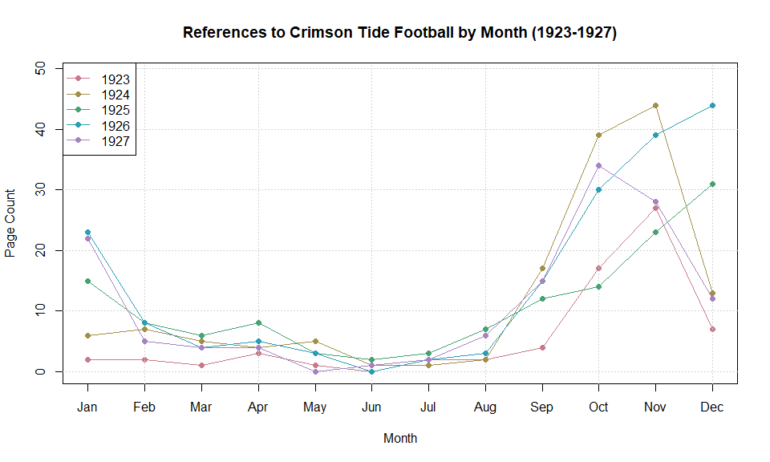
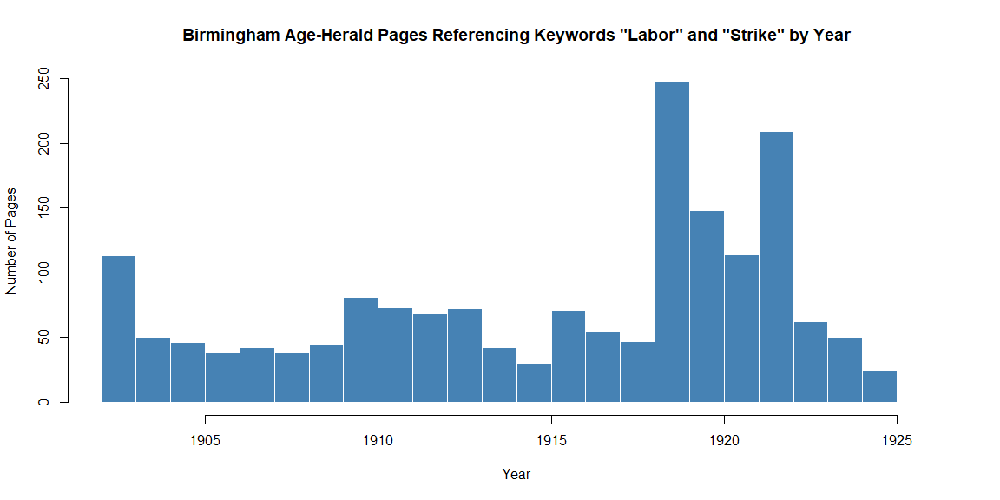

# Library of Congress API in R

By Michael T. Moen, Cyrus Gomes, Adam M. Nguyen, and Vincent F. Scalfani

The Library of Congress (loc\.gov) API provides programmatic access to Chronicling America, a vast collection of historic American newspapers, and other resources, enabling researchers and developers to search, retrieve, and analyze digitized newspaper pages and metadata.

Please see the following resources for more information on API usage:

- Documentation
  - <a href="https://www.loc.gov/apis/" target="_blank">APIs for LoC\.gov</a>
  - <a href="https://libraryofcongress.github.io/data-exploration/intro.html" target="_blank">Library of Congress Tutorials for Data Exploration</a>
  - <a href="https://www.loc.gov/apis/json-and-yaml/" target="_blank">JSON/YAML for LoC\.gov</a>
- Terms
  - <a href="https://www.loc.gov/apis/json-and-yaml/working-within-limits/" target="_blank">Working Within Limits</a>
- Data Reuse
  - <a href="https://www.loc.gov/legal/" target="_blank">Library of Congress Legal Notice</a>
  - <a href="https://www.loc.gov/collections/chronicling-america/about-this-collection/rights-and-access/" target="_blank">Library of Congress Rights and Access</a>

*These recipe examples were tested on March 23, 2026.*

> **Attribution:** We thank ***Professor Jessica Robertson*** (UA Libraries, Hoole Special Collections) for helpful discussions. All data was collected from the Library of Congress, Chronicling America: Historic American Newspapers site, using the API.

> Note that the University of Alabama Libraries has contributed content to Chronicling America: <a href="https://www.loc.gov/ndnp/awards/" target="_blank">https://www.loc.gov/ndnp/awards/</a>

## Setup

The following packages need to be installed into your environment to run the code examples in this tutorial. These packages can be installed with `install.packages()`.

- <a href="https://cran.r-project.org/web/packages/httr/index.html" target="_blank">httr: Tools for Working with URLs and HTTP</a>
- <a href="https://cran.r-project.org/web/packages/jsonlite/index.html" target="_blank">jsonlite: A Simple and Robust JSON Parser and Generator for R</a>
- <a href="https://cran.r-project.org/web/packages/qpdf/index.html" target="_blank">qpdf: Split, Combine and Compress PDF Files</a>

We load the libraries used in this tutorial below:


``` r
library(httr)
library(jsonlite)
library(qpdf)
```

## 1. Retrieve Publication Information by LCCN

A Library of Congress Control Number (LCCN) is a unique ID used to identify records within the Library of Congress. The loc\.gov API identifies newspapers and other records using LCCNs. We can query the API once we have the LCCN for the newspaper and even ask for particular issues and editions. For example, the following link lists newspapers published in the state of Alabama, from which the LCCN can be obtained: <a href="https://chroniclingamerica.loc.gov/newspapers/?state=Alabama" target="_blank">Chronicling America: Alabama Newspapers</a>.

Here is an example with the Alabama State Intelligencer:


``` r
BASE_URL <- "https://www.loc.gov/"
endpoint <- "item"
lccn <- "sn84021903"
params <- list(
  fo = "json"
)

# Retrieve API response
response <- GET(paste0(BASE_URL, endpoint, "/", lccn), query = params)

# Status code 200 indicates success
response$status_code
```

```
## [1] 200
```


``` r
# Extract JSON data from the response
data <- fromJSON(rawToChar(response$content))

# Print the structure of the response
str(data, max.level = 1)
```

```
## List of 12
##  $ articles_and_essays: NULL
##  $ calendar_url       : chr "https://www.loc.gov/item/sn84021903/?st=calendar"
##  $ cite_this          :List of 3
##  $ front_pages_url    : chr "https://www.loc.gov/search/?dl=page&fa=partof:chronicling+america%7Cnumber_page:0000000001%7Cnumber_lccn:sn8402"| __truncated__
##  $ holdings_url       : chr "https://www.loc.gov/item/sn84021903/?st=holdings"
##  $ item               :List of 84
##  $ more_like_this     :'data.frame':	6 obs. of  36 variables:
##  $ options            :List of 90
##  $ related_items      :'data.frame':	6 obs. of  29 variables:
##  $ resources          : list()
##  $ timestamp          : num 1.77e+12
##  $ title_image_url    : chr "https://tile.loc.gov/image-services/iiif/service:ndnp:au:batch_au_abernethy_ver01:data:sn84021903:00414187432:1"| __truncated__
```

Indexing into the JSON output allows data to be extracted using key names as demonstrated below:


``` r
data$item$title
```

```
## [1] "Alabama State Intelligencer (Tuscaloosa, Ala.) 1829-183?"
```


``` r
data$item$created_published
```

```
## [1] "Tuscaloosa, Ala. : M'Guire, Henry & M'Guire, 1829-"
```

## 2. Download an Issue as PDF and Full Text

Moving on to another publication, we can get *The Ocala Evening Star* newspaper published on July 29th, 1897.


``` r
endpoint <- "item"
lccn <- "sn84027621"
date <- "1897-07-29"
edition <- "ed-1"
params <- list(
  fo = "json"
)
response <- GET(paste0(BASE_URL, endpoint, "/", lccn, "/", date, "/", edition),
                query = params)

# Status code 200 indicates success
response$status_code
```

```
## [1] 200
```

Notice from the response below that we could use `next_issue` or `previous_issue` to gather batches of issues from the same publication.


``` r
# Extract JSON data from the response
data <- fromJSON(rawToChar(response$content))

# Print structure of the response
str(data, max.level = 1)
```

```
## List of 14
##  $ articles_and_essays: NULL
##  $ calendar_url       : chr "https://www.loc.gov/item/sn84027621/?st=calendar"
##  $ cite_this          :List of 3
##  $ item               :List of 80
##  $ locations          : NULL
##  $ method             : chr "mets_filesec"
##  $ more_like_this     :'data.frame':	6 obs. of  36 variables:
##  $ next_issue         : chr "https://www.loc.gov/item/sn84027621/1897-07-30/ed-1/?fo=json"
##  $ options            :List of 91
##  $ previous_issue     : chr "https://www.loc.gov/item/sn84027621/1897-07-28/ed-1/?fo=json"
##  $ related_items      :'data.frame':	6 obs. of  30 variables:
##  $ resources          :'data.frame':	1 obs. of  4 variables:
##  $ timestamp          : num 1.77e+12
##  $ title_url          : chr "https://www.loc.gov/item/sn84027621"
```

The `resources` section of the response contains PDF data for each page of the issue. We extract this data below.


``` r
page_urls <- c()
for (page in data$resources$files[[1]]) {
  for (i in seq_len(nrow(page))) {
    row <- page[i, ]
    if (row$mimetype == "application/pdf") {
      page_urls <- c(page_urls, row$url)
    }
  }
}

page_urls
```

```
## [1] "https://tile.loc.gov/storage-services/service/ndnp/fu/batch_fu_anderson_ver02/data/sn84027621/00295872287/1897072901/0502.pdf"
## [2] "https://tile.loc.gov/storage-services/service/ndnp/fu/batch_fu_anderson_ver02/data/sn84027621/00295872287/1897072901/0503.pdf"
## [3] "https://tile.loc.gov/storage-services/service/ndnp/fu/batch_fu_anderson_ver02/data/sn84027621/00295872287/1897072901/0504.pdf"
## [4] "https://tile.loc.gov/storage-services/service/ndnp/fu/batch_fu_anderson_ver02/data/sn84027621/00295872287/1897072901/0505.pdf"
```

Finally, we retrieve the PDF file from each URL and merge them to one PDF using the `pdf_combine` function from `qpdf`.


``` r
temp_files <- c()

for (url in page_urls) {
  temp_file <- tempfile(fileext = ".pdf")
  response <- GET(url)
  writeBin(content(response, "raw"), temp_file)
  temp_files <- c(temp_files, temp_file)
  Sys.sleep(1)
}

output_file <- paste0(lccn, "_", date, "_", edition, ".pdf")

# Merge PDFs
pdf_combine(input = temp_files, output = output_file)
```

### Retrieve Full-Text of the First Page

We can also retrieve the text data retrieved from Optical Character Recognition (OCR) using a similar method.


``` r
full_text_urls <- c()
for (page in data$resources$files[[1]]) {
  for (i in seq_len(nrow(page))) {
    row <- page[i, ]
    if (row$mimetype == "text/plain") {
      full_text_urls <- c(full_text_urls, row$fulltext_service)
    }
  }
}

full_text_urls
```

```
## [1] "https://tile.loc.gov/text-services/word-coordinates-service?segment=/service/ndnp/fu/batch_fu_anderson_ver02/data/sn84027621/00295872287/1897072901/0502.xml&format=alto_xml&full_text=1"
## [2] "https://tile.loc.gov/text-services/word-coordinates-service?segment=/service/ndnp/fu/batch_fu_anderson_ver02/data/sn84027621/00295872287/1897072901/0503.xml&format=alto_xml&full_text=1"
## [3] "https://tile.loc.gov/text-services/word-coordinates-service?segment=/service/ndnp/fu/batch_fu_anderson_ver02/data/sn84027621/00295872287/1897072901/0504.xml&format=alto_xml&full_text=1"
## [4] "https://tile.loc.gov/text-services/word-coordinates-service?segment=/service/ndnp/fu/batch_fu_anderson_ver02/data/sn84027621/00295872287/1897072901/0505.xml&format=alto_xml&full_text=1"
```


``` r
# Retrieve the data for the first page
response <- GET(full_text_urls[1])

# Status code 200 indicates success
response$status_code
```

```
## [1] 200
```


``` r
# Extract the full text from the response
full_text_key <- sub(".*segment=([^&]+).*", "\\1", full_text_urls[1])
parsed <- fromJSON(content(response, "text", encoding = "UTF-8"))
text <- parsed[[full_text_key]]$full_text

# Standardize all whitespace
clean_text <- gsub("\\s+", " ", text)

# Print first 1000 characters
cat(substr(clean_text, 1, 1000))
```

```
## 4 Volume III., Number 37 OCALA, FLORIDA, THURSDAY, JULY 29, 1897 Price 5 Cents A LA A PLAIN STATEMENT. List. Editor Harris and the Tax Let us Fulfill the Law. When our rights in the Marion county delinquent tax list vere threatened by resolutions passed by the county executive commit tee and when we learned that at torneys had been employed by editor F. E. Harris to break up our contract and being assured that a majority of the new board of county commissioners were opposed to us, we were forced to employ council and go into the courts to protect our interests. We were regularly and legally appointed to perform a public service, that of printing the tax sale list and in order, to perform that service, we had to purchase $500 worth of printing material. It would have been great folly in us to have sat down and allowed editor Harris to force this busi ness away from us by unfair and illegal measures after we had gone to so much expense in get ting ready to do it, "Self pre servation is t
```

## 3. Searching for Alabama Football from the Mid 1920s

In this example, we use the `collections` endpoint with the `chronicling-america` collection to search Chronicling America for a specific search phrase. We use the parameters below to achieve this:

- `searchType`: This must be specified as `advanced` to use many of the filters in this example.
- `dl`: The display level of the results, which can be either `all`, `issue`, or `page`.
- `qs`: The search query. In this example, we search for pages with "University of Alabama" and "Football" as search queries.
- `ops`: The search operation. `PHRASE` indicates that we want an exact match for the first search phrase provided in `qs` and `AND` indicates that we want all words from the second search phrase included.
- `location_state`: Specifies a U.S. state of origin for results.
- `start_date` and `end_date`: Limits for publication dates of queried pages.
- `c`: The number of results to return in each page of the query. This is 40 by default and can range anywhere from 1 to 1000.
- `sp`: The page number of the response.


``` r
endpoint <- "collections/chronicling-america/"
params <- list(
  searchType = "advanced",
  dl = "page",
  qs = "Crimson Tide!Football",
  ops = "PHRASE!AND",
  location_state = "Alabama",
  start_date = "1923-01-01",
  end_date = "1927-12-31",
  c = 1000,
  sp = 1,
  fo = "json"
)
response <- GET(paste0(BASE_URL, endpoint), query = params)

# Extract JSON data from the response
data = fromJSON(rawToChar(response$content))

# Print number of results returned
nrow(data$results)
```

```
## [1] 653
```


``` r
# Dates as Date objects
dates <- as.Date(data$results$date, format = "%Y-%m-%d")

dates[1:10]
```

```
##  [1] "1927-11-09" "1926-12-19" "1926-12-23" "1927-09-24" "1924-10-29"
##  [6] "1926-01-01" "1927-12-09" "1926-12-08" "1926-10-30" "1923-11-27"
```


``` r
# Extract year and month
yrs <- as.integer(format(dates, "%Y"))
mos <- as.integer(format(dates, "%m"))

# Count occurrences per (year, month)
year_month_counts <- table(yrs, mos)

# Ensure all 12 months exist as columns
all_months <- 1:12
year_month_counts <- year_month_counts[, all_months, drop = FALSE]

# Labels
month_labels <- month.abb
years <- as.integer(rownames(year_month_counts))

# Define colors
cols <- hcl.colors(length(years), "Dark 2")

# Plot setup
plot(
  all_months,
  as.numeric(year_month_counts[1, ]),
  type = "o",
  col = cols[1],
  xaxt = "n",
  xlab = "Month",
  ylim = c(0, max(year_month_counts) + 5),
  pch = 16,
  ylab = "Page Count",
  main = "References to Crimson Tide Football by Month (1923-1927)"
)
axis(1, at = all_months, labels = month_labels)
grid()

# Add remaining years
for (r in 2:nrow(year_month_counts)) {
  lines(
    all_months,
    as.numeric(year_month_counts[r, ]),
    type = "o",
    col = cols[r],
    pch = 16
  )
}

legend(
  "topleft",
  legend = years,
  col = cols,
  lty = 1,
  pch = 16
)
```

<!-- -->

## 4. Mentions of Keywords in the Birmingham Age-Herald

In this example, we search each page of the Birmingham Age-Herald newspapers from the year 1902 to 1926 and for pages that contain keywords "labor" and "strike" within 10 words of each other.


``` r
endpoint <- "collections/chronicling-america/"
lccn <- "sn85038485" # LCCN for the Birmingham Age-Herald
params <- list(
  searchType = "advanced",
  dl = "page",
  qs = "labor strike",   # The search terms
  ops = "~10",   # Instances of the search terms above being within 10 words of each other
  location_state = "Alabama",
  start_date = "1902-01-01",
  end_date = "1926-12-31",
  c = 160,
  fa = paste0("number_lccn:", lccn),
  fo = "json"
)
response <- GET(paste0(BASE_URL, endpoint), query = params)

# Extract data from response
data <- fromJSON(rawToChar(response$content))

# Print total number of results
data$pagination$of
```

```
## [1] 1766
```

### Page Through Results

Above, we queried for 160 records (denoted by the `c` parameter), but we see that the total number of results is greater than 1000. To retrieve all the records from this query, we can page through the results:


``` r
# Create data structure to store response data
bham_strike <- data$results

# Get URL for pagination
next_url <- data$pagination$`next`

# Page through results
while (!is.null(next_url)) {
  response <- GET(next_url)
  data <- fromJSON(rawToChar(response$content))
  bham_strike <- rbind(bham_strike, data$results)
  next_url <- data$pagination$`next`
  Sys.sleep(4)
}

# Print number of results
nrow(bham_strike)
```

```
## [1] 1766
```

### Plot Results


``` r
# Convert to Date objects
dates <- as.Date(bham_strike$date, format = "%Y-%m-%d")

# Extract years
years <- as.integer(format(dates, "%Y"))

# Determine bin range
min_year <- min(years)
max_year <- max(years)

bins <- seq(min_year, max_year + 1, by = 1)

# Plot histogram
hist(
  years,
  breaks = bins,
  col = "steelblue",
  border = "white",
  main = "Birmingham Age-Herald Pages Referencing Keywords \"Labor\" and \"Strike\" by Year",
  xlab = "Year",
  ylab = "Number of Pages"
)
```

<!-- -->
