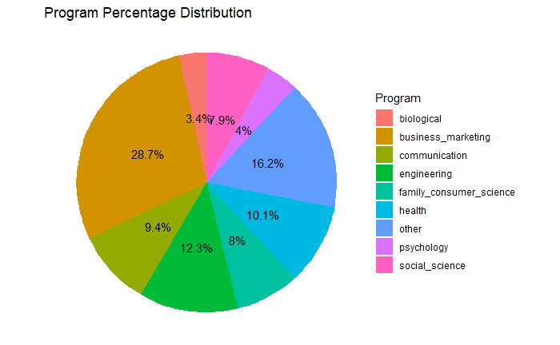

# College Scorecard API in R

by Michael T. Moen

**College Scorecard API Documentation:** <https://collegescorecard.ed.gov/data/api-documentation/>

**College Scorecard Copyright Status:** <https://www2.ed.gov/notices/copyright/index.html>

The College Scorecard API is an online tool hosted by the U.S. Department of Education that contains data concerning higher education institutions.

See the bottom of the document for information on R and package versions.

*These recipe examples were tested on February 7, 2025.*

## Setup

### API Key

An API key is required to access the College Scorecard API. This API key can be obtained [here](https://collegescorecard.ed.gov/data/api-documentation#api-access-and-authentication). The key is imported from an environment variable below:

```{r}
key <- Sys.getenv("college_scorecard_key")
```

### Import Libraries

Run the following lines of code to load the libraries ‘httr’ and ‘jsonlite’. If you have not done so already, additionally, before the ‘library()’ functions, run ‘install.packages(c(‘httr’,’jsonlite’))’.

```{r}
library(httr)
library(jsonlite)
library(dplyr)
library(ggplot2)
library(scales)
```

## 1. Get names of all institutions

To start, we'll use a basic query to find the names of all educational institutions recognized by the College Scorecard API.

All of the data for the API can be found using the `v1/schools` endpoint.

Fields in the College Scorecard API are accessed with a `<time>.<category>.<name>` sequence:
- `<time>` indicates the year of the data to be accessed. To access the most recent data, use `latest`.
- `<category>` and `<name>` can be found in the Data Dictionary file that can be downloaded from the API's documentation. The `<category>` of a field is given by the `dev-category` column in the `Institution_Data_Dictionary` section, and the `<name>` is given by the `developer-friendly name` column.

```{r}
# Define base URL
base_url <- paste0("http://api.data.gov/ed/collegescorecard/v1/schools?")

# Define parameters
field <- "school.name"

# Perform HTTP GET request
response <- GET(paste0(base_url, "fields=", field, "&api_key=", key))

# Status code 200 indicates success
response$status_code
```

```
## [1] 200
```

```{r}
names_data <- fromJSON(rawToChar(response$content))
names_data$metadata
```

```
## $page
## [1] 0
## 
## $total
## [1] 6484
## 
## $per_page
## [1] 20
```

The `total` value indicates the total number results returned in this query. These results are paginated, so each query will return only the number indicated by `page_size`, which has a default value of 20 and a maximum value of 100. The page number is indicated by `page`, which by default is set to 0.

We can use a loop to create an API request for each page:

```{r}
sort_key <- "school.name"
page_size <- 100

total_pages <- ceiling(names_data$metadata$total / page_size)
institution_names <- c()

for (page_number in 0:(total_pages - 1)) {
  url <- paste0(base_url,
                "fields=", field,
                "&page=", page_number,
                "&per_page=", page_size,
                "&sort=", sort_key,
                "&api_key=", key)
  name_data <- fromJSON(rawToChar(GET(url)$content))$results
  for (institution in name_data) {
    institution_names <- c(institution_names, institution)
  }
  Sys.sleep(1)
}

length(institution_names)
```

```
## [1] 6484
```

```{r}
head(institution_names, 10)
```

```
## [1] "A Better U Beauty Barber Academy"
## [2] "A T Still University of Health Sciences"
## [3] "Aaniiih Nakoda College"                           
## [4] "ABC Adult School"
## [5] "ABC Adult School - Cabrillo Lane"
## [6] "ABC Beauty Academy"                               
## [7] "ABCO Technology"
## [8] "Abcott Institute"
## [9] "Abilene Christian University"                     
## [10] "Abilene Christian University-Undergraduate Online"
```

## 2. Get names of all universities

College Scorecard API requests can also take conditions to only select certain institutions.

In this example, we limit the results to only include institutions that award graduate degrees. In order to do this, we set the `degrees_awarded.highest` parameter to `4` to indicate that the highest degree awarded by an institution is a graduate degree. This information is within the `Institution_Data_Dictionary` section of the College Scorecard data disctionary.

```{r}
condition <- "latest.school.degrees_awarded.highest=4"
field <- "school.name"
sort_key <- "school.name"
page_size <- 100

response <- GET(paste0(base_url, condition, "&fields=", field, "&api_key=", key))
names_data <- fromJSON(rawToChar(response$content))
total_pages <- ceiling(names_data$metadata$total / page_size)

university_names <- c()

for (page_number in 0:(total_pages - 1)) {
  url <- paste0(base_url, condition,
                "&fields=", field,
                "&page=", page_number,
                "&per_page=", page_size,
                "&sort=", sort_key,
                "&api_key=", key)
  name_data <- fromJSON(rawToChar(GET(url)$content))$results
  for (university in name_data) {
    university_names <- c(university_names, university)
  }
  Sys.sleep(1)
}

length(university_names)
```

```
## [1] 1985
```

```{r}
head(university_names, 10)
```

```
## [1] "A T Still University of Health Sciences"
## [2] "Abilene Christian University"
## [3] "Abraham Lincoln University"                           
## [4] "Academy for Five Element Acupuncture"
## [5] "Academy for Jewish Religion"
## [6] "Academy for Jewish Religion California"               
## [7] "Academy of Art University"
## [8] "Academy of Chinese Culture and Health Sciences"
## [9] "Academy of Vocal Arts"                                
## [10] "Acupuncture and Integrative Medicine College-Berkeley"
```

## 3. Find number of universities by state

The `school.state_fips` data element contains a number that corresponds to each state. This mapping is given below:

```{r}
states <- list(
    "1" = "Alabama", "2" = "Alaska", "4" = "Arizona", "5" = "Arkansas", "6" = "California",
    "8" = "Colorado", "9" = "Connecticut", "10" = "Delaware", "11" = "District of Columbia",
    "12" = "Florida", "13" = "Georgia", "15" = "Hawaii", "16" = "Idaho", "17" = "Illinois",
    "18" = "Indiana", "19" = "Iowa", "20" = "Kansas", "21" = "Kentucky", "22" = "Louisiana",
    "23" = "Maine", "24" = "Maryland", "25" = "Massachusetts", "26" = "Michigan",
    "27" = "Minnesota", "28" = "Mississippi", "29" = "Missouri", "30" = "Montana",
    "31" = "Nebraska", "32" = "Nevada", "33" = "New Hampshire", "34" = "New Jersey",
    "35" = "New Mexico", "36" = "New York", "37" = "North Carolina", "38" = "North Dakota",
    "39" = "Ohio", "40" = "Oklahoma", "41" = "Oregon", "42" = "Pennsylvania",
    "44" = "Rhode Island", "45" = "South Carolina", "46" = "South Dakota",  "47" = "Tennessee",
    "48" = "Texas", "49" = "Utah", "50" = "Vermont", "51" = "Virginia", "53" = "Washington",
    "54" = "West Virginia", "55" = "Wisconsin", "56" = "Wyoming", "60" = "American Samoa",
    "64" = "Federated States of Micronesia", "66" = "Guam", "69" = "Northern Mariana Islands",
    "70" = "Palau", "72" = "Puerto Rico", "78" = "Virgin Islands"
)
```

Using this mapping, we can find the number of universities in each state:

```{r}
condition <- "latest.school.degrees_awarded.highest=4"
field <- "latest.school.state_fips"
page_size <- 100

response <- GET(paste0(base_url, condition, "&fields=", field, "&api_key=", key))
state_data <- fromJSON(rawToChar(response$content))
total_pages <- ceiling(names_data$metadata$total / page_size)

state_freq <- list()

for (page_number in 0:(total_pages - 1)) {
  url <- paste0(base_url, condition,
                "&fields=", field,
                "&page=", page_number,
                "&per_page=", page_size,
                "&api_key=", key)
  state_data <- fromJSON(rawToChar(GET(url)$content))$results
  state_fips_codes <- as.character(state_data$latest.school.state_fips)
  for (state_fips in state_fips_codes) {
    state_name <- states[[state_fips]]
      state_freq[[state_name]] <- ifelse(is.null(state_freq[[state_name]]), 1, state_freq[[state_name]] + 1)
  }
  Sys.sleep(1)
}
```

Now, we can sort and display the results:

```{r}
# Convert state_freq to a data frame
state_freq_df <- data.frame(
  state = names(state_freq),
  num_universities = unlist(state_freq)
)

# Sort by number of universities in descending order
sorted_states <- state_freq_df[order(-state_freq_df$num_universities), ]

# Print top 10 results
head(sorted_states, 10)
```

```
##                  num_universities
## California       207		
## New York         155		
## Pennsylvania     109		
## Texas            105		
## Illinois         81		
## Florida          75		
## Massachusetts    73		
## Ohio             65		
## Missouri         56		
## North Carolina   55	
```

## 4. Retrieving multiple data points in a single query

The following example uses multiple conditions and multiple fields. The conditions in the query are separated by `&` while the fields are separated by `,`.

```{r}
conditions <- paste0(
  "latest.school.degrees_awarded.highest=4", "&",
  "latest.student.size__range=1000.."  # Limit results to schools with 1000+ students
)

fields <- paste0(
  "school.name,",
  "latest.admissions.admission_rate.overall,",
  "latest.student.size,",
  "latest.cost.tuition.out_of_state,",
  "latest.cost.tuition.in_state,",
  "latest.student.demographics.median_hh_income,",
  "latest.school.endowment.begin"
)
sort_key <- "school.name"
page_size <- 100

response <- GET(paste0(base_url, conditions, "&fields=", fields, "&api_key=", key))
names_data <- fromJSON(rawToChar(response$content))
total_pages <- ceiling(names_data$metadata$total / page_size)

rows <- list()

for (page_number in 0:(total_pages - 1)) {
  url <- paste0(base_url, conditions,
                "&fields=", fields,
                "&page=", page_number,
                "&per_page=", page_size,
                "&sort=", sort_key,
                "&api_key=", key)
  data <- fromJSON(rawToChar(GET(url)$content))$results
  for (university in 1:nrow(data)) {
    row <- list(
      Name = data$school.name[university],
      Admission_Rate = data$latest.admissions.admission_rate.overall[university],
      Size = data$latest.student.size[university],
      Tuition_Out_State = data$latest.cost.tuition.out_of_state[university],
      Tuition_In_State = data$latest.cost.tuition.in_state[university],
      Median_HH_Income = data$latest.student.demographics.median_hh_income[university],
      Endowment = data$latest.school.endowment.begin[university]
    )
    rows <- append(rows, list(row))
  }
  Sys.sleep(1)
}

df <- bind_rows(rows)

# Print first 10 rows
head(df, 10)
```

```
##   Name                         Admission_Rate  Size Tuition_Out_State Tuition_In_State Median_HH_Income Endowment
##  1 Abilene Christian University         0.658  3141             40500            40500            67136 621200594
##  2 Academy of Art University            NA     4485             26728            26728            74015        NA
##  3 Adams State University               0.992  1307             21848             9776            50726     62673
##  4 Adelphi University                   0.728  5004             43800            43800            80864 235144798
##  5 Adrian College                       0.691  1688             39596            39596            66915  46226719
##  6 Alabama A & M University             0.684  5196             18634            10024            49720        NA
##  7 Alabama State University             0.966  3296             19396            11068            46065 130589167
##  8 Albany State University              NA     5645             16656             5934            52181   4114598
##  9 Albright College                     0.849  1276             28230            28230            69057  67451308
## 10 Alcorn State University              0.299  2344              8549             8549            38329  21283437
```

We can query the resulting dataframe to find the data for specific universities:

```{r}
ua_df <- df[df$Name == "The University of Alabama", ]
print(ua_df)
```

```
##   Name                      Admission_Rate  Size Tuition_Out_State Tuition_In_State Median_HH_Income  Endowment
## 1 The University of Alabama          0.801 31360             32300            11940            57928 1237611651
```

We can also query the dataframe to find the data for universities that satisfy certain conditions:

```{r}
filtered_df <- df[df$Admission_Rate < 0.1, ]
filtered_df <- na.omit(filtered_df)
filtered_df <- filtered_df[order(filtered_df$Admission_Rate), ]
print(filtered_df)
```

```
##    Name                                        Admission_Rate  Size Tuition_Out_State Tuition_In_State Median_HH_Income   Endowment
##  1 Harvard University                                  0.0324  7973             57261            57261            76879 53165753000
##  2 Stanford University                                 0.0368  7761             58416            58416            80275 37788187000
##  3 Columbia University in the City of New York         0.0395  8902             66139            66139            76971 14349970000
##  4 Massachusetts Institute of Technology               0.0396  4638             57986            57986            77426 27394039000
##  5 Yale University                                     0.0457  6639             62250            62250            75345 42282852000
##  6 Brown University                                    0.0506  7222             65146            65146            79027  6520175000
##  7 University of Chicago                               0.0543  7511             64260            64260            74573  9594956009
##  8 Princeton University                                0.057   5527             57410            57410            81428 37026442000
##  9 Duke University                                     0.0635  6570             62688            62688            78468 12692472000
## 10 Dartmouth College                                   0.0638  4412             62658            62658            79834  8484189450
## 11 University of Pennsylvania                          0.065  10572             63452            63452            78252 20523546000
## 12 Vanderbilt University                               0.0667  7144             60348            60348            76279 10928512332
## 13 Northeastern University                             0.068  16172             60192            60192            80190  1365215950
## 14 Northwestern University                             0.0721  8837             63468            63468            81811 11361182000
## 15 Johns Hopkins University                            0.0725  5643             60480            60480            81539  9315279000
## 16 Cornell University                                  0.0747 15676             63200            63200            80346  9485887743
## 17 Williams College                                    0.085   2138             61770            61770            77966  3911574095
## 18 University of California-Los Angeles                0.0857 32423             43473            13401            72896  3161977000
## 19 Rice University                                     0.0868  4480             54960            54960            77707  8080292000
## 20 Tufts University                                    0.0969  6747             65222            65222            82793  2646506000
```

```{r}
filtered_df <- df[df$Endowment > 1.0e+10, ]
filtered_df <- na.omit(filtered_df)
filtered_df <- filtered_df[order(-filtered_df$Endowment), ]
print(filtered_df)
```

```
##    Name                                        Admission_Rate  Size Tuition_Out_State Tuition_In_State Median_HH_Income   Endowment
##  1 Harvard University                                  0.0324  7973             57261            57261            76879 53165753000
##  2 Yale University                                     0.0457  6639             62250            62250            75345 42282852000
##  3 Stanford University                                 0.0368  7761             58416            58416            80275 37788187000
##  4 Princeton University                                0.057   5527             57410            57410            81428 37026442000
##  5 Massachusetts Institute of Technology               0.0396  4638             57986            57986            77426 27394039000
##  6 University of Pennsylvania                          0.065  10572             63452            63452            78252 20523546000
##  7 University of Notre Dame                            0.129   8917             60301            60301            76710 18385354000
##  8 Texas A & M University-College Station              0.626  56792             40139            13239            67194 16895619110
##  9 University of Michigan-Ann Arbor                    0.177  32448             55334            16736            77145 16795776000
## 10 Columbia University in the City of New York         0.0395  8902             66139            66139            76971 14349970000
## 11 Washington University in St Louis                   0.118   7801             60590            60590            79298 13668081000
## 12 Duke University                                     0.0635  6570             62688            62688            78468 12692472000
## 13 Emory University                                    0.114   7017             57948            57948            80509 12218692520
## 14 Northwestern University                             0.0721  8837             63468            63468            81811 11361182000
## 15 Vanderbilt University                               0.0667  7144             60348            60348            76279 10928512332
## 16 University of Virginia-Main Campus                  0.187  17103             55914            20342            79524 10366577975
```

## 5. Retrieving all data for an institution

The College Scorecard API can also be used to retrieve all of the data for a particular institution. The example below finds all data for The University of Alabama:

```{r}
# Define condition with URL encoding
conditions <- "school.name=The%20University%20of%20Alabama"

url <- paste0(base_url, conditions, "&api_key=", key)
ua_data <- fromJSON(rawToChar(GET(url)$content))$results
```

Finally, we'll look at the breakdown of size of each program at the University of Alabama:

```{r}
# Extract program percentage data
program_percentage_data <- ua_data[[1]]$academics$program_percentage

# Convert list to data frame
programs <- names(program_percentage_data)
percentages <- as.numeric(program_percentage_data)
data <- data.frame(Program = programs, Percentage = percentages)

# Threshold for small sectors
smallest_percent_allowed <- 0.03
small_slices <- data$Percentage < smallest_percent_allowed

# Combine small slices into "Other" if more than one exists
if (sum(small_slices) > 1) {
  other_percentage <- sum(data$Percentage[small_slices])
  data <- data[!small_slices, ]  # Remove small slices
  data <- rbind(data, data.frame(Program = "other", Percentage = other_percentage))
}

# Create pie chart with color mapping
ggplot(data, aes(x = "", y = Percentage, fill = Program)) +
  geom_bar(stat = "identity", width = 1) +
  coord_polar("y", start = 0) +
  scale_fill_manual(values = scales::hue_pal()(nrow(data))) +
  theme_void() +
  geom_text(aes(label = paste0(round(Percentage * 100, 1), "%")), 
            position = position_stack(vjust = 0.5)) +
  labs(title = "Program Percentage Distribution")
```



```{r}
# Sort the list by values in descending order
sorted_program_percentage_data <- program_percentage_data[order(-unlist(program_percentage_data))]

# Print the sorted data
for (key in names(sorted_program_percentage_data)) {
  cat(paste(key, ":", sorted_program_percentage_data[[key]], "\n"))
}
```

```
## business_marketing : 0.2868 
## engineering : 0.1235 
## health : 0.1008 
## communication : 0.0944 
## family_consumer_science : 0.0798 
## social_science : 0.0786 
## psychology : 0.0403 
## biological : 0.0341 
## parks_recreation_fitness : 0.0268 
## education : 0.0243 
## visual_performing : 0.021 
## multidiscipline : 0.0141 
## computer : 0.0139 
## public_administration_social_service : 0.0111 
## english : 0.0105 
## mathematics : 0.0095 
## physical_science : 0.0095 
## history : 0.0087 
## language : 0.0042 
## resources : 0.0036 
## philosophy_religious : 0.0028 
## ethnic_cultural_gender : 0.0016 
## legal : 0 
## library : 0 
## military : 0 
## humanities : 0 
## agriculture : 0 
## architecture : 0 
## construction : 0 
## transportation : 0 
## personal_culinary : 0 
## science_technology : 0 
## precision_production : 0 
## engineering_technology : 0 
## security_law_enforcement : 0 
## communications_technology : 0 
## mechanic_repair_technology : 0 
## theology_religious_vocation : 0 
```

## R Session Info

```{r}
sessionInfo()
```

```
## R version 4.4.2 (2024-10-31 ucrt)
## Platform: x86_64-w64-mingw32/x64
## Running under: Windows 11 x64 (build 22631)
## 
## Matrix products: default
## 
## locale:
## [1] LC_COLLATE=English_United States.utf8
## [2] LC_CTYPE=English_United States.utf8
## [3] LC_MONETARY=English_United States.utf8
## [4] LC_NUMERIC=C                          
## [5] LC_TIME=English_United States.utf8    
## 
## time zone: America/Chicago
## tzcode source: internal
## 
## attached base packages:
## [1] stats     graphics  grDevices utils     datasets  methods   base     
## 
## other attached packages:
## [1] scales_1.3.0   ggplot2_3.5.1  dplyr_1.1.4    jsonlite_1.8.9 httr_1.4.7    
## 
## loaded via a namespace (and not attached):
##  [1] vctrs_0.6.5       cli_3.6.3         knitr_1.49        rlang_1.1.4
##  [5] xfun_0.50         generics_0.1.3    labeling_0.4.3    glue_1.8.0
##  [9] colorspace_2.1-1  htmltools_0.5.8.1 rmarkdown_2.29    grid_4.4.2
## [13] munsell_0.5.1     evaluate_1.0.3    tibble_3.2.1      fastmap_1.2.0
## [17] yaml_2.3.10       lifecycle_1.0.4   compiler_4.4.2    pkgconfig_2.0.3
## [21] farver_2.1.2      digest_0.6.37     R6_2.5.1          tidyselect_1.2.1
## [25] utf8_1.2.4        pillar_1.10.1     curl_6.1.0        magrittr_2.0.3
## [29] withr_3.0.2       tools_4.4.2       gtable_0.3.6   
```
