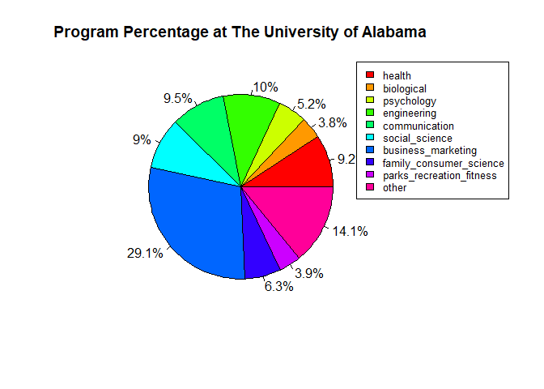

# College Scorecard API in R

by Michael T. Moen

The College Scorecard API is an online tool hosted by the U.S. Department of Education that contains data concerning higher education institutions.

Please see the following resources for more information on API usage:

- Documentation
    - <a href="https://collegescorecard.ed.gov/data/api-documentation/" target="_blank">College Scorecard API Documentation</a>
- Data Reuse
    - <a href="https://www.ed.gov/about/ed-overview/required-notices/website-policies/copyright-status-notice-us-department-of-education" target="_blank">College Scorecard Copyright Status</a>
    - <a href="https://data.gov/privacy-policy/" target="_blank">Data\.gov Privacy Policy</a>

**_NOTE:_** The College Scorecard API limits requests to a maximum of 1000 requests per IP address per hour.

*These recipe examples were tested on March 23, 2026.*

## Setup

### Load Libraries

The following packages need to be installed into your environment to run the code examples in this tutorial. These packages can be installed with `install.packages()`.

- <a href="https://cran.r-project.org/web/packages/httr/index.html" target="_blank">httr: Tools for Working with URLs and HTTP</a>
- <a href="https://cran.r-project.org/web/packages/jsonlite/index.html" target="_blank">jsonlite: A Simple and Robust JSON Parser and Generator for R</a>

We load the libraries used in this tutorial below:


``` r
library(httr)
library(jsonlite)
```

### Import API Key

An API key is required for to access the College Scorecard API. You can sign up for one at <a href="https://collegescorecard.ed.gov/data/api-documentation#api-access-and-authentication" target="_blank">College Scorecard Website</a>.

We keep our token in a `.Renviron` file that is stored in the working directory and use `Sys.getenv()` to access it. The `.Renviron` should have an entry like the one below.

```text
COLLEGE_SCORECARD_API_KEY="PUT_YOUR_API_KEY_HERE"
```

Below, we can test to whether the key was successfully imported.


``` r
if (nzchar(Sys.getenv("COLLEGE_SCORECARD_API_KEY"))) {
  print("API key successfully loaded.")
} else {
  warning("API key not found or is empty.")
}
```

```
## [1] "API key successfully loaded."
```

## 1. Get Names of All Institutions

To start, we'll use a basic query to find the names of all educational institutions recognized by the College Scorecard API.

All of the data for the API can be found using the `v1/schools` endpoint.

Fields in the College Scorecard API are accessed with a `<time>.<category>.<name>` sequence:
- `<time>` indicates the year of the data to be accessed. To access the most recent data, use `latest`.
- `<category>` and `<name>` can be found in the Data Dictionary file that can be downloaded from the API's documentation. The `<category>` of a field is given by the `dev-category` column in the `Institution_Data_Dictionary` section, and the `<name>` is given by the `developer-friendly name` column.


``` r
# Define base URL
BASE_URL <- "https://api.data.gov/ed/collegescorecard/v1/schools?"

# Define parameters
params <- list(
  fields = "school.name",
  api_key = Sys.getenv("COLLEGE_SCORECARD_API_KEY")
)

# Perform HTTP GET request
response <- GET(BASE_URL, query = params)

# Status code 200 indicates success
response$status_code
```

```
## [1] 200
```


``` r
names_data <- fromJSON(rawToChar(response$content))
names_data$metadata
```

```
## $page
## [1] 0
## 
## $total
## [1] 6322
## 
## $per_page
## [1] 20
```

The `total` value indicates the total number results returned in this query. These results are paginated, so each query will return only the number indicated by `page_size`, which has a default value of 20 and a maximum value of 100. The page number is indicated by `page`, which by default is set to 0.

We can use a loop to create an API request for each page:


``` r
field <- "school.name"
sort_key <- "school.name"
page_size <- 100

total_pages <- ceiling(names_data$metadata$total / page_size)
institution_names <- c()

for (page_number in 0:(total_pages - 1)) {
  params <- list(
    fields = field,
    page = page_number,
    per_page = page_size,
    sort = sort_key,
    api_key = Sys.getenv("COLLEGE_SCORECARD_API_KEY")
  )
  response <- GET(BASE_URL, query = params)
  name_data <- fromJSON(rawToChar(response$content))$results
  institution_names <- c(institution_names, name_data$school.name)
  Sys.sleep(1)
}

# Print number of institutions returned
length(institution_names)
```

```
## [1] 6322
```


``` r
# Print first 10 institution names
institution_names[1:10]
```

```
##  [1] "A Better U Beauty Barber Academy"                 
##  [2] "A T Still University of Health Sciences"          
##  [3] "Aaniiih Nakoda College"                           
##  [4] "ABC Adult School"                                 
##  [5] "ABC Adult School - Cabrillo Lane"                 
##  [6] "ABC Beauty Academy"                               
##  [7] "ABCO Technology"                                  
##  [8] "Abcott Institute"                                 
##  [9] "Abilene Christian University"                     
## [10] "Abilene Christian University-Undergraduate Online"
```

## 2. Get Names of All Universities

College Scorecard API requests can also take conditions to only select certain institutions.

In this example, we limit the results to only include institutions that award graduate degrees. In order to do this, we set the `degrees_awarded.highest` parameter to `4` to indicate that the highest degree awarded by an institution is a graduate degree. This information is within the `Institution_Data_Dictionary` section of the College Scorecard data dictionary.


``` r
page_size <- 100
field <- "school.name"
sort_key <- "school.name"

params <- list(
  fields = field,
  latest.school.degrees_awarded.highest = 4,
  api_key = Sys.getenv("COLLEGE_SCORECARD_API_KEY")
)

response <- GET(BASE_URL, query = params)
names_data <- fromJSON(rawToChar(response$content))
total_pages <- ceiling(names_data$metadata$total / page_size)

university_names <- c()
for (page_number in 0:(total_pages - 1)) {
  params <- list(
    fields = field,
    latest.school.degrees_awarded.highest = 4,
    sort = sort_key,
    page = page_number,
    per_page = page_size,
    api_key = Sys.getenv("COLLEGE_SCORECARD_API_KEY")
  )
  response <- GET(BASE_URL, query = params)
  name_data <- fromJSON(rawToChar(response$content))$results
  university_names <- c(university_names, name_data[[field]])
  Sys.sleep(1)
}

# Print number of university names found
length(university_names)
```

```
## [1] 1987
```


``` r
# Print first 10 university names
university_names[1:10]
```

```
##  [1] "A T Still University of Health Sciences"              
##  [2] "Abilene Christian University"                         
##  [3] "Abraham Lincoln University"                           
##  [4] "Academy for Five Element Acupuncture"                 
##  [5] "Academy for Jewish Religion"                          
##  [6] "Academy for Jewish Religion California"               
##  [7] "Academy of Art University"                            
##  [8] "Academy of Chinese Culture and Health Sciences"       
##  [9] "Academy of Vocal Arts"                                
## [10] "Acupuncture and Integrative Medicine College-Berkeley"
```

## 3. Find Number of Universities by State

The `school.state_fips` data element contains a number that corresponds to each state. This mapping is given below:


``` r
states <- list(
  "1" = "Alabama", "2" = "Alaska", "4" = "Arizona", "5" = "Arkansas", "6" = "California",
  "8" = "Colorado", "9" = "Connecticut", "10" = "Delaware", "11" = "District of Columbia",
  "12" = "Florida", "13" = "Georgia", "15" = "Hawaii", "16" = "Idaho", "17" = "Illinois",
  "18" = "Indiana", "19" = "Iowa", "20" = "Kansas", "21" = "Kentucky", "22" = "Louisiana",
  "23" = "Maine", "24" = "Maryland", "25" = "Massachusetts", "26" = "Michigan",
  "27" = "Minnesota", "28" = "Mississippi", "29" = "Missouri", "30" = "Montana",
  "31" = "Nebraska", "32" = "Nevada", "33" = "New Hampshire", "34" = "New Jersey",
  "35" = "New Mexico", "36" = "New York", "37" = "North Carolina", "38" = "North Dakota",
  "39" = "Ohio", "40" = "Oklahoma", "41" = "Oregon", "42" = "Pennsylvania",
  "44" = "Rhode Island", "45" = "South Carolina", "46" = "South Dakota",  "47" = "Tennessee",
  "48" = "Texas", "49" = "Utah", "50" = "Vermont", "51" = "Virginia", "53" = "Washington",
  "54" = "West Virginia", "55" = "Wisconsin", "56" = "Wyoming", "60" = "American Samoa",
  "64" = "Federated States of Micronesia", "66" = "Guam", "69" = "Northern Mariana Islands",
  "70" = "Palau", "72" = "Puerto Rico", "78" = "Virgin Islands"
)
```

Using this mapping, we can find the number of universities in each state:


``` r
field <- "latest.school.state_fips"
page_size <- 100

# Calculate the number of loops needed to page through every result
params <- list(
  latest.school.degrees_awarded.highest = 4,
  fields = field,
  api_key = Sys.getenv("COLLEGE_SCORECARD_API_KEY")
)
response <- GET(BASE_URL, query = params)
state_data <- fromJSON(rawToChar(response$content))
total_pages <- ceiling(names_data$metadata$total / page_size)

state_freq <- list()
for (page_number in 0:(total_pages - 1)) {

  params <- list(
    latest.school.degrees_awarded.highest = 4,
    fields = field,
    page = page_number,
    per_page = page_size,
    api_key = Sys.getenv("COLLEGE_SCORECARD_API_KEY")
  )
  response <- GET(BASE_URL, query = params)
  state_data <- fromJSON(rawToChar(response$content))$results

  state_fips_codes <- as.character(state_data$latest.school.state_fips)
  for (state_fips in state_fips_codes) {
    state_name <- states[[state_fips]]
      state_freq[[state_name]] <- ifelse(is.null(state_freq[[state_name]]), 1, state_freq[[state_name]] + 1)
  }
  Sys.sleep(1)
}
```

Now, we can sort and display the results:


``` r
# Print the top 20 states/territories with the most universities
head(sort(unlist(state_freq), decreasing = TRUE), 20)
```

```
##     California       New York   Pennsylvania          Texas       Illinois 
##            203            149            112            105             79 
##        Florida  Massachusetts           Ohio North Carolina       Missouri 
##             72             72             70             57             56 
##       Virginia        Georgia        Indiana    Puerto Rico      Tennessee 
##             53             51             50             48             47 
##       Michigan      Minnesota      Wisconsin     New Jersey South Carolina 
##             45             40             38             37             35
```

## 4. Retrieve Multiple Data Points in a Single Query

The following example uses multiple conditions and multiple fields. The conditions in the query are separated by `&` while the fields are separated by `,`.


``` r
# Join fields into a comma-delimited string
fields <- paste(
  "school.name",
  "latest.admissions.admission_rate.overall",
  "latest.student.size",
  "latest.cost.tuition.out_of_state",
  "latest.cost.tuition.in_state",
  "latest.student.demographics.median_hh_income",
  "latest.school.endowment.begin",
  sep = ","
)
sort_key <- "school.name"
page_size <- 100

# Calculate the number of loops needed to page through every result
params <- list(
  fields = fields,
  latest.school.degrees_awarded.highest = 4,
  latest.student.size__range = "1000..",  # Schools with 1000 or more students
  api_key = Sys.getenv("COLLEGE_SCORECARD_API_KEY")
)

response <- GET(BASE_URL, query = params)
names_data <- fromJSON(rawToChar(response$content))
total_pages <- ceiling(names_data$metadata$total / page_size)

rows <- list()
for (page_number in 0:(total_pages - 1)) {
  params <- list(
    fields = fields,
    latest.school.degrees_awarded.highest = 4,
    latest.student.size__range = "1000..",
    page = page_number,
    per_page = page_size,
    sort = sort_key,
    api_key = Sys.getenv("COLLEGE_SCORECARD_API_KEY")
  )
  response <- GET(BASE_URL, query = params)
  data <- fromJSON(rawToChar(response$content))$results
  for (university in 1:nrow(data)) {
    row <- list(
      Name = data$school.name[university],
      Admission_Rate = data$latest.admissions.admission_rate.overall[university],
      Size = data$latest.student.size[university],
      Tuition_Out_State = data$latest.cost.tuition.out_of_state[university],
      Tuition_In_State = data$latest.cost.tuition.in_state[university],
      Median_HH_Income = data$latest.student.demographics.median_hh_income[university],
      Endowment = data$latest.school.endowment.begin[university]
    )
    rows <- append(rows, list(row))
  }
  Sys.sleep(1)
}

df <- do.call(rbind.data.frame, rows)

# Print first 10 rows
head(df, 10)
```

```
##                            Name Admission_Rate Size Tuition_Out_State
## 1  Abilene Christian University         0.6603 3195             44200
## 2     Academy of Art University             NA 3587             30736
## 3        Adams State University             NA 1250             21944
## 4            Adelphi University         0.6591 5276             49110
## 5                Adrian College         0.7253 1604             41684
## 6       AdventHealth University             NA 1361             21420
## 7      Alabama A & M University         0.5795 6124             18634
## 8      Alabama State University         0.9755 3477             19576
## 9       Albany State University             NA 5956             17008
## 10             Albright College         0.7633 1217             29082
##    Tuition_In_State Median_HH_Income Endowment
## 1             44200            67136 666216238
## 2             30736            74015        NA
## 3              9824            50726     62673
## 4             49110            80864 223962671
## 5             41684            66915  50551776
## 6             21420            60028  11241909
## 7             10024            49720        NA
## 8             11248            46065 118616285
## 9              5656            52181   4519285
## 10            29082            69057  53600000
```

We can query the resulting data frame to find the data for specific universities:


``` r
ua_df <- df[df$Name == "The University of Alabama", ]
print(ua_df)
```

```
##                          Name Admission_Rate  Size Tuition_Out_State
## 832 The University of Alabama         0.7665 33227             34172
##     Tuition_In_State Median_HH_Income  Endowment
## 832            12180            57928 1369440098
```

We can also query the data frame to find the data for universities that satisfy certain conditions:


``` r
filtered_df <- df[df$Admission_Rate < 0.1, ]
filtered_df <- na.omit(filtered_df)
filtered_df <- filtered_df[order(filtered_df$Admission_Rate), ]
filtered_df
```

```
##                                             Name Admission_Rate  Size
## 765                          Stanford University         0.0361  7554
## 347                           Harvard University         0.0365  7601
## 1151                             Yale University         0.0387  6758
## 186  Columbia University in the City of New York         0.0399  8973
## 903                        University of Chicago         0.0448  7569
## 473        Massachusetts Institute of Technology         0.0455  4535
## 635                         Princeton University         0.0462  5709
## 571                      Northeastern University         0.0522 17326
## 98                              Brown University         0.0539  7226
## 219                            Dartmouth College         0.0540  4541
## 1005                  University of Pennsylvania         0.0540 10650
## 238                              Duke University         0.0571  6442
## 1075                       Vanderbilt University         0.0586  7208
## 396                     Johns Hopkins University         0.0644  5693
## 583                      Northwestern University         0.0769  9201
## 657                              Rice University         0.0800  4776
## 1138                            Williams College         0.0825  2076
## 200                           Cornell University         0.0876 15995
## 892         University of California-Los Angeles         0.0897 33475
## 555                          New York University         0.0923 28663
## 160                    Claremont McKenna College         0.0959  1388
## 1030           University of Southern California         0.0981 20443
##      Tuition_Out_State Tuition_In_State Median_HH_Income   Endowment
## 765              65910            65910            80275 36494893000
## 347              61676            61676            76879 50748594000
## 1151             67250            67250            75345 40746867000
## 186              71845            71845            76971 13642667000
## 903              70662            70662            74573  8552674498
## 473              62396            62396            77426 23453446000
## 635              62688            62688            81428 33380863000
## 571              66162            66162            80190  1553646774
## 98               71412            71412            79027  6201434000
## 219              68268            68268            79834  7930125009
## 1005             68686            68686            78252 20962941000
## 238              68758            68758            78468 11602230000
## 1075             67498            67498            76279  9684196096
## 396              65230            65230            81539 10538865000
## 583              68322            68322            81811 10553989000
## 657              64144            64144            77707  7700629000
## 1138             68560            68560            77966  3368671196
## 200              69314            69314            80346  9553279351
## 892              49403            15203            72896  3161632000
## 555              62796            62796            82106  5825489947
## 160              67980            67980            82855  1206468000
## 1030             72097            72097            76787  7589079000
```


``` r
filtered_df <- df[df$Endowment > 1.0e+10, ]
filtered_df <- na.omit(filtered_df)
filtered_df <- filtered_df[order(-filtered_df$Endowment), ]
filtered_df
```

```
##                                             Name Admission_Rate  Size
## 347                           Harvard University         0.0365  7601
## 1151                             Yale University         0.0387  6758
## 765                          Stanford University         0.0361  7554
## 635                         Princeton University         0.0462  5709
## 473        Massachusetts Institute of Technology         0.0455  4535
## 1005                  University of Pennsylvania         0.0540 10650
## 813         Texas A&M University-College Station         0.5743 59615
## 960             University of Michigan-Ann Arbor         0.1564 34177
## 1001                    University of Notre Dame         0.1127  8818
## 186  Columbia University in the City of New York         0.0399  8973
## 238                              Duke University         0.0571  6442
## 1096           Washington University in St Louis         0.1206  7857
## 269                             Emory University         0.1065  7298
## 583                      Northwestern University         0.0769  9201
## 396                     Johns Hopkins University         0.0644  5693
##      Tuition_Out_State Tuition_In_State Median_HH_Income   Endowment
## 347              61676            61676            76879 50748594000
## 1151             67250            67250            75345 40746867000
## 765              65910            65910            80275 36494893000
## 635              62688            62688            81428 33380863000
## 473              62396            62396            77426 23453446000
## 1005             68686            68686            78252 20962941000
## 813              40124            13154            67194 18128516595
## 960              60946            17736            77145 17626819000
## 1001             65025            65025            76710 16960542000
## 186              71845            71845            76971 13642667000
## 238              68758            68758            78468 11602230000
## 1096             65790            65790            79298 11489314000
## 269              64280            64280            80509 11358435000
## 583              68322            68322            81811 10553989000
## 396              65230            65230            81539 10538865000
```

## 5. Retrieve All Data for an Institution

The College Scorecard API can also be used to retrieve all of the data for a particular institution. The example below finds all data for The University of Alabama:


``` r
params <- list(
  school.name = "The University of Alabama",
  api_key = Sys.getenv("COLLEGE_SCORECARD_API_KEY")
)
response <- GET(BASE_URL, query = params)
ua_data <- fromJSON(rawToChar(response$content))$results

# Print structure of the result
str(ua_data, max.level = 1)
```

```
## 'data.frame':	1 obs. of  7 variables:
##  $ latest    :'data.frame':	1 obs. of  10 variables:
##  $ school    :'data.frame':	1 obs. of  38 variables:
##  $ location  :'data.frame':	1 obs. of  2 variables:
##  $ id        : int 100751
##  $ ope6_id   : chr "001051"
##  $ ope8_id   : chr "00105100"
##  $ fed_sch_cd: chr "001051"
```

Finally, we'll look at the breakdown of size of each program at the University of Alabama:


``` r
program_percentage_data <- ua_data[[1]]$academics$program_percentage
perc <- unlist(program_percentage_data)

threshold <- 0.03
small <- perc < threshold

if (sum(small) > 1) {
  perc <- c(perc[!small], other = sum(perc[small]))
}

par(mar = c(5, 4, 4, 8))

pie(
  perc,
  labels = paste0(round(perc * 100, 1), "%"),
  col = rainbow(length(perc)),
  main = "Program Percentage at The University of Alabama"
)

legend(
  "topright",
  inset = c(-0.25, 0),
  xpd = TRUE,
  legend = names(perc),
  fill = rainbow(length(perc)),
  cex = 0.8
)
```

<!-- -->


``` r
# Sort the list by values in descending order
sorted_program_percentage_data <- program_percentage_data[order(-unlist(program_percentage_data))]

# Print the sorted data
for (key in names(sorted_program_percentage_data)) {
  cat(paste(key, ":", sorted_program_percentage_data[[key]], "\n"))
}
```

```
## business_marketing : 0.2911 
## engineering : 0.1002 
## communication : 0.095 
## health : 0.092 
## social_science : 0.09 
## family_consumer_science : 0.0628 
## psychology : 0.0517 
## parks_recreation_fitness : 0.0392 
## biological : 0.0375 
## education : 0.025 
## visual_performing : 0.0241 
## computer : 0.0163 
## multidiscipline : 0.0138 
## history : 0.01 
## public_administration_social_service : 0.01 
## english : 0.0098 
## physical_science : 0.0098 
## mathematics : 0.008 
## resources : 0.0068 
## language : 0.0033 
## philosophy_religious : 0.0021 
## ethnic_cultural_gender : 0.0014 
## humanities : 2e-04 
## legal : 0 
## library : 0 
## military : 0 
## agriculture : 0 
## architecture : 0 
## construction : 0 
## transportation : 0 
## personal_culinary : 0 
## science_technology : 0 
## precision_production : 0 
## engineering_technology : 0 
## security_law_enforcement : 0 
## communications_technology : 0 
## mechanic_repair_technology : 0 
## theology_religious_vocation : 0
```
