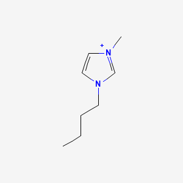
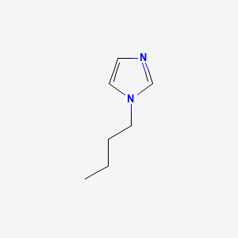
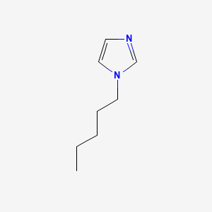
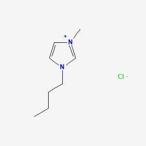
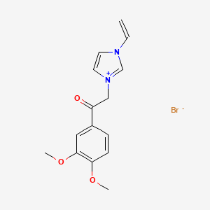
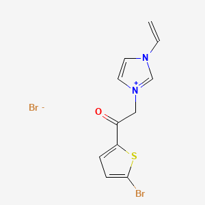
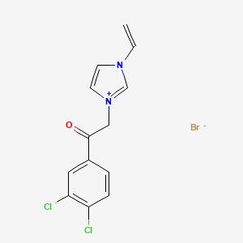

# PubChem API in R

by Vishank Patel, Adam M. Nguyen, and Michael T. Moen

<div class="rmd-btn-wrapper">
  <a class="rmd-btn"
     href="https://github.com/UA-Libraries-Research-Data-Services/UALIB_ScholarlyAPI_Cookbook/blob/main/rmarkdown/pubchem.Rmd"
     target="_blank"
     rel="noreferrer">
    View RMarkdown File
  </a>
</div>

PubChem provides programmatic access to chemical data and bioactivity information from the National Center for Biotechnology Information (NCBI), enabling efficient retrieval and analysis of chemical structures, identifiers, properties, and associated biological activities.

Please see the following resources for more information on API usage:
- Documentation
    - <a href="https://pubchemdocs.ncbi.nlm.nih.gov/programmatic-access" target="_blank">PubChem Programmatic Access</a>
    - <a href="https://pubchem.ncbi.nlm.nih.gov/docs/pug-rest" target="_blank">PUG-REST API Documentation</a>
- Terms
    - <a href="https://www.ncbi.nlm.nih.gov/home/about/policies/" target="_blank">NCBI Policies and Disclaimers</a>
- Data Reuse
    - <a href="https://www.ncbi.nlm.nih.gov/home/about/policies/" target="_blank">NCBI Copyright Information</a>

_**NOTE:**_ The PubChem limits requests to a maximum of 5 requests per second.

*These recipe examples were tested on March 24, 2026.*

**Attribution:** This tutorial was adapted from supporting information in:

**Scalfani, V. F.**; Ralph, S. C. Alshaikh, A. A.; Bara, J. E. Programmatic Compilation of Chemical Data and Literature From PubChem Using Matlab. *Chemical Engineering Education*, **2020**, *54*, 230. https://doi.org/10.18260/2-1-370.660-115508 and https://github.com/vfscalfani/MATLAB-cheminformatics

## Setup

The following packages need to be installed into your environment to run the code examples in this tutorial. These packages can be installed with `install.packages()`.

- <a href="https://cran.r-project.org/web/packages/httr/index.html" target="_blank">httr: Tools for Working with URLs and HTTP</a>
- <a href="https://cran.r-project.org/web/packages/jsonlite/index.html" target="_blank">jsonlite: A Simple and Robust JSON Parser and Generator for R</a>
- <a href="https://cran.r-project.org/web/packages/magick/index.html" target="_blank">magick: Advanced Graphics and Image-Processing in R</a>

We load the libraries used in this tutorial below:


``` r
library(httr)
library(jsonlite)
library(magick)
```

## 1. PubChem Similarity

### Get Compound Image

We can search for a compound and display an image. In this example, we look at 1-Butyl-3-methyl-imidazolium, which has a compound ID (CID) of 2734162.


``` r
BASE_URL <- "https://pubchem.ncbi.nlm.nih.gov/rest/pug/compound/"
compoundID <- "2734162"

cid_url <- paste0(BASE_URL, "cid/", compoundID, "/PNG")

# Display the image from the CID_URL
image_read(cid_url)
```

<!-- -->

### Retrieve InChI and Isomeric SMILES

An International Chemical Identifier (InChI) is a textual representation of a substance's molecular structure.


``` r
inchi_url <- paste0(BASE_URL, "cid/", compoundID, "/property/inchi/TXT")

# "$content" filters the HTTP response from the output and only returns the required output data
raw_inchi <- rawToChar(GET(inchi_url)$content)

# Clear newline character from output
inchi <- sub("\n", "", raw_inchi)
inchi
```

```
## [1] "InChI=1S/C8H15N2/c1-3-4-5-10-7-6-9(2)8-10/h6-8H,3-5H2,1-2H3/q+1"
```

Isomeric SMILES is a textual representation of molecules that includes stereochemical and isotropic information.


``` r
IS_url <- paste0(BASE_URL, "cid/", compoundID, "/property/IsomericSMILES/TXT")

raw_IS <- rawToChar(GET(IS_url)$content)
IS <- sub("\n", "", raw_IS)
IS
```

```
## [1] "CCCCN1C=C[N+](=C1)C"
```

### Perform a Similarity Search

Search for chemical structures by similarity using a 2D Tanimoto threshold of 95% (defined by the `Threshold` parameter).


``` r
threshold <- 95
SS_url <- paste0(BASE_URL, "fastsimilarity_2d/cid/", compoundID,
                 "/cids/JSON?Threshold=", threshold)

raw_output <- GET(SS_url)$content    # Get the Unicode output
raw_result <- rawToChar(raw_output)  # Convert the output from Unicode to text

# Print first 500 characters of the JSON response
cat(substr(prettify(raw_result), 1, 500))
```

```
## {
##     "IdentifierList": {
##         "CID": [
##             61347,
##             529334,
##             2734161,
##             118785,
##             12971008,
##             304622,
##             2734162,
##             11171745,
##             11424151,
##             11448496,
##             20148470,
##             87560886,
##             87754289,
##             2734236,
##             11160028,
##             2734168,
##             5245884,
##             53384410,
##             87942618,
##             4183883,
##             10313448,
## 
```

With `fromJSON()`, we can convert the raw text string above to a list of lists. From this, we can easily extract the CIDs.


``` r
# Create a list of lists from the JSON data
CIDs1_ls <- fromJSON(raw_result)

# Extract CIDs from list of lists
CIDs <- CIDs1_ls$IdentifierList$CID

# Display the first few elements of the data
head(CIDs)
```

```
## [1]    61347   529334  2734161   118785 12971008   304622
```

### Retrieve Identifier and Property Data

Get the following data for the retrieved compounds: `InChI`, `ConnectivitySMILES`, `MolecularWeight`, `IUPACname`, `HeavyAtomCount`, `RotableBondCount`, and `Charge`.


``` r
properties <- c("InChI", "ConnectivitySMILES", "MolecularWeight", "IUPACname",
                "HeavyAtomCount", "CovalentUnitCount", "Charge")

# Merge properties into a comma-delimited string for the API call
properties_arg <- paste(properties, collapse = ",")

# In this example, we only look at the first 10 CIDs
results <- list()
for (cid in CIDs[1:10]) {
  url <- paste0(BASE_URL, "cid/", cid, "/property/", properties_arg, "/JSON")
  result <- sub("\n", "", rawToChar(GET(url)$content))
  results <- append(results, list(fromJSON(result)$PropertyTable$Properties))
  Sys.sleep(0.25)
}

similarity_results_df <- do.call(rbind, results)
head(similarity_results_df)
```

```
##        CID MolecularWeight        ConnectivitySMILES
## 1    61347          124.18             CCCCN1C=CN=C1
## 2   529334          138.21            CCCCCN1C=CN=C1
## 3  2734161          174.67 CCCCN1C=C[N+](=C1)C.[Cl-]
## 4   118785          110.16              CCCN1C=CN=C1
## 5 12971008          252.10   CCCN1C=C[N+](=C1)C.[I-]
## 6   304622          138.21            CCCCN1C=CN=C1C
##                                                                          InChI
## 1                    InChI=1S/C7H12N2/c1-2-3-5-9-6-4-8-7-9/h4,6-7H,2-3,5H2,1H3
## 2                InChI=1S/C8H14N2/c1-2-3-4-6-10-7-5-9-8-10/h5,7-8H,2-4,6H2,1H3
## 3 InChI=1S/C8H15N2.ClH/c1-3-4-5-10-7-6-9(2)8-10;/h6-8H,3-5H2,1-2H3;1H/q+1;/p-1
## 4                        InChI=1S/C6H10N2/c1-2-4-8-5-3-7-6-8/h3,5-6H,2,4H2,1H3
## 5      InChI=1S/C7H13N2.HI/c1-3-4-9-6-5-8(2)7-9;/h5-7H,3-4H2,1-2H3;1H/q+1;/p-1
## 6                InChI=1S/C8H14N2/c1-3-4-6-10-7-5-9-8(10)2/h5,7H,3-4,6H2,1-2H3
##                                 IUPACName Charge HeavyAtomCount
## 1                        1-butylimidazole      0              9
## 2                       1-pentylimidazole      0             10
## 3 1-butyl-3-methylimidazol-3-ium chloride      0             11
## 4                       1-propylimidazole      0              8
## 5  1-methyl-3-propylimidazol-1-ium iodide      0             10
## 6               1-butyl-2-methylimidazole      0             10
##   CovalentUnitCount
## 1                 1
## 2                 1
## 3                 2
## 4                 1
## 5                 2
## 6                 1
```

### Retrieve Images of CID Compounds from Similarity Search

Create the results png:


``` r
content <- list()
for(cid in CIDs[1:3]) {
  url <- paste0(BASE_URL, "cid/", cid, "/PNG")
  content[[length(content) + 1]] <- GET(url)$content
  Sys.sleep(0.25)
}
image_read(content[[1]])
```

<!-- -->

``` r
image_read(content[[2]])
```

<!-- -->

``` r
image_read(content[[3]])
```

<!-- -->

## 2. PubChem SMARTS Search

We can search for chemical structures from a SMARTS substructure query using the `fastsubstructure` endpoint. Pattern syntax can be viewed at <a href="https://smarts.plus/" target="_blank">SMARTSPlus</a>.

In this example, we use vinyl imidazolium substructure searches.


``` r
smarts_q <- c(
  "[CR0H2][n+]1[cH1][cH1]n([CR0H1]=[CR0H2])[cH1]1",
  "[CR0H2][n+]1[cH1][cH1]n([CR0H2][CR0H1]=[CR0H2])[cH1]1",
  "[CR0H2][n+]1[cH1][cH1]n([CR0H2][CR0H2][CR0H1]=[CR0H2])[cH1]1"
)
```

### Perform a SMARTS Query Search


``` r
# Generate URLs for SMARTS query searches
sq_urls <- paste0(BASE_URL, "fastsubstructure/smarts/", smarts_q, "/cids/JSON")

# Perform substructure searches for each query link in sq_urls
sq_cids <- c()
for (url in sq_urls) {
  hit_CIDs_ls <- fromJSON(rawToChar(GET(url)$content))
  sq_cids <- append(sq_cids, hit_CIDs_ls$IdentifierList$CID)
  Sys.sleep(0.25)
}

# Print number of results
length(sq_cids)
```

```
## [1] 1025
```

### Retrieve Identifier and Property Data

Create an identifier/property dataset from the SMARTS substructure search results

Retrieve the following data for each CID: `InChI`, `ConnectivitySMILES`, `MolecularWeight`, `IUPACname`, `HeavyAtomCount`, `CovalentUnitCount`, and `Charge`.


``` r
properties <- c("InChI", "CanonicalSMILES", "MolecularWeight", "IUPACname",
                "HeavyAtomCount", "CovalentUnitCount", "Charge")

# Merge properties into a comma-separated string for the API call
properties_arg <- paste(properties, collapse = ",")

# In this example, we only look at the first 10 CIDs
results = list()
for (cid in sq_cids[1:10]) {
  url <- paste0(BASE_URL, "cid/", cid, "/property/", properties_arg, "/JSON")
  result <- sub("\n", "", rawToChar(GET(url)$content))
  results <- append(results, list(fromJSON(result)$PropertyTable$Properties))
  Sys.sleep(0.25)
}

smarts_results_df <- do.call(rbind, results)
head(smarts_results_df)
```

```
##        CID MolecularWeight                               ConnectivitySMILES
## 1  2881855          353.21 COC1=C(C=C(C=C1)C(=O)C[N+]2=CN(C=C2)C=C)OC.[Br-]
## 2 23724184          378.08       C=CN1C=C[N+](=C1)CC(=O)C2=CC=C(S2)Br.[Br-]
## 3  2881236           362.0 C=CN1C=C[N+](=C1)CC(=O)C2=CC(=C(C=C2)Cl)Cl.[Br-]
## 4  2881558          307.19      CC1=CC=C(C=C1)C(=O)C[N+]2=CN(C=C2)C=C.[Br-]
## 5  2881232          323.18     COC1=CC=C(C=C1)C(=O)C[N+]2=CN(C=C2)C=C.[Br-]
## 6  2881324          372.05     C=CN1C=C[N+](=C1)CC(=O)C2=CC=C(C=C2)Br.[Br-]
##                                                                                                                  InChI
## 1 InChI=1S/C15H17N2O3.BrH/c1-4-16-7-8-17(11-16)10-13(18)12-5-6-14(19-2)15(9-12)20-3;/h4-9,11H,1,10H2,2-3H3;1H/q+1;/p-1
## 2                   InChI=1S/C11H10BrN2OS.BrH/c1-2-13-5-6-14(8-13)7-9(15)10-3-4-11(12)16-10;/h2-6,8H,1,7H2;1H/q+1;/p-1
## 3             InChI=1S/C13H11Cl2N2O.BrH/c1-2-16-5-6-17(9-16)8-13(18)10-3-4-11(14)12(15)7-10;/h2-7,9H,1,8H2;1H/q+1;/p-1
## 4             InChI=1S/C14H15N2O.BrH/c1-3-15-8-9-16(11-15)10-14(17)13-6-4-12(2)5-7-13;/h3-9,11H,1,10H2,2H3;1H/q+1;/p-1
## 5         InChI=1S/C14H15N2O2.BrH/c1-3-15-8-9-16(11-15)10-14(17)12-4-6-13(18-2)7-5-12;/h3-9,11H,1,10H2,2H3;1H/q+1;/p-1
## 6                InChI=1S/C13H12BrN2O.BrH/c1-2-15-7-8-16(10-15)9-13(17)11-3-5-12(14)6-4-11;/h2-8,10H,1,9H2;1H/q+1;/p-1
##                                                                   IUPACName
## 1  1-(3,4-dimethoxyphenyl)-2-(3-ethenylimidazol-1-ium-1-yl)ethanone bromide
## 2 1-(5-bromothiophen-2-yl)-2-(3-ethenylimidazol-1-ium-1-yl)ethanone bromide
## 3   1-(3,4-dichlorophenyl)-2-(3-ethenylimidazol-1-ium-1-yl)ethanone bromide
## 4       2-(3-ethenylimidazol-1-ium-1-yl)-1-(4-methylphenyl)ethanone bromide
## 5      2-(3-ethenylimidazol-1-ium-1-yl)-1-(4-methoxyphenyl)ethanone bromide
## 6        1-(4-bromophenyl)-2-(3-ethenylimidazol-1-ium-1-yl)ethanone bromide
##   Charge HeavyAtomCount CovalentUnitCount
## 1      0             21                 2
## 2      0             17                 2
## 3      0             19                 2
## 4      0             18                 2
## 5      0             19                 2
## 6      0             18                 2
```

### Retrieve Images of CID Compounds from SMARTS query match

Create the results images:


``` r
content <- list()
for(cid in sq_cids[1:3]) {
  url <- paste0(BASE_URL, "cid/", cid, "/PNG");
  content[[length(content) + 1]] <- GET(url)$content
  Sys.sleep(0.25)
}
image_read(content[[1]])
```

<!-- -->

``` r
image_read(content[[2]])
```

<!-- -->

``` r
image_read(content[[3]])
```

<!-- -->
