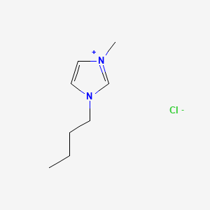
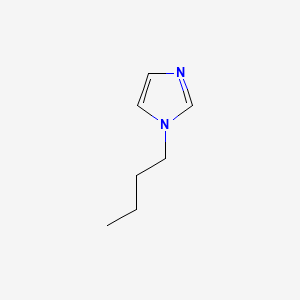
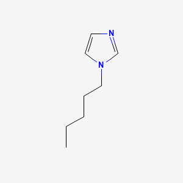
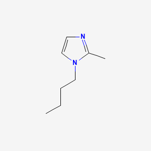
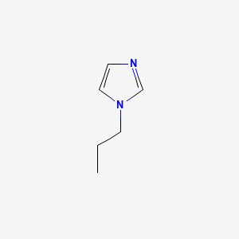
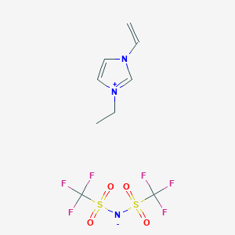
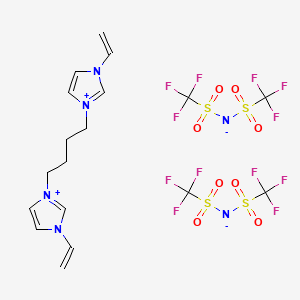
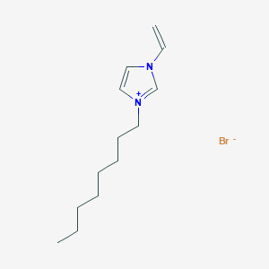
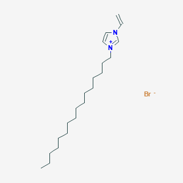

# PubChem API in R

by Vishank Patel and Adam M. Nguyen

**Documentation:**

Pubchem API Documentation: <https://pubchemdocs.ncbi.nlm.nih.gov/programmatic-access>

These recipe examples were tested on March 24, 2023.

See the bottom of the document for information on R and package versions.

Attribution: This tutorial was adapted from supporting information in:

Scalfani, V. F.; Ralph, S. C. Alshaikh, A. A.; Bara, J. E. Programmatic Compilation of Chemical Data and Literature From PubChem Using Matlab. Chemical Engineering Education, 2020, 54, 230. <https://doi.org/10.18260/2-1-370.660-115508> and <https://github.com/vfscalfani/MATLAB-cheminformatics>)


**Tutorial License**: This tutorial uses the knitr and imager R libraries, which are licensed as GPL-3 and LGPL-3, respectively. As a result, this tutorial code is licensed as GPL-3: https://github.com/UA-Libraries-Research-Data-Services/UALIB_ScholarlyAPI_Cookbook/blob/main/LICENSE_selected_R_tutorials

### Setup

Importing the necessary libraries and setting up the base api:


```r
library(tidyverse)  #essential packages
library(dplyr)      #tibbles (R data_frames)
library(purrr)      #character manipulation 
library(httr)       #GET() API requests
library(jsonlite)   #converting to JSON
library(knitr)      #including graphics
library(imager)     #including images
library(magick)     #Image manipulation

# Create base URL for PubChem API
api <- 'https://pubchem.ncbi.nlm.nih.gov/rest/pug/compound/'
```

## 1. PubChem Similarity

Search for chemical structures in PubChem via a Fingerprint Tanimoto Similarity Search.

### Get compound image


```r
compoundID <- "2734162"
CID_URL <- paste0(api,"cid/",compoundID,"/PNG")  #paste0 concatenates strings 

include_graphics(CID_URL)
```

<!-- -->

Replace the above CID value (CID_SS_query) with a different CID to customize.

### Retrieve InChI and SMILES

Retrieve InChI


```r
inchi_url <- paste0(api,"cid/",compoundID,"/property/inchi/TXT")

raw_inchi <- rawToChar(GET(inchi_url)$content);   #"$content" filters the http response from the output and only returns the required output data 
inchi <- raw_inchi %>% gsub("\n","",.);           #"." refers to raw_inchi in gsub
inchi
```

```
## [1] "InChI=1S/C8H15N2/c1-3-4-5-10-7-6-9(2)8-10/h6-8H,3-5H2,1-2H3/q+1"
```

Retrieve Isomeric SMILES


```r
IS_url <- paste0(api,"cid/",compoundID,"/property/IsomericSMILES/TXT");

raw_IS <- rawToChar(GET(IS_url)$content);
IS <- raw_IS %>% gsub("\n","",.);
IS
```

```
## [1] "CCCCN1C=C[N+](=C1)C"
```

### Perform a Similarity Search

Search for chemical structures by Similarity Search (SS), (2D Tanimoto threshold 95% to 1-Butyl-3-methyl-imidazolium; CID = 2734162)


```r
api <- "https://pubchem.ncbi.nlm.nih.gov/rest/pug/compound/";
SS_url <- paste0(api,'fastsimilarity_2d/cid/',compoundID, '/cids/JSON?Threshold=95');

raw_output <- GET(SS_url)$content;    #getting the unicode output
raw_result <- rawToChar(raw_output);  #converts the output from unicode to text
CIDs1_ls <- fromJSON(raw_result);   #creates a list of lists from the JSON data
```


```r
head(CIDs1_ls)
```

```
## $IdentifierList
## $IdentifierList$CID
##   [1]   2734161     61347    529334    304622    118785  12971008  11448496
##   [8]  11424151  11171745  11160028   2734236  11245926   2734162  53384410
##  [15]  11788435   5245884   2734168 139254006  91983981  87560886  87559770
##  [22]  11448364  10537570  10154187 156579812 141109628 132087981 129831898
##  [29] 118120095  91210418  90744066  87754289  87106874  87105369  37818425
##  [36]  25053226  24766551  17870330  16720567  15557008  15255204  12392681
##  [43]  12392676  11277167  11031767  10608883  10513048  10313448  10313447
##  [50]   4183883 166063320 162198727 162171380 161819746 161124984 161112590
##  [57] 160933286 160731515 160674142 160464403 160266994 159865990 159563905
##  [64] 159509762 159490164 159312353 158808695 158224178 158212500 157839501
##  [71] 157806980 157754871 157540783 157223666 157050789 156847779 156847755
##  [78] 156447427 155713168 154005528 153940412 153897980 153615844 145473275
##  [85] 145394036 144530620 144439506 144220344 143565409 143530527 142964175
##  [92] 142585407 142152870 142141931 142071419 142062823 141885951 141442188
##  [99] 141391260 141319938 141319527 141292180 141130209 140729180 140162362
## [106] 140162361 139215657 134991434 134345956 131201342 129864984 126970742
## [113] 124094863 124013672 124013100 123725669 122625623 121299516 118952202
## [120] 118524186 118524174 118131665 118057427 117890836 117703152 117684660
## [127] 102147231 101839829 101369383  91367525  90912888  89713026  89678233
## [134]  89432682  88864524  88236103  87942618  87813936  87806569  87790333
## [141]  87789992  87789923  87789740  87754264  87690425  87688227  87669070
## [148]  87572549  87572548  87572214  87572213  87560545  87560544  87509019
## [155]  87397668  87388314  87356647  87325711  87308565  87222859  87181405
## [162]  87181202  87181191  87181050  87173651  87125511  87125508  87121545
## [169]  87121544  87121543  87121443  87121324  87121318  87121317  87121316
## [176]  87121297  87121296  87121295  87099925  87096071  87092336  87059628
## [183]  86222771  69317070  68379078  67674484  66751376  60860613  60103428
## [190]  59872702  59798517  59672181  59653228  59653227  59161437  58850418
## [197]  57320166  54694426  54390693  54061781  53830935  53712415  25136370
## [204]  25030218  22382810  22055176  20646157  20646140  20612472  20532437
## [211]  20148470  19964884  19964723  19964469  17870312  16726386  14647320
## [218]  13723913  13034366  12392683  12392680  12392679  12392671  12392670
## [225]  12224822  11788445  11564856  11031768  10057718  11108531  11356498
## [232]  11390126  11390127  11404132  13034385  17885728  44178740  44178741
## [239]  44178743  44178745  45112083  54589973  54589974  54589975  54589976
## [246]  54589977  54589978  54589979  54589980  54589981  54589982  56973040
## [253]  57483533  60103429  66560137  66560138  68569453  87121298  87121319
## [260]  87121326  87121546  87125509  87338472  87457441  87645661 101456096
## [267] 101476671 101540709 101548772 102490458 102490464 117064740 123927694
## [274] 124705578 129761517 130557690 131038087 132565110 132604341 141130203
## [281] 142734045 149791673 155683104 156847757 165390285
```

Working with list of lists is hard, so we convert the same into a tibble. The code is adopted from: https://www.r-bloggers.com/2015/11/accessing-apis-from-r-and-a-little-r-programming/


```r
CIDs1_df <- do.call( # do.call feeds in all the arguments (dataframes to be binded together) to the rbind command 
  what = "rbind", # rbind binds all the dataframes together
  args = lapply( # lapply applies its second argument (as.data.frame) to every element of the list in the first argument (result1_ls)
            CIDs1_ls, as.data.frame)) # converts the list of lists to a dataframe


CIDs1_df <- tibble(CIDs1_df)  # converting the dataset into a tibble (from dplyr)
CIDs1_df   # displaying the first few elements of the data
```

```
## # A tibble: 285 × 1
##         CID
##       <int>
##  1  2734161
##  2    61347
##  3   529334
##  4   304622
##  5   118785
##  6 12971008
##  7 11448496
##  8 11424151
##  9 11171745
## 10 11160028
## # … with 275 more rows
```

In the above SS_url value, you can adjust to the desired Tanimoto threshold (i.e., 97, 90, etc.)

### Retrieve Identifier and Property Data

Create an identifier/property dataset from Similarity Search results.

Retrieve the following data from CID hit results: InChI, Isomeric SMILES, MW, Heavy Atom Count, Rotable Bond Count, and Charge


```r
short_CIDs <- CIDs1_df$CID[1:25] #taking the first 25 CIDs from the similarity search results

#initializing the tibble
similarity_results_tibble <- tibble();
similarity_results_tibble <- add_column(similarity_results_tibble,
                             Compound_ID = "",
                             InChi = "",
                             IsoSMI = "",
                             MW = "",
                             Heavy_Atom_Count = "",
                             Rotatable_Bond_Count = "",
                             Charge = ""
                             );


for (CID in short_CIDs) {
  
  #define the api calls:
  api = 'https://pubchem.ncbi.nlm.nih.gov/rest/pug/compound/';
  CID_InChI_url = paste0(api,'cid/',toString(CID),'/property/InChI/TXT');
  CID_IsoSMI_url = paste0(api,'cid/',toString(CID),'/property/IsomericSMILES/TXT');
  CID_MW_url = paste0(api,'cid/',toString(CID),'/property/MolecularWeight/TXT');
  CID_HeavyAtomCount_url = paste0(api,'cid/',toString(CID),'/property/HeavyAtomCount/TXT');
  CID_RotatableBondCount_url = paste0(api,'cid/',toString(CID),'/property/RotatableBondCount/TXT');
  CID_Charge_url = paste0(api,'cid/',toString(CID),'/property/Charge/TXT');
  
  
  #downloading the data
  inchi_temp <- rawToChar(GET(CID_InChI_url)$content) %>% gsub("\n","",.);
  Sys.sleep(1)       # adding a delay for the PubChem server
  isoSMI_temp <- rawToChar(GET(CID_IsoSMI_url)$content) %>% gsub("\n","",.);
  Sys.sleep(1)
  mw_temp <- rawToChar(GET(CID_MW_url)$content) %>% gsub("\n","",.);
  Sys.sleep(1)
  heavy_atom_count_temp <- rawToChar(GET(CID_HeavyAtomCount_url)$content) %>% gsub("\n","",.);
  Sys.sleep(1)
  rotatable_bond_count_temp <- rawToChar(GET(CID_RotatableBondCount_url)$content) %>% gsub("\n","",.);
  Sys.sleep(1)
  charge_temp <- rawToChar(GET(CID_Charge_url)$content) %>% gsub("\n","",.);
  Sys.sleep(1)

  #Appending the data in a tibble
  similarity_results_tibble <- similarity_results_tibble %>%
    add_row(
      Compound_ID = toString(CID),
      InChi = inchi_temp,
      IsoSMI = isoSMI_temp,
      MW = mw_temp,
      Heavy_Atom_Count = heavy_atom_count_temp,
      Rotatable_Bond_Count = rotatable_bond_count_temp,
      Charge = charge_temp
    )

}

similarity_results_tibble
```

```
## # A tibble: 25 × 7
##    Compound_ID InChi                         IsoSMI MW    Heavy…¹ Rotat…² Charge
##    <chr>       <chr>                         <chr>  <chr> <chr>   <chr>   <chr> 
##  1 2734161     InChI=1S/C8H15N2.ClH/c1-3-4-… CCCCN… 174.… 11      3       0     
##  2 61347       InChI=1S/C7H12N2/c1-2-3-5-9-… CCCCN… 124.… 9       3       0     
##  3 529334      InChI=1S/C8H14N2/c1-2-3-4-6-… CCCCC… 138.… 10      4       0     
##  4 304622      InChI=1S/C8H14N2/c1-3-4-6-10… CCCCN… 138.… 10      3       0     
##  5 118785      InChI=1S/C6H10N2/c1-2-4-8-5-… CCCN1… 110.… 8       2       0     
##  6 12971008    InChI=1S/C7H13N2.HI/c1-3-4-9… CCCN1… 252.… 10      2       0     
##  7 11448496    InChI=1S/C8H15N2.HI/c1-3-4-5… CCCCN… 266.… 11      3       0     
##  8 11424151    InChI=1S/C8H15N2.CHNS/c1-3-4… CCCCN… 197.… 13      3       0     
##  9 11171745    InChI=1S/C8H15N2.C2N3/c1-3-4… CCCCN… 205.… 15      3       0     
## 10 11160028    InChI=1S/C7H13N2.BrH/c1-3-4-… CCCN1… 205.… 10      2       0     
## # … with 15 more rows, and abbreviated variable names ¹​Heavy_Atom_Count,
## #   ²​Rotatable_Bond_Count
```

We will now export the generated dataframe as a tab separated text file. The file will be saved in the present working directory.


```r
write.table(similarity_results_tibble, file = "Data/R_Similarityq_results.txt", sep = "\t", row.names = TRUE, col.names = NA);
```

### Retrieve Images of CID Compounds from Similarity Search

Create the results png:


```r
content <- list()
 for(CID in short_CIDs[1:5]){
  #define the url
  CID_URL <- paste0(api,"cid/",toString(CID),"/PNG");
  content[[length(content) + 1]] <- GET(CID_URL)$content
  Sys.sleep(1)
 }
image_read(content[[1]])
```



```r
image_read(content[[2]])
```



```r
image_read(content[[3]])
```



```r
image_read(content[[4]])
```



```r
image_read(content[[5]])
```



## 2. PubChem SMARTS Search

Search for chemical structures in PubChem via a SMARTS substructure query and compile results


```r
#defining the PubChem base API
api <- "https://pubchem.ncbi.nlm.nih.gov/rest/pug/compound/";
```

### Define SMARTS Queries


```r
# view pattern syntax at: https://smartsview.zbh.uni-hamburg.de/
# these are vinyl imidazolium substructure searches

SmartsQ <- c("[CR0H2][n+]1[cH1][cH1]n([CR0H1]=[CR0H2])[cH1]1","[CR0H2][n+]1[cH1][cH1]n([CR0H2][CR0H1]=[CR0H2])[cH1]1","[CR0H2][n+]1[cH1][cH1]n([CR0H2][CR0H2][CR0H1]=[CR0H2])[cH1]1");
```

Add your own SMARTS queries to customize. You can add as many as desired within a cell array.

### Perform a SMARTS Query Search


```r
#generate URLs for SMARTS query searches

SmartsQ_url= c();
for (Smarts_query in SmartsQ) {
  SmartsQ_url <- append(SmartsQ_url, 
                        values = paste0(api,"fastsubstructure/smarts/",Smarts_query,"/cids/JSON"));
}

#perform substructure searches for each query link in SMARTSq_url

hit_CIDs_results_seperate =c();
for (url in SmartsQ_url) {
  hit_CIDs_ls_temp <- fromJSON(rawToChar(GET(url)$content))
  hit_CIDs_df_temp <- tibble(do.call(what = "rbind",
                                     args = lapply(hit_CIDs_ls_temp, as.data.frame)))
  hit_CIDs_results_seperate <- append(hit_CIDs_results_seperate, hit_CIDs_df_temp)
}

#create the final result by appending each of the returned CID list outputs 
hit_CIDs_results <- c();
hit_CIDs_results <- append(hit_CIDs_results,
                                 values = c(hit_CIDs_results_seperate[1]$CID,
                                            hit_CIDs_results_seperate[2]$CID, 
                                            hit_CIDs_results_seperate[3]$CID))
length(hit_CIDs_results)
```

```
## [1] 847
```

We will shorten the list to the first 25 results for time considerations. This limit can be increased.


```r
hit_CIDs_results <- hit_CIDs_results[1:25];
hit_CIDs_results
```

```
##  [1] 121235111 132274871  86657882  46178576 139254006 129853306 129853221
##  [8] 129850195  87560886  87559770  87327009  59435292  24766550 162277521
## [15] 162204473 161909937 161556919 161457090 161355970 161152181 161033043
## [22] 160979882 160848969 160787397 160707335
```

### Retrieve Identifier and Property Data

Create an identifier/property dataset from the SMARTS substructure search results

Retrieve the following data for each CID: InChI, Canonical SMILES, MW, IUPAC Name, Heavy Atom Count, Covalent Unit Count, Charge


```r
smarts_results_tibble <- tibble();
smarts_results_tibble <- add_column(smarts_results_tibble,
                             Compound_ID = "",
                             InChi = "",
                             CanSMI = "",
                             MW = "",
                             IUPACName = "",
                             Heavy_Atom_Count = "",
                             Covalent_Unit_Count = "",
                             Charge = ""
                             );


for (CID in hit_CIDs_results) {
  
  #define the api calls:
  api = 'https://pubchem.ncbi.nlm.nih.gov/rest/pug/compound/';
  CID_InChI_url = paste0(api,'cid/',toString(CID),'/property/InChI/TXT');
  CID_CanSMI_url = paste0(api,'cid/',toString(CID),'/property/CanonicalSMILES/TXT');
  CID_MW_url = paste0(api,'cid/',toString(CID),'/property/MolecularWeight/TXT');
  CID_IUPACName_url = paste0(api,'cid/',toString(CID),'/property/IUPACName/TXT');
  CID_HeavyAtomCount_url = paste0(api,'cid/',toString(CID),'/property/HeavyAtomCount/TXT');
  CID_CovalentUnitCount_url = paste0(api,'cid/',toString(CID),'/property/CovalentUnitCount/TXT');
  CID_Charge_url = paste0(api,'cid/',toString(CID),'/property/Charge/TXT');
  
  
  #downloading the data
  inchi_temp <- rawToChar(GET(CID_InChI_url)$content) %>% gsub("\n","",.);
  Sys.sleep(1)       # adding a delay for the PubChem server
  canSMI_temp <- rawToChar(GET(CID_CanSMI_url)$content) %>% gsub("\n","",.);
  Sys.sleep(1)
  mw_temp <- rawToChar(GET(CID_MW_url)$content) %>% gsub("\n","",.);
  Sys.sleep(1)
  iupac_name_temp <- rawToChar(GET(CID_IUPACName_url)$content) %>% gsub("\n","",.);
  Sys.sleep(1)
  heavy_atom_count_temp <- rawToChar(GET(CID_HeavyAtomCount_url)$content) %>% gsub("\n","",.);
  Sys.sleep(1)
  covalent_unit_count_temp <- rawToChar(GET(CID_CovalentUnitCount_url)$content) %>% gsub("\n","",.);
  Sys.sleep(1)
  charge_temp <- rawToChar(GET(CID_Charge_url)$content) %>% gsub("\n","",.);
  Sys.sleep(1)

  #Appending the data in a tibble
  smarts_results_tibble <- smarts_results_tibble %>%
    add_row(
      Compound_ID = toString(CID),
      InChi = inchi_temp,
      CanSMI = canSMI_temp,
      MW = mw_temp,
      IUPACName = iupac_name_temp,
      Heavy_Atom_Count = heavy_atom_count_temp,
      Covalent_Unit_Count = covalent_unit_count_temp,
      Charge = charge_temp
    )

}

smarts_results_tibble
```

```
## # A tibble: 25 × 8
##    Compound_ID InChi                 CanSMI MW    IUPAC…¹ Heavy…² Coval…³ Charge
##    <chr>       <chr>                 <chr>  <chr> <chr>   <chr>   <chr>   <chr> 
##  1 121235111   InChI=1S/C7H11N2.C2F… CC[N+… 403.3 bis(tr… 24      2       0     
##  2 132274871   InChI=1S/C14H20N4.2C… C=CN1… 804.6 bis(tr… 48      3       0     
##  3 86657882    InChI=1S/C13H23N2.Br… CCCCC… 287.… 1-ethe… 16      2       0     
##  4 46178576    InChI=1S/C21H39N2.Br… CCCCC… 399.5 1-ethe… 24      2       0     
##  5 139254006   InChI=1S/C9H15N2.HI/… CCCC[… 278.… 1-buty… 12      2       0     
##  6 129853306   InChI=1S/C13H23N2.C2… CCCCC… 487.5 bis(tr… 30      2       0     
##  7 129853221   InChI=1S/C11H19N2.C2… CCCCC… 459.4 bis(tr… 28      2       0     
##  8 129850195   InChI=1S/C21H39N2.C2… CCCCC… 599.7 bis(tr… 38      2       0     
##  9 87560886    InChI=1S/C9H15N2.BrH… CCCC[… 231.… 1-buty… 12      2       0     
## 10 87559770    InChI=1S/C9H15N2.ClH… CCCC[… 186.… 1-buty… 12      2       0     
## # … with 15 more rows, and abbreviated variable names ¹​IUPACName,
## #   ²​Heavy_Atom_Count, ³​Covalent_Unit_Count
```

Rearrange the result's columns:


```r
smarts_results_tibble2 <- smarts_results_tibble[c("CanSMI","IUPACName","Compound_ID","InChi","MW","Heavy_Atom_Count","Covalent_Unit_Count","Charge")]
```

Exporting the data as a tabbed text file


```r
write.table(smarts_results_tibble2, file = "Data/R_Smartsq_results.txt", sep = "\t", row.names = TRUE, col.names = NA);
```

### Retrieve Images of CID Compounds from SMARTS query match

Create the results png:


```r
content2 <- list()
for(CID in hit_CIDs_results[1:5]){
  #define the url
  hit_CID_URL <- paste0(api,"cid/",toString(CID),"/PNG");
  content2[[length(content2) + 1]] <- GET(hit_CID_URL)$content
  Sys.sleep(1)
 }
image_read(content2[[1]])
```



```r
image_read(content2[[2]])
```



```r
image_read(content2[[3]])
```



```r
image_read(content2[[4]])
```



```r
image_read(content2[[5]])
```


## R Session Info


```r
sessionInfo()
```

```
## R version 4.2.1 (2022-06-23 ucrt)
## Platform: x86_64-w64-mingw32/x64 (64-bit)
## Running under: Windows 10 x64 (build 19042)
## 
## Matrix products: default
## 
## locale:
## [1] LC_COLLATE=English_United States.utf8 
## [2] LC_CTYPE=English_United States.utf8   
## [3] LC_MONETARY=English_United States.utf8
## [4] LC_NUMERIC=C                          
## [5] LC_TIME=English_United States.utf8    
## 
## attached base packages:
## [1] stats     graphics  grDevices utils     datasets  methods   base     
## 
## other attached packages:
##  [1] magick_2.7.4    imager_0.42.18  magrittr_2.0.3  knitr_1.42     
##  [5] jsonlite_1.8.4  httr_1.4.5      lubridate_1.9.2 forcats_1.0.0  
##  [9] stringr_1.5.0   dplyr_1.1.0     purrr_1.0.1     readr_2.1.4    
## [13] tidyr_1.3.0     tibble_3.1.8    ggplot2_3.4.1   tidyverse_2.0.0
## 
## loaded via a namespace (and not attached):
##  [1] tidyselect_1.2.0 xfun_0.37        bslib_0.4.2      colorspace_2.1-0
##  [5] vctrs_0.5.2      generics_0.1.3   htmltools_0.5.4  yaml_2.3.7      
##  [9] utf8_1.2.3       rlang_1.0.6      jquerylib_0.1.4  pillar_1.8.1    
## [13] glue_1.6.2       withr_2.5.0      jpeg_0.1-10      lifecycle_1.0.3 
## [17] munsell_0.5.0    gtable_0.3.1     evaluate_0.20    tzdb_0.3.0      
## [21] fastmap_1.1.0    curl_5.0.0       fansi_1.0.4      highr_0.10      
## [25] Rcpp_1.0.10      scales_1.2.1     cachem_1.0.7     hms_1.1.2       
## [29] bmp_0.3          png_0.1-8        digest_0.6.31    stringi_1.7.12  
## [33] tiff_0.1-11      grid_4.2.1       cli_3.6.0        tools_4.2.1     
## [37] sass_0.4.5       readbitmap_0.1.5 pkgconfig_2.0.3  ellipsis_0.3.2  
## [41] timechange_0.2.0 rmarkdown_2.20   rstudioapi_0.14  R6_2.5.1        
## [45] igraph_1.4.1     compiler_4.2.1
```

