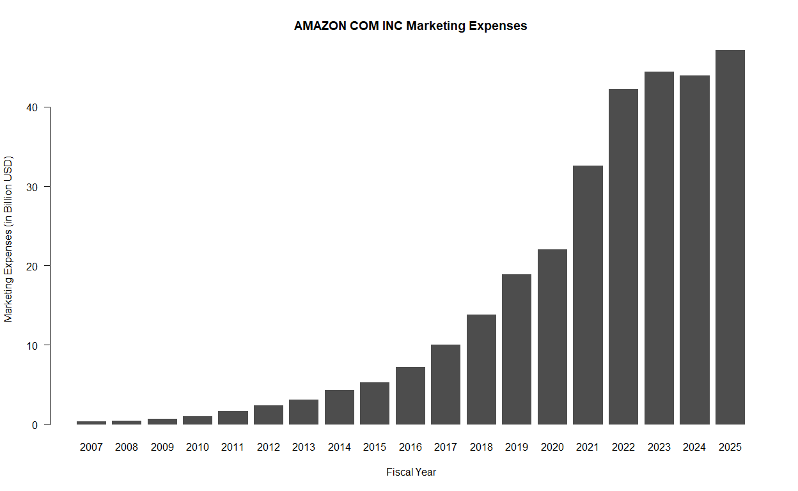
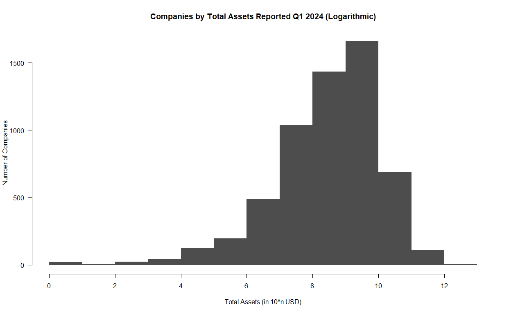

# SEC EDGAR API in R

by Adam M. Nguyen and Michael T. Moen

<div class="rmd-btn-wrapper">
  <a class="rmd-btn"
     href="https://github.com/UA-Libraries-Research-Data-Services/UALIB_ScholarlyAPI_Cookbook/blob/main/rmarkdown/sec-edgar.Rmd"
     target="_blank"
     rel="noreferrer">
    View RMarkdown File
  </a>
</div>

The U.S. Securities and Exchange Commission (SEC) allows free public access to documents filed by publicly traded companies in the Electronic Data Gathering, Analysis, and Retrieval (EDGAR) system.

Please see the following resources for more information on API usage:

- Documentation
    - <a href="https://www.sec.gov/search-filings" target="_blank">SEC EDGAR</a>
    - <a href="https://www.sec.gov/search-filings/edgar-application-programming-interfaces" target="_blank">SEC EDGAR Documentation</a>
    - <a href="https://www.sec.gov/search-filings/edgar-search-assistance/accessing-edgar-data" target="_blank">SEC EDGAR Search Assistance</a>
- Terms
    - <a href="https://www.sec.gov/privacy#security" target="_blank">SEC Website Policies</a>
- Data Reuse
    - <a href="https://www.sec.gov/about/privacy-information#dissemination" target="_blank">SEC Website Dissemination</a>

**_NOTE:_** Please see access details and rate limit requests for this API in the official documentation.

*These recipe examples were tested on March 23, 2026.*

## Setup

### Load Libraries

The following packages need to be installed into your environment to run the code examples in this tutorial. These packages can be installed with `install.packages()`.

- <a href="https://cran.r-project.org/web/packages/httr/index.html" target="_blank">httr: Tools for Working with URLs and HTTP</a>
- <a href="https://cran.r-project.org/web/packages/jsonlite/index.html" target="_blank">jsonlite: A Simple and Robust JSON Parser and Generator for R</a>

We load the libraries used in this tutorial below:


``` r
library(httr)
library(jsonlite)
```

### Import User Agent

A user agent is required to access the SEC EDGAR API.

We keep our user agent in a `.Renviron` file that is stored in the working directory and use `Sys.getenv()` to access it. The `.Renviron` should have an entry like the one below.

```text
SEC_EDGAR_USER_AGENT="Institution, email@domain.com"
```

Below, we can test to whether the user agent was successfully imported.


``` r
if (nzchar(Sys.getenv("SEC_EDGAR_USER_AGENT"))) {
  print("User agent successfully loaded.")
} else {
  warning("User agent not found or is empty.")
}
```

```
## [1] "User agent successfully loaded."
```

### SEC EDGAR Data Installation

In addition to the publicly available API, SEC EDGAR data can also be access via a bulk data download, which is compiled nightly. This approach is advantageous when working with large datasets, since it does not require making many individual API calls. However, it requires about 15 GB of storage to install and is more difficult to keep up to date.

To access this data, download the companyfacts.zip file under the 'Bulk data' heading at the bottom of <a href="https://www.sec.gov/edgar/sec-api-documentation" target="_blank">the SEC EDGAR documentation</a>.

## 1. Obtaining Marketing Expenses for Amazon

To access the data from an individual company, we must first obtain its Central Index Key (CIK) value. These values can be obtained by searching for a company <a href="https://www.sec.gov/edgar/search/#" target="_blank">here</a>. Alternatively, you can find a list of all companies and their CIK value <a href="https://www.sec.gov/Archives/edgar/cik-lookup-data.txt" target="_blank">here</a>.

For this section of the guide, we'll use Amazon (AMZN) as an example, which has a CIK of 0001018724.

With this CIK, we can now build a URL for the `/companyfacts/` endpoint:


``` r
BASE_URL <- "https://data.sec.gov/api/xbrl/"
endpoint <- "companyfacts/"
cik <- "0001018724"  # CIK for Amazon

# Make the API request
response <- GET(paste0(BASE_URL, endpoint, "CIK", cik, ".json"),
                add_headers("User-Agent" = Sys.getenv("SEC_EDGAR_USER_AGENT")))

# Status code 200 indicates success
response$status_code
```

```
## [1] 200
```

We can also access individual pieces of information with our retrieved data:

**_NOTE:_** It may be useful to open the <a href="https://data.sec.gov/api/xbrl/companyfacts/CIK0001018724.json" target="_blank">URL</a> we created in Firefox, which has a built in JSON viewer that other browsers lack.


``` r
# Extract data from the response
amzn <- fromJSON(rawToChar(response$content))

# Extract the company name from the response
company_name <- amzn$entityName
company_name
```

```
## [1] "AMAZON COM INC"
```

For an example, let's look at the yearly marketing expenses of Amazon, which is defined as "Expenditures for planning and executing the conception, pricing, promotion, and distribution of ideas, goods, and services. Costs of public relations and corporate promotions are typically considered to be marketing costs."


``` r
# Retrieve marketing expenses in USD
amzn_me <- amzn$facts$`us-gaap`$MarketingExpense$units$USD

# View data frame
head(amzn_me)
```

```
##        start        end      val                 accn   fy fp form      filed
## 1 2007-01-01 2007-12-31 3.44e+08 0001193125-10-016098 2009 FY 10-K 2010-01-29
## 2 2008-01-01 2008-06-30 2.05e+08 0001193125-09-154174 2009 Q2 10-Q 2009-07-24
## 3 2008-04-01 2008-06-30 1.02e+08 0001193125-09-154174 2009 Q2 10-Q 2009-07-24
## 4 2008-01-01 2008-09-30 3.13e+08 0001193125-09-212134 2009 Q3 10-Q 2009-10-23
## 5 2008-07-01 2008-09-30 1.08e+08 0001193125-09-212134 2009 Q3 10-Q 2009-10-23
## 6 2008-01-01 2008-12-31 4.82e+08 0001193125-10-016098 2009 FY 10-K 2010-01-29
##      frame
## 1   CY2007
## 2     <NA>
## 3 CY2008Q2
## 4     <NA>
## 5 CY2008Q3
## 6     <NA>
```


``` r
# Filter out unneeded entries
amzn_me <- amzn_me[amzn_me["form"] == "10-K" & !is.na(amzn_me["frame"]), ]

# View filtered results
head(amzn_me)
```

```
##         start        end       val                 accn   fy fp form      filed
## 1  2007-01-01 2007-12-31 3.440e+08 0001193125-10-016098 2009 FY 10-K 2010-01-29
## 7  2008-01-01 2008-12-31 4.820e+08 0001193125-11-016253 2010 FY 10-K 2011-01-28
## 19 2009-01-01 2009-12-31 6.800e+08 0001193125-12-032846 2011 FY 10-K 2012-02-01
## 32 2010-01-01 2010-12-31 1.029e+09 0001193125-13-028520 2012 FY 10-K 2013-01-30
## 45 2011-01-01 2011-12-31 1.630e+09 0001018724-14-000006 2013 FY 10-K 2014-01-31
## 58 2012-01-01 2012-12-31 2.408e+09 0001018724-15-000006 2014 FY 10-K 2015-01-30
##     frame
## 1  CY2007
## 7  CY2008
## 19 CY2009
## 32 CY2010
## 45 CY2011
## 58 CY2012
```


``` r
# Cumulative sum of marketing expenses over the years
total_marketing_expenses <- sum(amzn_me$val)

# Let's take a look
paste("Amazon's Total Marketing Expenses:", total_marketing_expenses / 1e9,
      "billion USD")
```

```
## [1] "Amazon's Total Marketing Expenses: 301.489 billion USD"
```

Finally, we can plot the data:


``` r
# Extract years and values cleanly
years <- as.integer(substr(amzn_me$start, 1, 4))
values <- amzn_me$val / 1e9

barplot(
  values, years,
  names.arg = years,
  col = "#4d4d4d",
  border = NA,
  main = paste(company_name, "Marketing Expenses"),
  xlab = "Fiscal Year",
  ylab = "Marketing Expenses (in Billion USD)",
  yaxt = "n"
)

axis(2, las = 1)
```

<!-- -->

## 2. Number of Shares Outstanding for Tesla

For another use case, let's look at the number of shares outstanding for Tesla, which the SEC defines as "Number of shares of common stock outstanding. Common stock represent the ownership interest in a corporation."


``` r
endpoint <- "companyfacts/"
cik <- "0001318605"  # CIK value for Tesla
url <- paste0("https://data.sec.gov/api/xbrl/companyfacts/CIK", cik, ".json")

# Make the API request
response <- GET(paste0(BASE_URL, endpoint, "CIK", cik, ".json"),
                add_headers("User-Agent" = Sys.getenv("SEC_EDGAR_USER_AGENT")))

# Query API
tsla <- fromJSON(rawToChar(response$content))

# Check the name of the company of the data retrieved
tsla$entityName
```

```
## [1] "Tesla, Inc."
```


``` r
# Retrieve shares outstanding data
tsla_so <- tsla$facts$`us-gaap`$CommonStockSharesOutstanding$units$shares

# Print out some sample data from the response
head(tsla_so)
```

```
##          end       val                 accn   fy fp   form      filed     frame
## 1 2010-12-31  94908370 0001193125-11-221497 2011 Q2   10-Q 2011-08-12      <NA>
## 2 2010-12-31  94908370 0001193125-11-308489 2011 Q3   10-Q 2011-11-14      <NA>
## 3 2010-12-31  94908370 0001193125-12-081990 2011 FY   10-K 2012-02-27      <NA>
## 4 2010-12-31  94908370 0001193125-12-137560 2011 FY 10-K/A 2012-03-28 CY2010Q4I
## 5 2011-06-30 103980989 0001193125-11-221497 2011 Q2   10-Q 2011-08-12 CY2011Q2I
## 6 2011-09-30 104188831 0001193125-11-308489 2011 Q3   10-Q 2011-11-14 CY2011Q3I
```


``` r
# Filter out unneeded entries
tsla_so <- tsla_so[tsla_so["form"] == "10-K" & !is.na(tsla_so["frame"]), ]

# Print some sample data from the response
head(tsla_so)
```

```
##           end       val                 accn   fy fp form      filed     frame
## 12 2011-12-31 104530305 0001193125-13-096241 2012 FY 10-K 2013-03-07 CY2011Q4I
## 20 2012-12-31 114214274 0001193125-14-069681 2013 FY 10-K 2014-02-26 CY2012Q4I
## 28 2013-12-31 123090990 0001564590-15-001031 2014 FY 10-K 2015-02-26 CY2013Q4I
## 36 2014-12-31 125688000 0001564590-16-013195 2015 FY 10-K 2016-02-24 CY2014Q4I
## 44 2015-12-31 131425000 0001564590-17-003118 2016 FY 10-K 2017-03-01 CY2015Q4I
## 52 2016-12-31 161561000 0001564590-18-002956 2017 FY 10-K 2018-02-23 CY2016Q4I
```

Let's see the FY and the corresponding value of shares outstanding


``` r
cbind(tsla_so$fy, tsla_so$val)
```

```
##       [,1]       [,2]
##  [1,] 2012  104530305
##  [2,] 2013  114214274
##  [3,] 2014  123090990
##  [4,] 2015  125688000
##  [5,] 2016  131425000
##  [6,] 2017  161561000
##  [7,] 2018  168797000
##  [8,] 2019  173000000
##  [9,] 2020  905000000
## [10,] 2021  960000000
## [11,] 2022 3100000000
## [12,] 2023 3164000000
## [13,] 2024 3185000000
## [14,] 2025 3216000000
## [15,] 2025 3751000000
```

## 3. Comparing Total Assets of All Filing Companies

The SEC EDGAR API also has an endpoint called `/frames` that returns the data from all companies for a given category and filing period. In this example, we’ll look at the total assets of all companies reported for Q1 2024.


``` r
# Specify query parameters
endpoint <- "frames/us-gaap/Assets/USD/"
year <- "2024"
quarter <- "1"

# Make the API request
response <- GET(paste0(BASE_URL, endpoint, "CY", year, "Q", quarter, "I.json"),
                add_headers("User-Agent" = Sys.getenv("SEC_EDGAR_USER_AGENT")))
asset_df <- fromJSON(rawToChar(response$content))$data

# Display number of results
nrow(asset_df)
```

```
## [1] 5840
```


``` r
# Sort companies based on total assets
asset_df <- asset_df[order(asset_df$val, decreasing = TRUE), ]

# Display the first few results
head(asset_df[, c("entityName", "val")], n = 20)
```

```
##                                            entityName          val
## 492  FEDERAL NATIONAL MORTGAGE ASSOCIATION FANNIE MAE 4.323819e+12
## 83                                JPMorgan Chase & Co 4.090727e+12
## 1579           Federal Home Loan Mortgage Corporation 3.287373e+12
## 287                       Bank of America Corporation 3.273803e+12
## 964                                     Citigroup Inc 2.432510e+12
## 301                          WELLS FARGO & COMPANY/MN 1.959153e+12
## 1174                    The Goldman Sachs Group, Inc. 1.698440e+12
## 1222                                   MORGAN STANLEY 1.228503e+12
## 1758                           BERKSHIRE HATHAWAY INC 1.070035e+12
## 2017                       Prudential Financial, Inc. 7.258230e+11
## 152                                 US BANCORP \\DE\\ 6.836060e+11
## 1885                                    MetLife, Inc. 6.775760e+11
## 602                PNC Financial Services Group, Inc. 5.661620e+11
## 21                 American International Group, Inc. 5.441210e+11
## 375                      TRUIST FINANCIAL CORPORATION 5.349590e+11
## 1543                                 AMAZON.COM, INC. 5.309690e+11
## 2043                                HDFC BANK LIMITED 5.293806e+11
## 818                             MICROSOFT CORPORATION 4.842750e+11
## 1381                       CAPITAL ONE FINANCIAL CORP 4.817200e+11
## 513                               SCHWAB CHARLES CORP 4.687840e+11
```

### Graphing the Total Assets of All Companies

Since the total assets of all companies is a dataset that ranges from values as low as zero to those as large as 4.3 trillion, these values must be graphed logarithmically. Below, we take the $\log_{10}$ of each of the total asset values so that we can group the total assets in groups of ones ($10^0$), tens ($10^1$), hundreds ($10^2$), thousands ($10^3$), and so on.

**_Note:_** Since 0 is outside the domain of the log function, it must be handled separately in order to avoid throwing an error. In this case, we group these values into the ones ($10^0$) group, although this is not actually true.


``` r
transformed_values <- ifelse(
  asset_df$val == 0,
  0,
  log10(asset_df$val)
)

hist(
  transformed_values,
  main = paste0("Companies by Total Assets Reported Q", quarter, " ", year, " (Logarithmic)"),
  xlab = "Total Assets (in 10^n USD)",
  ylab = "Number of Companies",
  col = "#4D4D4D",
  border = NA,
  yaxt = "n"
)

axis(2, las = 1)
```

<!-- -->

Note that for the above data, the 0-1 bucket indicates that a company reported between 0 and 9 USD in assets, while the 12-13 bucket indicates that a company reported between $10^{12}$ and $10^{13}$ (or one trillion and ten trillion) USD in assets.

## 4. Finding the Top 500 Companies by Revenue

The Fortune 500 is a ranking of the top 500 companies by revenue, according to the data filed in their 10-K or a comparable form. In this example, we'll look at only the revenues reported in the 10-K forms to construct a similar ranking of U.S. companies by revenue.


``` r
# Define query and parameters
endpoint <- "frames/us-gaap/Revenues/USD"
year <- "2022"

# Make the API request
response <- GET(paste0(BASE_URL, endpoint, "/CY", year, ".json"),
                add_headers("User-Agent" = Sys.getenv("SEC_EDGAR_USER_AGENT")))
revenue_df <- fromJSON(rawToChar(response$content))$data

# Display number of results
nrow(revenue_df)
```

```
## [1] 2790
```


``` r
head(revenue_df)
```

```
##                   accn  cik                       entityName   loc      start
## 1 0000950170-24-027907 2098                 ACME UNITED CORP US-CT 2022-01-01
## 2 0000002178-24-000035 2178   ADAMS RESOURCES & ENERGY, INC. US-TX 2022-01-01
## 3 0001654954-24-003098 2186      BK TECHNOLOGIES CORPORATION US-FL 2022-01-01
## 4 0000002969-24-000056 2969 AIR PRODUCTS AND CHEMICALS, INC. US-PA 2021-10-01
## 5 0000003499-25-000004 3499                   ALEXANDERS INC US-NJ 2022-01-01
## 6 0000003570-25-000033 3570            CHENIERE ENERGY, INC. US-TX 2022-01-01
##          end         val
## 1 2022-12-31   193962357
## 2 2022-12-31  3366917000
## 3 2022-12-31    50951000
## 4 2022-09-30 12698600000
## 5 2022-12-31   205814000
## 6 2022-12-31 33428000000
```


``` r
# Sort companies based on total assets
revenue_df <- revenue_df[order(revenue_df$val, decreasing = TRUE), ]

# Display the first few results
head(revenue_df[, c("entityName", "val")], n = 20)
```

```
##                           entityName         val
## 222                     WALMART INC. 6.11289e+11
## 74           Exxon Mobil Corporation 4.13680e+11
## 335  UnitedHealth Group Incorporated 3.24162e+11
## 133           CVS HEALTH CORPORATION 3.22467e+11
## 830           BERKSHIRE HATHAWAY INC 3.02020e+11
## 195                     Chevron Corp 2.46252e+11
## 971                    CENCORA, INC. 2.38587e+11
## 603       COSTCO WHOLESALE CORP /NEW 2.26954e+11
## 308            Cardinal Health, Inc. 1.81326e+11
## 2147                 The Cigna Group 1.80518e+11
## 81                     Ford Motor Co 1.58057e+11
## 1470          GENERAL MOTORS COMPANY 1.56735e+11
## 982            ELEVANCE HEALTH, INC. 1.56595e+11
## 840              Centene Corporation 1.44547e+11
## 337      Verizon Communications Inc. 1.36835e+11
## 42               JPMorgan Chase & Co 1.28695e+11
## 1704   Alibaba Group Holding Limited 1.26491e+11
## 999              COMCAST CORPORATION 1.21427e+11
## 338                        AT&T INC. 1.20741e+11
## 1687          Dell Technologies Inc. 1.02301e+11
```
