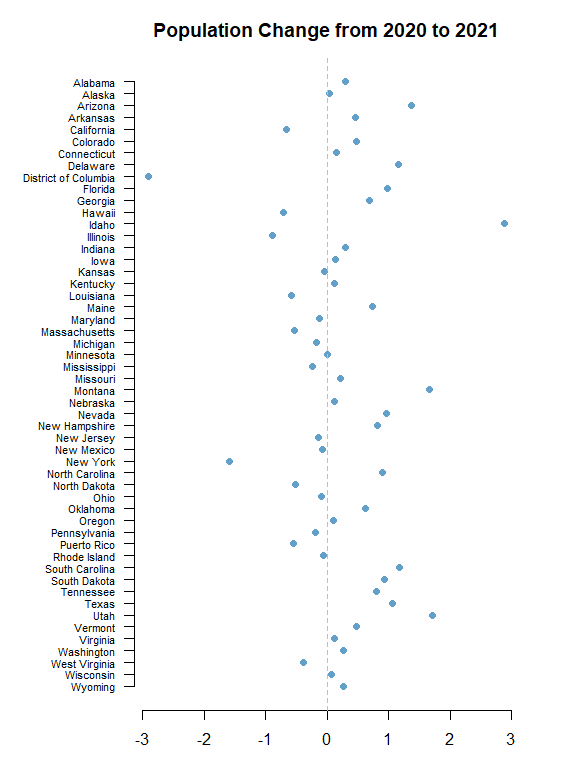

# U.S. Census Data API in R

By Michael T. Moen and Adam M. Nguyen

The U.S. Census Data API provides programmatic access to demographic, economic, and geographic data collected by the U.S. Census Bureau. It enables users to retrieve and analyze a wide variety of data sets, including Census surveys and population statistics.

Please see the following resources for more information on API usage:
- Documentation
    - <a href="https://www.census.gov/data/developers/data-sets.html" target="_blank">U.S. Census Bureau API Datasets</a>
    - <a href="https://www.census.gov/data/developers/guidance/api-user-guide.html" target="_blank">U.S. Census Bureau API User Guide</a>
    - <a href="https://www.census.gov/data/developers/about.html" target="_blank">U.S. Census Bureau API Overview</a>
    - <a href="https://api.census.gov/data.html" target="_blank">U.S. Census Data Discovery Tool</a>
- Terms
    - <a href="https://www.census.gov/data/developers/about/terms-of-service.html" target="_blank">U.S. Census Bureau API Terms of Service</a>
- Data Reuse
    - <a href="https://www.census.gov/about/policies/open-gov/open-data.html" target="_blank">U.S. Census Bureau Open Data Policy</a>

_**NOTE:**_ The U.S. Census Bureau Data API limits requests to a maximum of 500 calls per IP address per day without an API key; however, users can request an API key for increased limits.

*These recipe examples were tested on March 23, 2026.*

## Setup   

### Load Libraries

The following packages need to be installed into your environment to run the code examples in this tutorial. These packages can be installed with `install.packages()`.

- <a href="https://cran.r-project.org/web/packages/httr/index.html" target="_blank">httr: Tools for Working with URLs and HTTP</a>
- <a href="https://cran.r-project.org/web/packages/jsonlite/index.html" target="_blank">jsonlite: A Simple and Robust JSON Parser and Generator for R</a>

We load the libraries used in this tutorial below:


``` r
library(httr)
library(jsonlite)
```

### Import API Key

An API key is required to access the U.S. Census Data API. You can sign up for one at the <a href="https://api.census.gov/data/key_signup.html" target="_blank">Key Signup page</a>.

We keep our token in a `.Renviron` file that is stored in the working directory and use `Sys.getenv()` to access it. The `.Renviron` should have an entry like the one below.

```text
CENSUS_API_KEY="PUT_YOUR_API_KEY_HERE"
```

Below, we can test to whether the key was successfully imported.


``` r
if (nzchar(Sys.getenv("CENSUS_API_KEY"))) {
  print("API key successfully loaded.")
} else {
  warning("API key not found or is empty.")
}
```

```
## [1] "API key successfully loaded."
```

## 1. Get Population Estimates of Counties by State

*Note: This data includes the District of Columbia and Puerto Rico*

For obtaining data from the Census API, it is helpful to first obtain a list of state IDs:


``` r
# Set the base URL that will be used throughout this tutorial
BASE_URL <- "https://api.census.gov/data/"

# The parameters specify what data we want to retrieve
params <- list(
  get = "NAME",
  `for` = "state:*",   # This will grab the names of all states in the US
  key = Sys.getenv("CENSUS_API_KEY")
)
year <- 2019

# Make the request to the Census API
response <- GET(paste0(BASE_URL, year, "/pep/population"), query = params)

# Get the JSON data from the response
states <- data.frame(fromJSON(rawToChar(response$content)))

# Print first 6 rows of the resulting data frame
head(states)
```

```
##           X1    X2
## 1       NAME state
## 2    Alabama    01
## 3     Alaska    02
## 4    Arizona    04
## 5   Arkansas    05
## 6 California    06
```


``` r
# Add rownames and drop the first row
names(states) <- c("state", "fips_state")
states <- states[-1, ]
head(states)
```

```
##        state fips_state
## 2    Alabama         01
## 3     Alaska         02
## 4    Arizona         04
## 5   Arkansas         05
## 6 California         06
## 7   Colorado         08
```


``` r
params <- list(
  get = "NAME,POP",
  `for` = "county:*",
  key = Sys.getenv("CENSUS_API_KEY")
)
year <- 2019

response <- GET(paste0(BASE_URL, year, "/pep/population"), query = params)
raw_df <- data.frame(fromJSON(rawToChar(response$content)))
names(raw_df) <- raw_df[1, ]
raw_df <- raw_df[-1, ]

df <- data.frame(
  # Merge State and County FIPS codes
  fips = paste0(raw_df$state, raw_df$county),
  # Split County and State name into different columns
  county = sub(",.*$", "", raw_df$NAME),
  state = sub("^[^,]*,\\s*", "", raw_df$NAME),
  pop_2019 = as.integer(raw_df$POP)
)

# Print number of rows in the data frame (one per U.S. county)
nrow(df)
```

```
## [1] 3220
```


``` r
# Print first 6 rows of the result data frame
head(df)
```

```
##    fips            county    state pop_2019
## 1 17051    Fayette County Illinois    21336
## 2 17107      Logan County Illinois    28618
## 3 17165     Saline County Illinois    23491
## 4 17127     Massac County Illinois    13772
## 5 18069 Huntington County  Indiana    36520
## 6 18075        Jay County  Indiana    20436
```


``` r
# Filter data frame by state
head(df[df$state == "Missouri", ])
```

```
##      fips                county    state pop_2019
## 219 29041       Chariton County Missouri     7426
## 220 29201          Scott County Missouri    38280
## 221 29073      Gasconade County Missouri    14706
## 222 29186 Ste. Genevieve County Missouri    17894
## 223 29067        Douglas County Missouri    13185
## 224 29083          Henry County Missouri    21824
```


``` r
# Filter counties over a certain population threshold
df[df$pop_2019 > 3000000, ]
```

```
##       fips             county      state pop_2019
## 204  06073   San Diego County California  3338330
## 347  06059      Orange County California  3175692
## 703  17031        Cook County   Illinois  5150233
## 1198 04013    Maricopa County    Arizona  4485414
## 1876 06037 Los Angeles County California 10039107
## 2771 48201      Harris County      Texas  4713325
```

## 2. Get Population Estimates Over a Range of Years

We can use similar code as before, but now loop through different population estimate datasets by year. Here are the specific endpoints used:

- <a href="https://api.census.gov/data/2015/pep/population/examples.html" target="_blank">Vintage 2015 Population Estimates</a>
- <a href="https://api.census.gov/data/2016/pep/population/examples.html" target="_blank">Vintage 2016 Population Estimates</a>
- <a href="https://api.census.gov/data/2017/pep/population/examples.html" target="_blank">Vintage 2017 Population Estimates</a>
- <a href="https://api.census.gov/data/2018/pep/population/examples.html" target="_blank">Vintage 2018 Population Estimates</a>


``` r
params <- list(
  get = "GEONAME,POP",
  `for` = "county:*",
  key = Sys.getenv("CENSUS_API_KEY")
)

for (year in 2015:2018) {
  response <- GET(paste0(BASE_URL, year, "/pep/population"), query = params)
  Sys.sleep(1)
  
  # Process data from the response
  raw_df <- data.frame(fromJSON(rawToChar(response$content)))
  names(raw_df) <- raw_df[1, ]
  raw_df <- raw_df[-1, ]
  
  raw_df <- data.frame(
    # Merge State and County FIPS codes
    fips = paste0(raw_df$state, raw_df$county),
    # Split County and State name into different columns
    pop = as.integer(raw_df$POP)
  )
  
  # Rename the pop column to contain the year
  names(raw_df)[names(raw_df) == "pop"] <- paste0("pop_", year)
  
  # Merge the new data with the overall data frame
  df <- merge(df, raw_df, by = "fips")
}

# Reorder columns
df <- df[, c("state", "county", "fips", "pop_2015", "pop_2016", "pop_2017",
             "pop_2018", "pop_2019")]

# Print updated data frame
head(df)
```

```
##     state         county  fips pop_2015 pop_2016 pop_2017 pop_2018 pop_2019
## 1 Alabama Autauga County 01001    55347    55416    55504    55601    55869
## 2 Alabama Baldwin County 01003   203709   208563   212628   218022   223234
## 3 Alabama Barbour County 01005    26489    25965    25270    24881    24686
## 4 Alabama    Bibb County 01007    22583    22643    22668    22400    22394
## 5 Alabama  Blount County 01009    57673    57704    58013    57840    57826
## 6 Alabama Bullock County 01011    10696    10362    10309    10138    10101
```

## 3. Plot Population Change

This data is based off the <a href="https://api.census.gov/data/2021/pep/population/examples.html" target="_blank">2021 Population Estimates</a> dataset.

The percentage change in population is from July 1, 2020 to July 1, 2021 for states (including the District of Columbia and Puerto Rico).


``` r
params <- list(
  get = "NAME,POP_2021,PPOPCHG_2021",
  `for` = "state:*",
  key = Sys.getenv("CENSUS_API_KEY")
)
year <- 2021

response <- GET(paste0(BASE_URL, year, "/pep/population"), query = params)
data <- data.frame(fromJSON(rawToChar(response$content)))
data <- data[-1, ]

# Print number of results
nrow(data)
```

```
## [1] 52
```


``` r
# Rename columns
names(data) <- c("state", "pop_2021", "percent_pop_change_2021", "fips_state")

# Sort data frame alphabetically by state
data <- data[order(data$state), ]

# Convert state to a factor for plotting
data$state <- factor(data$state, levels = rev(sort(data$state)))

# Print first 6 states
head(data)
```

```
##         state pop_2021 percent_pop_change_2021 fips_state
## 50    Alabama  5039877            0.2999918604         01
## 53     Alaska   732673            0.0316749062         02
## 47    Arizona  7276316            1.3698828613         04
## 14   Arkansas  3025891            0.4534511286         05
## 21 California 39237836           -0.6630474360         06
## 30   Colorado  5812069            0.4799364073         08
```


``` r
# Expand left margin
par(mar = c(3, 7, 3, 3))

# Make a scatter plot
plot(
  data$percent_pop_change_2021,
  data$state,
  pch = 21,
  bg = adjustcolor("#1f77b4", 0.7),
  col = "white",
  cex = 1.2,
  xlab = "% Population Change",
  ylab = "",
  main = "Population Change from 2020 to 2021",
  frame.plot = FALSE,
  yaxt = "n"
)

# Add line at x = 0
abline(v = 0, col = "gray", lty = 2)

# Add state labels along y-axis
axis(
  side = 2,
  at = seq_along(levels(data$state)),
  labels = levels(data$state),
  las = 2,
  cex.axis = 0.7
)
```

<!-- -->
