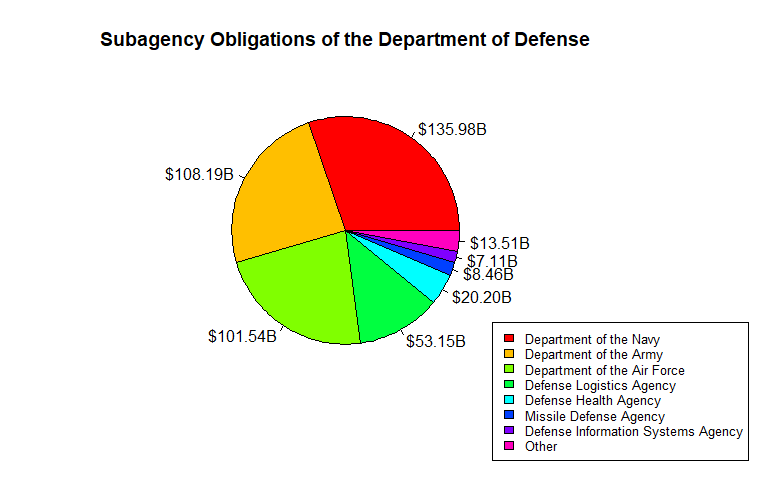
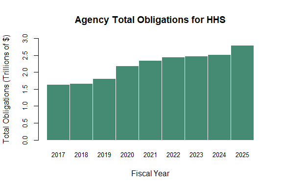
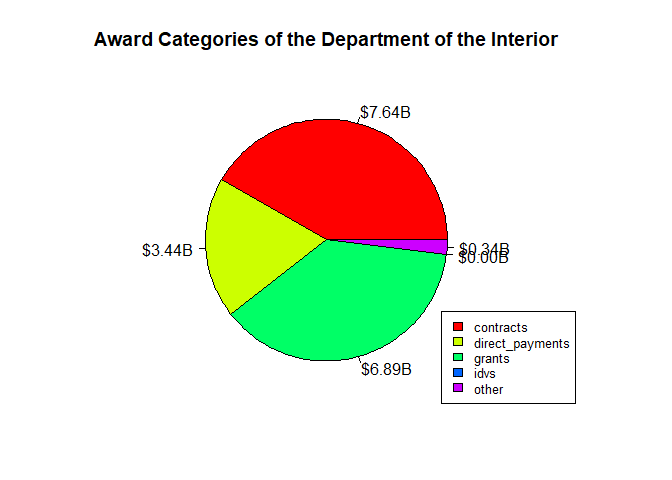

# USAspending API in Python

by Adam M. Nguyen and Michael T. Moen

Please see the following resources for more information on API usage:

- Documentation
    - <a href="https://www.usaspending.gov/" target="_blank">USAspending Website</a>
    - <a href="https://api.usaspending.gov/" target="_blank">USAspending Documentation</a>
- Terms
    - <a href="https://github.com/fedspendingtransparency/usaspending-api?tab=CC0-1.0-1-ov-file" target="_blank">USAspending API License</a>: <a href="https://creativecommons.org/publicdomain/zero/1.0/deed.en" target="_blank">CC0 1.0 Univeral</a>
- Data Reuse
    - <a href="https://www.usaspending.gov/about#about-licensing" target="_blank">USAspending Data Reuse</a>

*These recipe examples were tested on March 23, 2026.*

## Setup

The following packages need to be installed into your environment to run the code examples in this tutorial. These packages can be installed with `install.packages()`.

- <a href="https://cran.r-project.org/web/packages/httr/index.html" target="_blank">httr: Tools for Working with URLs and HTTP</a>
- <a href="https://cran.r-project.org/web/packages/jsonlite/index.html" target="_blank">jsonlite: A Simple and Robust JSON Parser and Generator for R</a>

We load the libraries used in this tutorial below:


``` r
library(httr)
library(jsonlite)
```

## 1. Get Agency Names and Toptier Codes

To obtain data from the API, it is useful to first build a dictionary containing agency names and toptier codes, the latter of which will be used to access subagency data. The toptier codes serve as unique identifiers for each agency, so they are needed for accessing some of the data in the API.


``` r
BASE_URL <- "https://api.usaspending.gov/api/v2/"
toptier_agencies_endpoint <- "references/toptier_agencies/"

# Request data from the API
toptier_response <- GET(paste0(BASE_URL, toptier_agencies_endpoint))

# Response code of 200 indicates success
toptier_response$status_code
```

```
## [1] 200
```


``` r
# Extract data from response
toptier_df <- fromJSON(rawToChar(toptier_response$content))$results

# Print number of agencies
nrow(toptier_df)
```

```
## [1] 111
```


``` r
# Display the data for the first 5 results
head(toptier_df, n = 5)
```

```
##   agency_id toptier_code abbreviation
## 1      1525          247         AAHC
## 2      1146          310         USAB
## 3      1136          302         ACUS
## 4      1144          306         ACHP
## 5      1527          166        USADF
##                                        agency_name
## 1 400 Years of African-American History Commission
## 2                                     Access Board
## 3            Administrative Conference of the U.S.
## 4        Advisory Council on Historic Preservation
## 5                   African Development Foundation
##                                                                           congressional_justification_url
## 1                                                                                                    <NA>
## 2                                                                         https://www.access-board.gov/cj
## 3                                                                                 https://www.acus.gov/cj
## 4 https://www.achp.gov/sites/default/files/2021-06/ACHP%202022%20Budget%20Justification-final-5-10-21.pdf
## 5                                                                                https://www.usadf.gov/cj
##   active_fy active_fq outlay_amount obligated_amount budget_authority_amount
## 1      2026         2             0                0                       0
## 2      2026         2       2937972          2177662                 6834308
## 3      2026         2       1017478          1050524                 1215211
## 4      2026         2       2573530          4160479                17256104
## 5      2026         2       3159752          2599974                35589405
##   current_total_budget_authority_amount percentage_of_total_budget_authority
## 1                          1.328608e+13                         0.000000e+00
## 2                          1.328608e+13                         5.143962e-07
## 3                          1.328608e+13                         9.146500e-08
## 4                          1.328608e+13                         1.298811e-06
## 5                          1.328608e+13                         2.678699e-06
##                                        agency_slug
## 1 400-years-of-african-american-history-commission
## 2                                     access-board
## 3              administrative-conference-of-the-us
## 4        advisory-council-on-historic-preservation
## 5                   african-development-foundation
```

Now we can create a mapping containing the agency names as keys and the toptier codes as the data.


``` r
toptier_codes <- setNames(toptier_df$toptier_code, toptier_df$agency_name)

# Let's see the first 10 agencies and their toptier codes
head(toptier_codes, n = 10)
```

```
##                   400 Years of African-American History Commission 
##                                                              "247" 
##                                                       Access Board 
##                                                              "310" 
##                              Administrative Conference of the U.S. 
##                                                              "302" 
##                          Advisory Council on Historic Preservation 
##                                                              "306" 
##                                     African Development Foundation 
##                                                              "166" 
##                               Agency for International Development 
##                                                              "072" 
##                               American Battle Monuments Commission 
##                                                              "074" 
##                                    Appalachian Regional Commission 
##                                                              "309" 
##                                       Armed Forces Retirement Home 
##                                                              "084" 
## Barry Goldwater Scholarship and Excellence In Education Foundation 
##                                                              "313"
```

Finally, let's print the toptier code for a particular agency using the `toptier_codes` mapping. This will be useful when building URLs to view other data from the API.


``` r
# Look up toptier code of specific agency, in this case Department of Transportation
toptier_codes["Department of Transportation"]
```

```
## Department of Transportation 
##                        "069"
```

## 2. Retrieving Data from Subagencies

The `toptier_codes` mapping we created above contains every agency name in the API. For this example, we'll look at the total obligations of each subagency of the Department of Defense.


``` r
# Specify agency name
agency_name <- 'Department of Defense'

# Assemble URL and send API request
dod_url <- paste0(BASE_URL, "agency/", toptier_codes[agency_name], "/sub_agency/")
params <- list(
  fiscal_year = 2024
)
dod_response <- GET(dod_url, query = params)

# Status code 200 indicates success
dod_response$status_code
```

```
## [1] 200
```


``` r
# Extract data from HTTP response
dod_df <- fromJSON(rawToChar(dod_response$content))$results

# Drop children column of data frame for display
dod_df <- dod_df[, names(dod_df) != "children"]

# Display the first 6 responses
head(dod_df)
```

```
##   abbreviation                        name total_obligations transaction_count
## 1          USN      Department of the Navy      135984528084            227615
## 2          USA      Department of the Army      108188048621            158007
## 3         USAF Department of the Air Force      101536586326            115687
## 4          DLA    Defense Logistics Agency       53148863110           3815438
## 5          DHA       Defense Health Agency       20196091028             15496
## 6          MDA      Missile Defense Agency        8463883396              3837
##   new_award_count
## 1           78953
## 2           53065
## 3           37597
## 4         3639087
## 5            4299
## 6             356
```

We'll represent our data using a pie chart. To make the data easier to read, we can create an "Other" category for smaller subagencies.


``` r
obligations <- dod_df$total_obligations
names(obligations) <- dod_df$name

total_obligations <- sum(obligations)

threshold <- 0.015
small <- obligations < threshold * total_obligations

if (sum(small) > 1) {
  obligations <- c(obligations[!small], Other = sum(obligations[small]))
}

par(mar = c(5, 4, 4, 8))

pie(
  obligations,
  # Format data labels to billions of dollars
  labels = paste0("$", formatC(obligations / 1e9, format = "f", digits = 2), "B"),
  col = rainbow(length(obligations)),
  main = paste("Subagency Obligations of the", agency_name)
)

legend(
  "bottomright",
  inset = c(-0.25, -0.25),
  xpd = TRUE,
  legend = names(obligations),
  fill = rainbow(length(obligations)),
  cex = 0.8
)
```

<!-- -->

## 3. Accessing Fiscal Data Per Year

We can use the API to examine the annual budget of an agency from 2017 onward.


``` r
# Specify agency name
agency_name <- "Department of Health and Human Services"

# Assemble URL and send API request
hhs_url <- paste0(BASE_URL, "agency/", toptier_codes[agency_name], "/budgetary_resources/")
hhs_response <- GET(hhs_url)

# Status code 200 indicates success
hhs_response$status_code
```

```
## [1] 200
```


``` r
# Extract data into a data frame
hhs_df <- fromJSON(rawToChar(hhs_response$content))$agency_data_by_year

# Drop agency_obligation_by_period column for display purpose
hhs_df <- hhs_df[, names(hhs_df) != "agency_obligation_by_period"]

# Print the first few rows of the data frame
head(hhs_df, n = 5)
```

```
##   fiscal_year agency_budgetary_resources agency_total_obligated
## 1        2026               2.604643e+12           1.188028e+12
## 2        2025               3.129725e+12           2.794350e+12
## 3        2024               2.864471e+12           2.518648e+12
## 4        2023               2.841385e+12           2.475674e+12
## 5        2022               2.735931e+12           2.452970e+12
##   agency_total_outlayed total_budgetary_resources
## 1          1.000654e+12              1.328608e+13
## 2          2.722170e+12              1.326370e+13
## 3          2.474861e+12              1.224855e+13
## 4          2.423435e+12              1.188986e+13
## 5          2.386741e+12              1.140981e+13
```


``` r
# Drop the most recent year, since the data is not complete
hhs_df <- hhs_df[hhs_df$fiscal_year != max(hhs_df$fiscal_year), ]
head(hhs_df, n = 5)
```

```
##   fiscal_year agency_budgetary_resources agency_total_obligated
## 2        2025               3.129725e+12           2.794350e+12
## 3        2024               2.864471e+12           2.518648e+12
## 4        2023               2.841385e+12           2.475674e+12
## 5        2022               2.735931e+12           2.452970e+12
## 6        2021               2.660484e+12           2.355524e+12
##   agency_total_outlayed total_budgetary_resources
## 2          2.722170e+12              1.326370e+13
## 3          2.474861e+12              1.224855e+13
## 4          2.423435e+12              1.188986e+13
## 5          2.386741e+12              1.140981e+13
## 6          2.168495e+12              1.221910e+13
```

Now, we can create a bar plot of the retrieved data.


``` r
# Extract and name values for plotting
values <- hhs_df$agency_total_obligated / 1e12
names(values) <- hhs_df$fiscal_year

# Sort by fiscal year
values <- values[order(names(values))]

y_breaks <- pretty(c(0, values), n = 6)
y_lim    <- c(0, max(y_breaks))

barplot(
  values,
  xlab = "Fiscal Year",
  ylab = "Total Obligations (Trillions of $)",
  main = "Agency Total Obligations for HHS",
  col = "aquamarine4",
  border = "white",
  space = 0,
  cex.axis = 0.8,
  cex.names = 0.8,
  ylim = y_lim
)
```

<!-- -->

## 4. Breaking Down Award Categories

We can use the API to view the breakdown the spending of a particular agency.


``` r
# Specify agency name
agency_name <- "Department of the Interior"

# Define parameters and make API request
doi_url <- paste0(BASE_URL, "agency/", toptier_codes[agency_name],
                  "/obligations_by_award_category")
params <- list(
  fiscal_year = 2023
)
doi_response <- GET(doi_url, query = params)

# Status code 200 indicates success
doi_response$status_code
```

```
## [1] 200
```


``` r
# Extract data from API response
doi_df <- fromJSON(rawToChar(doi_response$content))$results

# Print results
doi_df
```

```
##          category aggregated_amount
## 1       contracts        7641526477
## 2 direct_payments        3435334040
## 3          grants        6893917437
## 4            idvs           3579836
## 5           loans                 0
## 6           other         338985935
```


``` r
# Clean data frame values
doi_df <- doi_df[doi_df$aggregated_amount > 0, ]
doi_df
```

```
##          category aggregated_amount
## 1       contracts        7641526477
## 2 direct_payments        3435334040
## 3          grants        6893917437
## 4            idvs           3579836
## 6           other         338985935
```


``` r
values <- doi_df$aggregated_amount
names(values) <- doi_df$category

total_aggregated_amount <- sum(values)

par(mar = c(4, 4, 4, 5))

pie(
  values,
  # Format data labels to billions of dollars
  labels = paste0("$", formatC(values / 1e9, format = "f", digits = 2), "B"),
  col = rainbow(length(values)),
  main = paste("Award Categories of the", agency_name)
)

legend(
  "bottomright",
  xpd = TRUE,
  legend = names(values),
  fill = rainbow(length(values)),
  cex = 0.8
)
```

<!-- -->
