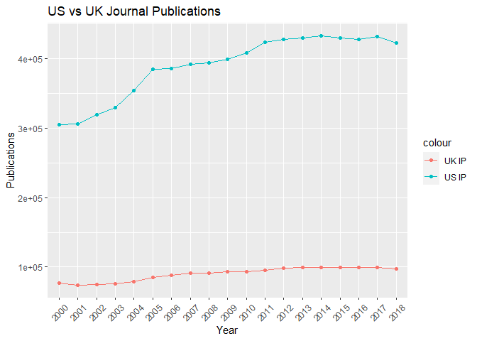
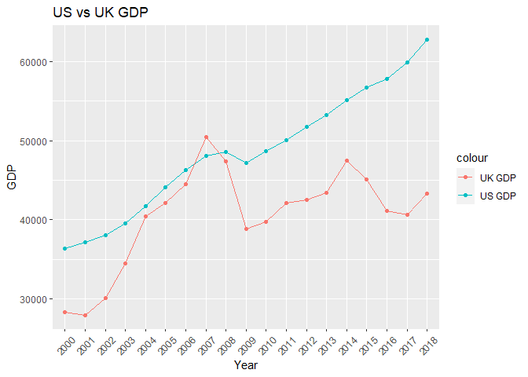
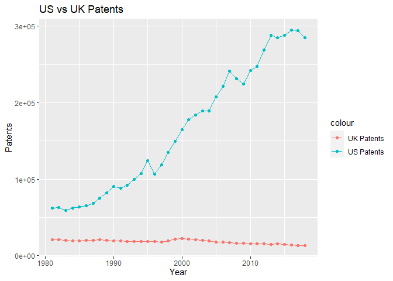

# World Bank Data API in R

by Vishank Patel and Adam M. Nguyen

**Documentation:**

See the [World Bank API documentation](https://datahelpdesk.worldbank.org/knowledgebase/articles/889392-about-the-indicators-api-documentation)

These recipe examples were tested on March 24, 2023.

## Setup

```r
# Load Packages
library(tidyverse)  #ggplot2
library(dplyr)      #tibbles
library(purrr)      #turning into character
library(httr)       #GET()
library(jsonlite)   #converting to JSON

# define root World Bank API
urlRoot <- "https://api.worldbank.org/v2/"
```

## 1. Get list of country iso2Codes and names

For obtaining data from the World Bank API, it is helpful to first obtain a list of country codes and names.


```r
countryURL <- paste0(urlRoot,"country?format=json&per_page=500") # Create URL we are querying

raw_country_data <- GET(countryURL) # Use 'GET()' to retrieve info
prelim_country_data <- # Reading Data to R
  fromJSON( # Converts JSON data to R objects
  rawToChar(raw_country_data$content), flatten = TRUE) # Reads raw 8 bit data to chars
# To view try 'view(prelim_country_data)'
country_data <- prelim_country_data[[2]] # Retrieve only country data frame
country_data[1:10,1:5] # Display first 5 features of first 10 countries from country_data
```

```
##     id iso2Code                        name      capitalCity longitude
## 1  ABW       AW                       Aruba       Oranjestad  -70.0167
## 2  AFE       ZH Africa Eastern and Southern                           
## 3  AFG       AF                 Afghanistan            Kabul   69.1761
## 4  AFR       A9                      Africa                           
## 5  AFW       ZI  Africa Western and Central                           
## 6  AGO       AO                      Angola           Luanda    13.242
## 7  ALB       AL                     Albania           Tirane   19.8172
## 8  AND       AD                     Andorra Andorra la Vella    1.5218
## 9  ARB       1A                  Arab World                           
## 10 ARE       AE        United Arab Emirates        Abu Dhabi   54.3705
```
### Extract Country Codes


```r
countryIso2Code <- as.list(country_data$iso2Code) # Extract iso2Codes
length(countryIso2Code)# Display Length
```

```
## [1] 299
```

```r
head(countryIso2Code,n=10) # Display first 10
```

```
## [[1]]
## [1] "AW"
## 
## [[2]]
## [1] "ZH"
## 
## [[3]]
## [1] "AF"
## 
## [[4]]
## [1] "A9"
## 
## [[5]]
## [1] "ZI"
## 
## [[6]]
## [1] "AO"
## 
## [[7]]
## [1] "AL"
## 
## [[8]]
## [1] "AD"
## 
## [[9]]
## [1] "1A"
## 
## [[10]]
## [1] "AE"
```

### Extract country names


```r
countryName <- as.list(country_data$name) # Extract Country Names
length(countryName)# Display Length
```

```
## [1] 299
```

```r
head(countryName,n=10) # Display first 10 Country names
```

```
## [[1]]
## [1] "Aruba"
## 
## [[2]]
## [1] "Africa Eastern and Southern"
## 
## [[3]]
## [1] "Afghanistan"
## 
## [[4]]
## [1] "Africa"
## 
## [[5]]
## [1] "Africa Western and Central"
## 
## [[6]]
## [1] "Angola"
## 
## [[7]]
## [1] "Albania"
## 
## [[8]]
## [1] "Andorra"
## 
## [[9]]
## [1] "Arab World"
## 
## [[10]]
## [1] "United Arab Emirates"
```

### Store Country Codes and Names together

```r
countryIso2CodeName <- transpose(list(countryIso2Code,countryName))
length(countryIso2CodeName)# Display Length
```

```
## [1] 299
```

```r
head(countryIso2CodeName, n=10)
```

```
## [[1]]
## [[1]][[1]]
## [1] "AW"
## 
## [[1]][[2]]
## [1] "Aruba"
## 
## 
## [[2]]
## [[2]][[1]]
## [1] "ZH"
## 
## [[2]][[2]]
## [1] "Africa Eastern and Southern"
## 
## 
## [[3]]
## [[3]][[1]]
## [1] "AF"
## 
## [[3]][[2]]
## [1] "Afghanistan"
## 
## 
## [[4]]
## [[4]][[1]]
## [1] "A9"
## 
## [[4]][[2]]
## [1] "Africa"
## 
## 
## [[5]]
## [[5]][[1]]
## [1] "ZI"
## 
## [[5]][[2]]
## [1] "Africa Western and Central"
## 
## 
## [[6]]
## [[6]][[1]]
## [1] "AO"
## 
## [[6]][[2]]
## [1] "Angola"
## 
## 
## [[7]]
## [[7]][[1]]
## [1] "AL"
## 
## [[7]][[2]]
## [1] "Albania"
## 
## 
## [[8]]
## [[8]][[1]]
## [1] "AD"
## 
## [[8]][[2]]
## [1] "Andorra"
## 
## 
## [[9]]
## [[9]][[1]]
## [1] "1A"
## 
## [[9]][[2]]
## [1] "Arab World"
## 
## 
## [[10]]
## [[10]][[1]]
## [1] "AE"
## 
## [[10]][[2]]
## [1] "United Arab Emirates"
```

Now we know the country iso2codes, which we can use to pull specific indicator data for countries.

## 2. Compile a Custom Indicator Dataset

There are many availabe indicators: <https://data.worldbank.org/indicator>

We wll select three indicators for this example:

1.  Scientific and Technical Journal Article Data = [IP.JRN.ARTC.SC](https://data.worldbank.org/indicator/IP.JRN.ARTC.SC?view=chart)

2.  Patent Applications, residents = [IP.PAT.RESD](https://data.worldbank.org/indicator/IP.PAT.RESD?view=chart)

3.  GDP per capita (current US\$) Code = [NY.GDP.PCAP.CD](https://data.worldbank.org/indicator/NY.GDP.PCAP.CD?view=chart)

Note that these three selected indictaors have a [CC-BY 4.0 license](https://datacatalog.worldbank.org/public-licenses#cc-by). We will compile this indicator data for the United States (US) and United Kingdom (GB)


```r
indicators <- list("IP.JRN.ARTC.SC", "IP.PAT.RESD", "NY.GDP.PCAP.CD")
```

### United States (US)

#### Generate the web API URLs we need for U.S.:


```r
# Create an Empty List
us_api_url <- c()

# Iterate through each indicator, appending to the base URL, creating a list of unique URLs
for (indicator in indicators) {
  us_api_url <- append(x = us_api_url,
         values = paste(urlRoot,"country/US/indicator/",indicator,"?format=json&per_page=500",sep = ""))
}
# Display URLs
us_api_url
```

```
## [1] "https://api.worldbank.org/v2/country/US/indicator/IP.JRN.ARTC.SC?format=json&per_page=500"
## [2] "https://api.worldbank.org/v2/country/US/indicator/IP.PAT.RESD?format=json&per_page=500"   
## [3] "https://api.worldbank.org/v2/country/US/indicator/NY.GDP.PCAP.CD?format=json&per_page=500"
```

#### Retrieving Data


```r
# Create an empty list for Indicator Data to be stored
us_indicator_data <- list()
# Iterate through URLs to collect and reformat data into lists
for (url in us_api_url) {
  temp_data <- tibble(fromJSON(rawToChar(GET(url)$content), flatten = TRUE)[[2]])
  us_indicator_data <- append(us_indicator_data,list(temp_data))  #making a list of tibbles 
}
```
#### Extracting Data


```r
us_journal_data <- us_indicator_data[[1]][,c("date","value")] #the first element in us_indicator_data is regarding journal publications
head(us_journal_data,n=10)
```

```
## # A tibble: 10 × 2
##    date    value
##    <chr>   <dbl>
##  1 2021      NA 
##  2 2020      NA 
##  3 2019      NA 
##  4 2018  422808.
##  5 2017  432216.
##  6 2016  427265.
##  7 2015  429989.
##  8 2014  433192.
##  9 2013  429570.
## 10 2012  427997.
```


```r
us_patent_data <- us_indicator_data[[2]][,c("date","value")]    # Takes all rows but 2nd column
head(us_patent_data,n=10)
```

```
## # A tibble: 10 × 2
##    date   value
##    <chr>  <int>
##  1 2021      NA
##  2 2020  269586
##  3 2019  285113
##  4 2018  285095
##  5 2017  293904
##  6 2016  295327
##  7 2015  288335
##  8 2014  285096
##  9 2013  287831
## 10 2012  268782
```


```r
us_GDP_data <- us_indicator_data[[3]][,c("date","value")] 
head(us_GDP_data)
```

```
## # A tibble: 6 × 2
##   date   value
##   <chr>  <dbl>
## 1 2021  70249.
## 2 2020  63531.
## 3 2019  65120.
## 4 2018  62823.
## 5 2017  59908.
## 6 2016  57867.
```


```r
# Create a dataframe using retrieved data
us_data <- as.data.frame(c(us_journal_data,us_patent_data[2],us_GDP_data[2]),
                         col.names= c("Year","Scientific and Technical Journal Article Data", "Patent Applications, residents","GDP per capita (current US$) Code")) # Set column names
head(us_data)
```

```
##   Year Scientific.and.Technical.Journal.Article.Data
## 1 2021                                            NA
## 2 2020                                            NA
## 3 2019                                            NA
## 4 2018                                      422807.7
## 5 2017                                      432216.5
## 6 2016                                      427264.6
##   Patent.Applications..residents GDP.per.capita..current.US...Code
## 1                             NA                          70248.63
## 2                         269586                          63530.63
## 3                         285113                          65120.39
## 4                         285095                          62823.31
## 5                         293904                          59907.75
## 6                         295327                          57866.74
```

### United Kingdom (GB)

Now we can repeat the same process to find the relevant information for the United Kingdom indicated by the country code "GB". As you will see, much of the code is the same, so if needed, reference the United States example.


```r
uk_api_url <- c()
for (indicator in indicators) {
  uk_api_url <- append(x = uk_api_url,
         values = paste(urlRoot,"country/GB/indicator/",indicator,"?format=json&per_page=500",sep = ""))
}
uk_api_url
```

```
## [1] "https://api.worldbank.org/v2/country/GB/indicator/IP.JRN.ARTC.SC?format=json&per_page=500"
## [2] "https://api.worldbank.org/v2/country/GB/indicator/IP.PAT.RESD?format=json&per_page=500"   
## [3] "https://api.worldbank.org/v2/country/GB/indicator/NY.GDP.PCAP.CD?format=json&per_page=500"
```

#### Retrieving Data


```r
uk_indicator_data <- list()
for (url in uk_api_url) {
  temp_data <- tibble(fromJSON(rawToChar(GET(url)$content), flatten = TRUE)[[2]])
  uk_indicator_data <- append(uk_indicator_data,list(temp_data))  #making a list of tibbles 
}
```
#### Extracting Data

```r
# Extract Data
uk_journal_data <- uk_indicator_data[[1]][,c("date","value")]  #takes all rows but only two columns
uk_patent_data <- uk_indicator_data[[2]][,c("date","value")]  
uk_GDP_data <- uk_indicator_data[[3]][,c("date","value")] 

# Combine extracted data into a data frame
uk_data <- as.data.frame(c(uk_journal_data,uk_patent_data[2],uk_GDP_data[2]),col.names= c("Year","Scientific and Technical Journal Article Data", "Patent Applications, residents","GDP per capita (current US$) Code"))
head(uk_data)
```

```
##   Year Scientific.and.Technical.Journal.Article.Data
## 1 2021                                            NA
## 2 2020                                            NA
## 3 2019                                            NA
## 4 2018                                      97680.90
## 5 2017                                      99128.72
## 6 2016                                      99366.17
##   Patent.Applications..residents GDP.per.capita..current.US...Code
## 1                             NA                          46510.28
## 2                          11990                          40318.56
## 3                          12061                          42747.08
## 4                          12865                          43306.31
## 5                          13301                          40621.33
## 6                          13876                          41146.08
```

## 3. Plot Indicator Data

Create line plots of US/UK Number of Scientific and Technical Journal Articles and Patents by year. Upon inspecting the dataset, there are no values before the year 2000 and after 2018. Hence, we will slice our data for visualizations accordingly.


```r
# Plotting the Data

# Part [4:22] corresponds to years 2000-2018
journal_data <- tibble(dates= c(us_journal_data$date[4:22]),       
                       us_journals=c(us_journal_data$value[4:22]),
                       uk_journals=c(uk_journal_data$value[4:22]))

ggplot(journal_data, aes(x = dates))+
  geom_line(aes(y = us_journals, color = "US IP", group=1))+
  geom_point(aes(y = us_journals, color = "US IP"))+
  geom_line(aes(y = uk_journals, color = "UK IP"), group=1)+
  geom_point(aes(y = uk_journals, color = "UK IP"))+
  labs(title = "US vs UK Journal Publications",
      x="Year",
      y="Publications")+
  theme(axis.text.x = element_text(angle = 45, hjust = 0.5, vjust = 0.5))
```

<!-- -->

Similarly for the GDP data,


```r
gdp_data <- tibble(dates= c(us_GDP_data$date[4:22]),
                       us_gdp=c(us_GDP_data$value[4:22]),
                       uk_gdp=c(uk_GDP_data$value[4:22]))

ggplot(gdp_data, aes(x = dates))+
  geom_line(aes(y = us_gdp, color = "US GDP", group=1))+
  geom_point(aes(y = us_gdp, color = "US GDP"))+
  geom_line(aes(y = uk_gdp, color = "UK GDP"), group=1)+
  geom_point(aes(y = uk_gdp, color = "UK GDP"))+
  labs(title = "US vs UK GDP",
      x="Year",
      y="GDP")+
  theme(axis.text.x = element_text(angle = 45, hjust = 0.5, vjust = 0.5))
```

<!-- -->

Patents:


```r
patent_data <- tibble(dates= as.numeric(c(us_patent_data$date[4:41])),
                       us_patents=as.numeric(c(us_patent_data$value[4:41])),
                       uk_patents=as.numeric(c(uk_patent_data$value[4:41])))

ggplot(patent_data, aes(x = dates))+
  geom_line(aes(y = us_patents, color = "US Patents", group=1))+
  geom_point(aes(y = us_patents, color = "US Patents"))+
  geom_line(aes(y = uk_patents, color = "UK Patents"), group=1)+
  geom_point(aes(y = uk_patents, color = "UK Patents"))+
  labs(title = "US vs UK Patents",
      x="Year",
      y="Patents")+
  theme(axis.text.x = element_text(angle = 90, hjust = 0.5, vjust = 0.5)+
  scale_x_continuous(breaks=seq(1980, 2020, by = 5))
  )
```

<!-- -->
