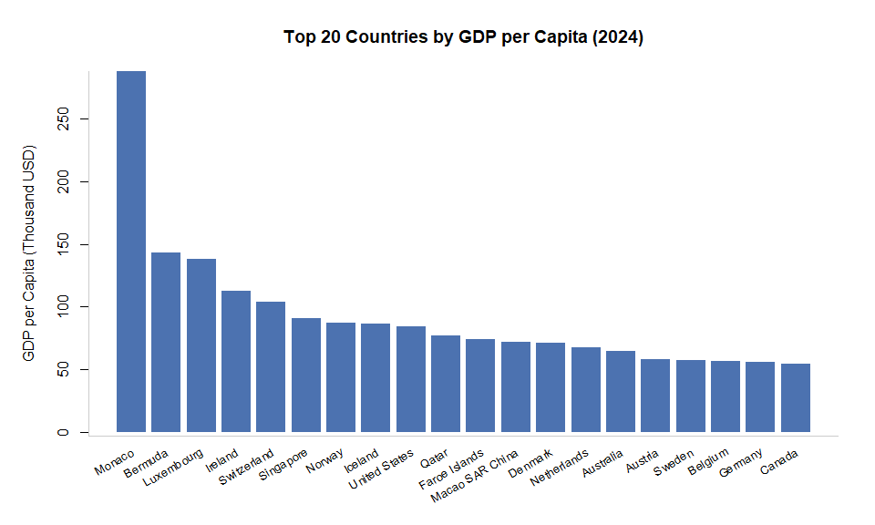

# World Bank API in R

by Michael T. Moen, Vishank Patel, and Adam M. Nguyen

The World Bank offers a suite of APIs providing access to a vast array of global development data, including economic indicators, project information, and more. These APIs enable users to programmatically retrieve data for analysis, application development, and research purposes.

Please see the following resources for more information on API usage:
- Documentation
    - <a href="https://datahelpdesk.worldbank.org/knowledgebase/articles/889392-about-the-indicators-api-documentation" target="_blank">World Bank Indicators API Documentation</a>
    - <a href="https://datahelpdesk.worldbank.org/knowledgebase/articles/1886698-data-catalog-api" target="_blank">World Bank Data Catalog API Documentation</a>
    - <a href="https://data.worldbank.org/" target="_blank">World Bank Data Catalog</a>
    - <a href="https://datahelpdesk.worldbank.org/knowledgebase/articles/902064-development-best-practices" target="_blank">World Bank Development Best Practices</a>
- Terms
    - <a href="https://www.worldbank.org/en/about/legal/terms-and-conditions#:~:text=You%20may%20not%20use%20the,your%20use%20of%20the%20APIs." target="_blank">World Bank Terms of Use</a>
    - <a href="https://data.worldbank.org/summary-terms-of-use" target="_blank">World Bank Summary Terms of Use</a>
- Data Reuse
    - <a href="https://www.worldbank.org/en/about/legal/terms-of-use-for-datasets" target="_blank">World Bank Data Licensing and Terms of Use</a>

*These recipe examples were tested on April 2, 2026.*

## Setup

### Import Libraries

The following external libraries need to be installed into your environment to run the code examples in this tutorial:

- <a href="https://cran.r-project.org/web/packages/countrycode/index.html" target="_blank">countrycode: Convert Country Names and Country Codes</a>
- <a href="https://cran.r-project.org/web/packages/httr/index.html" target="_blank">httr: Tools for Working with URLs and HTTP</a>
- <a href="https://cran.r-project.org/web/packages/jsonlite/index.html" target="_blank">jsonlite: A Simple and Robust JSON Parser and Generator for R</a>
- <a href="https://cran.r-project.org/web/packages/plotly/index.html" target="_blank">plotly: Create Interactive Web Graphics via 'plotly.js'</a>

We import the libraries used in this tutorial below:


``` r
library(countrycode)
library(httr)
library(jsonlite)
library(plotly)
```

### DataBank Bulk Download

The World Bank offers bulk downloads of specific datasets from <a href="https://databank.worldbank.org/home.aspx" target="_blank">DataBank Bulk Download</a> or <a href="https://microdata.worldbank.org/index.php/home" target="_blank">DataBank Bulk Microdata Download</a>. If you require extensive or complete data, consider using these bulk downloads. For smaller requests or interactive analysis, the standard API calls work well.

## 1. Comparing GDP per Capita by Country

In this example, we look at the GDP per capita of each country using the <a href="https://data.worldbank.org/indicator/NY.GDP.PCAP.CD" target="_blank">NY.GDP.PCAP.CD</a> indicator. Note we examine both countries and dependent territories defined as having <a href="https://en.wikipedia.org/wiki/ISO_3166-1_alpha-3" target="_blank">ISO 3166-1 alpha-3</a> (also known here as ISO 3) codes.


``` r
BASE_URL <- "http://api.worldbank.org/v2/country/all/indicator/"
indicator <- "NY.GDP.PCAP.CD"    # Indicator code for GDP per capita (current USD)

params <- list(
  date = 2024,
  format = "json",
  per_page = 500
)
response <- GET(paste0(BASE_URL, indicator), query = params)

# Status code 200 indicates success
response$status_code
```

```
## [1] 200
```


``` r
# Extract JSON data from response
df <- fromJSON(rawToChar(response$content))[[2]]

# Drop unneeded columns
df <- df[, !(names(df) %in% c("country", "indicator", "unit", "obs_status", "decimal"))]

# Print first result
head(df)
```

```
##   countryiso3code date     value
## 1             AFE 2024  1615.396
## 2             AFW 2024  1411.337
## 3             ARB 2024  7583.812
## 4             CSS 2024 19903.811
## 5             CEB 2024 24604.807
## 6             EAR 2024  4450.187
```

Below, we use the `countrycode` package to retrieve the names of the countries based on their ISO 3 codes. Since the World Bank also maintains listings for different aggregations, we also drop those from the data below:


``` r
# Get country names by ISO 3 codes
df$country_name <- countrycode(
  df$countryiso3code,
  origin = "iso3c",
  destination = "country.name"
)

# Drop rows that don't have a related country name
df <- df[!is.na(df$country_name), ]

# Find and sort top 20
top20 <- head(df[order(-df$value), ], 20)

# Display results
top20
```

```
##     countryiso3code date     value    country_name
## 180             MCO 2024 288001.43          Monaco
## 71              BMU 2024 142855.37         Bermuda
## 166             LUX 2024 137781.68      Luxembourg
## 143             IRL 2024 112894.95         Ireland
## 238             CHE 2024 103998.19     Switzerland
## 221             SGP 2024  90674.07       Singapore
## 197             NOR 2024  86785.43          Norway
## 138             ISL 2024  86040.53         Iceland
## 256             USA 2024  84534.04   United States
## 209             QAT 2024  76688.69           Qatar
## 115             FRO 2024  74119.66   Faroe Islands
## 167             MAC 2024  72004.74 Macao SAR China
## 103             DNK 2024  71026.48         Denmark
## 189             NLD 2024  67520.42     Netherlands
## 60              AUS 2024  64603.99       Australia
## 61              AUT 2024  58268.88         Austria
## 237             SWE 2024  57117.49          Sweden
## 68              BEL 2024  56614.57         Belgium
## 123             DEU 2024  56103.73         Germany
## 85              CAN 2024  54340.35          Canada
```


``` r
# Margins adjusted for rotated labels
par(mar = c(5, 5, 4, 2) + 0.1)

# Create barplot
bp <- barplot(
  top20$value / 1000,
  col = "#4C72B0",
  border = NA,
  names.arg = NA,
  main = "Top 20 Countries by GDP per Capita (2024)",
  xlab = NA,
  ylab = "GDP per Capita (Thousand USD)"
)

# Add rotated bar labels
text(
  x = bp,
  y = par("usr")[3] - 0.04 * diff(par("usr")[3:4]),
  labels = top20$country_name,
  srt = 30,
  adj = 1,
  xpd = TRUE,
  cex = 0.8
)

# Draw axis again so it appears above grid
box(bty = "l", col = "#CCCCCC")
```

<!-- -->

## 2. Comparing Scientific and Technical Journal Articles by Country

In this example, we look at the "scientific and technical journal articles" of each country using the <a href="https://data.worldbank.org/indicator/IP.JRN.ARTC.SC" target="_blank">IP.JRN.ARTC.SC</a> indicator and the total population of each country using the <a href="https://data.worldbank.org/indicator/SP.POP.TOTL" target="_blank">SP.POP.TOTL</a>. Note we examine both countries and dependent territories defined as having <a href="https://en.wikipedia.org/wiki/ISO_3166-1_alpha-3" target="_blank">ISO 3166-1 alpha-3</a> (also known here as ISO 3) codes.


``` r
BASE_URL <- "https://api.worldbank.org/v2/country/all/indicator/"
indicators <- c(
  "IP.JRN.ARTC.SC" = "Article Count",
  "SP.POP.TOTL" = "Population"
)
params <- list(
  date = 2021,
  format = "json",
  per_page = 500
)

dfs <- list()

for (indicator in names(indicators)) {
  colname <- indicators[[indicator]]
  response <- GET(paste0(BASE_URL, indicator), query = params)
  response <- fromJSON(rawToChar(response$content))
  df_temp <- response[[2]]
  df_temp <- df_temp[, c("countryiso3code", "value")]
  names(df_temp)[names(df_temp) == "value"] <- colname
  dfs[[indicator]] <- df_temp
}

# Merge both datasets
df <- merge(dfs[[1]], dfs[[2]], by = "countryiso3code")

# Get country names by ISO 3 codes
df$`Country Name` <- countrycode(
  df$countryiso3code,
  origin = "iso3c",
  destination = "country.name"
)

# Remove aggregates like "World", "High income", etc.
df <- df[!is.na(df$`Country Name`), ]

head(df)
```

```
##    countryiso3code Article Count Population         Country Name
## 26             ABW            NA     107700                Aruba
## 28             AFG        177.39   40000412          Afghanistan
## 30             AGO         42.35   34532429               Angola
## 31             ALB        241.09    2489762              Albania
## 32             AND          9.44      78364              Andorra
## 34             ARE       5266.62    9575152 United Arab Emirates
```


``` r
# Calculate article count per million people
df$`Article Count per Million` = df$`Article Count` / df$`Population` * 1000000

head(df)
```

```
##    countryiso3code Article Count Population         Country Name
## 26             ABW            NA     107700                Aruba
## 28             AFG        177.39   40000412          Afghanistan
## 30             AGO         42.35   34532429               Angola
## 31             ALB        241.09    2489762              Albania
## 32             AND          9.44      78364              Andorra
## 34             ARE       5266.62    9575152 United Arab Emirates
##    Article Count per Million
## 26                        NA
## 28                  4.434704
## 30                  1.226383
## 31                 96.832549
## 32                120.463478
## 34                550.029911
```


``` r
fig <- plot_ly(
  data = df,
  type = "choropleth",
  locations = ~countryiso3code,
  z = ~`Article Count per Million`,
  text = ~`Country Name`,
  colorscale = "Viridis",
  locationmode = "ISO-3",
  hovertemplate = paste(
    "<b>%{text}</b><br>",
    "Article Count per Million: %{z:.2f}",
    "<extra></extra>"
  ),
  colorbar = list(
    title = list(text = "Article Count per Million")
  )
) %>%
  layout(
    title = list(text = "Technical Journal Articles by Country (2021)"),
    margin = list(l = 50, r = 50, b = 50, t = 50),
    geo = list(
      projection = list(type = "natural earth"),
      showframe = FALSE,
      showcoastlines = TRUE,
      coastlinecolor = "lightgray"
    )
  )

fig
```

```{=html}
<div class="plotly html-widget html-fill-item" id="htmlwidget-fec7ec92453549d1d6b7" style="width:672px;height:480px;"></div>
<script type="application/json" data-for="htmlwidget-fec7ec92453549d1d6b7">{"x":{"visdat":{"2e284b0a2422":["function () ","plotlyVisDat"]},"cur_data":"2e284b0a2422","attrs":{"2e284b0a2422":{"locations":{},"z":{},"text":{},"colorscale":"Viridis","locationmode":"ISO-3","hovertemplate":"<b>%{text}<\/b><br> Article Count per Million: %{z:.2f} <extra><\/extra>","colorbar":{"title":{"text":"Article Count per Million"}},"alpha_stroke":1,"sizes":[10,100],"spans":[1,20],"type":"choropleth"}},"layout":{"margin":{"b":50,"l":50,"t":50,"r":50},"title":{"text":"Technical Journal Articles by Country (2021)"},"geo":{"projection":{"type":"natural earth"},"showframe":false,"showcoastlines":true,"coastlinecolor":"lightgray"},"scene":{"zaxis":{"title":"`Article Count per Million`"}},"hovermode":"closest","showlegend":false,"legend":{"yanchor":"top","y":0.5}},"source":"A","config":{"modeBarButtonsToAdd":["hoverclosest","hovercompare"],"showSendToCloud":false},"data":[{"colorbar":{"title":{"text":"Article Count per Million"},"ticklen":2,"len":0.5,"lenmode":"fraction","y":1,"yanchor":"top"},"colorscale":"Viridis","showscale":true,"locations":["AFG","AGO","ALB","AND","ARE","ARG","ARM","ATG","AUS","AUT","AZE","BDI","BEL","BEN","BFA","BGD","BGR","BHR","BHS","BIH","BLR","BLZ","BOL","BRA","BRB","BRN","BTN","BWA","CAF","CAN","CHE","CHL","CHN","CIV","CMR","COD","COG","COL","COM","CPV","CRI","CUB","CYP","CZE","DEU","DJI","DMA","DNK","DOM","DZA","ECU","EGY","ERI","ESP","EST","ETH","FIN","FJI","FRA","FSM","GAB","GBR","GEO","GHA","GIN","GMB","GNB","GNQ","GRC","GRD","GRL","GTM","GUY","HND","HRV","HTI","HUN","IDN","IND","IRL","IRN","IRQ","ISL","ISR","ITA","JAM","JOR","JPN","KAZ","KEN","KGZ","KHM","KIR","KNA","KOR","KWT","LAO","LBN","LBR","LBY","LCA","LIE","LKA","LSO","LTU","LUX","LVA","MAR","MCO","MDA","MDG","MDV","MEX","MHL","MKD","MLI","MLT","MMR","MNE","MNG","MOZ","MRT","MUS","MWI","MYS","NAM","NER","NGA","NIC","NLD","NOR","NPL","NRU","NZL","OMN","PAK","PAN","PER","PHL","PLW","PNG","POL","PRI","PRK","PRT","PRY","PSE","QAT","ROU","RUS","RWA","SAU","SDN","SEN","SGP","SLB","SLE","SLV","SMR","SOM","SRB","SSD","STP","SUR","SVK","SVN","SWE","SWZ","SYC","SYR","TCD","TGO","THA","TJK","TKM","TLS","TON","TTO","TUN","TUR","TUV","TZA","UGA","UKR","URY","USA","UZB","VCT","VEN","VNM","VUT","WSM","YEM","ZAF","ZMB","ZWE"],"z":[4.4347043225454774,1.2263834669724507,96.832548653244771,120.4634781277117,550.02991075233058,220.26545077260621,194.49076730918543,80.455662757582644,2412.885181674329,1671.5028266049351,100.04981381470246,2.0770536781473825,1581.155849698715,28.449872243590132,15.085534631283682,45.042536196746276,746.69820867361136,432.30864849953304,55.85647861988582,346.07771501617765,171.6759373872961,31.668462561907798,14.76792188557604,351.83601317209315,196.74141493618572,741.96240599839291,135.44533311324381,160.93670425382095,2.9870307701336047,1822.2912612869125,2881.0474434852777,513.50269788748483,542.49653770993234,11.283838695459366,49.727746846289826,2.1507039531197374,15.050449044097919,201.22050458804225,5.8911674044885327,45.678981281295428,148.82051103678506,137.77080151999141,1316.259131304804,1511.8117926031518,1437.6112777816281,7.3132794885698784,102.82432070474094,2773.2850379213119,10.088573032386638,152.78892057587774,175.04527369334596,192.68174570821159,9.7964797743884429,1481.3718313286781,1410.7182034844755,46.799296549915901,2131.5491361964782,225.27274135469085,1024.0017914352045,20.067369024582529,38.935979891632257,1641.2758270631791,177.2496973259523,78.710488268814231,3.5352433566854864,31.249878688359125,6.8533704156853297,2.5130971022057262,1395.4869083366425,529.10324969148496,621.14980671809076,7.0476996815096618,36.726745654717092,10.950568213789145,1490.7858532949761,3.5324362574602715,870.84302952196117,142.96259700887546,127.14306650446393,1846.5596404325531,671.23432748457617,264.71672691069682,2017.7977021367979,1614.7950146189469,1570.6466487093464,74.78286855257214,367.68923754124665,867.86686416363295,166.885952883068,37.14300971946836,36.844511287326178,10.08936742918193,18.383355273919783,736.69353976434365,1498.3032783042554,287.82821756692772,11.687606682450504,386.02534188672433,4.9740242232698009,63.947976048239873,27.615644010262038,1026.2365371854421,107.98429319371728,19.429221301218373,1104.7472208176955,1680.941280871913,1010.0929163858656,199.93915751724785,1490.902483972279,110.92880870664983,5.8670813725454201,48.93888258155512,170.42064723101194,71.796359416926535,239.94156051284787,5.042291556026429,1019.8398147254655,5.1291414918906817,502.24540958926684,83.918952425732328,6.9279483281716168,7.7404382883261516,153.00860594440329,18.55016780848533,767.23568849426204,82.055172158596832,2.316532351868041,43.118934640183653,6.8565501650101943,1992.433259164809,2624.5710312999231,60.973685844381393,0,1799.9488652008024,310.87959712240445,86.662521174561817,66.796995907170896,122.60147385009996,35.834623847102961,315.46983073722095,8.3532276775869825,1116.2509400969277,174.6124618453795,9.3429784556840758,1891.5981162016635,28.426814230970969,127.73960240507895,1060.0101400848732,628.68177532555467,696.67838234612816,24.628498434324754,701.98580884339958,11.398898752081577,24.465667146723799,2312.4410706682561,18.646954920789781,9.7002916264443879,5.3422577704913632,470.045544785706,3.1549209790433692,771.84641177491392,1.2046995245624335,13.33567608724055,40.330411590299988,1072.8869096628077,2121.0258249335061,2181.6534497409752,32.944000172386218,219.52890447117613,25.121089486125449,1.3843180435928932,12.094550142542912,232.90229169544463,12.989986463204033,1.7540784792195987,12.487603128270496,34.790027490757417,193.07407802813483,425.12828437974071,565.67934821166853,5.8858151854031782,15.87049914617781,26.302451289921592,341.6335129024277,350.06086799079691,1422.6100012839515,70.333237393533679,95.195495959782576,23.820884794743048,97.54920341818432,58.423895275085982,111.14281571155259,11.645054432888541,261.6577057722256,15.954716904904286,31.377692643194592],"text":["Afghanistan","Angola","Albania","Andorra","United Arab Emirates","Argentina","Armenia","Antigua & Barbuda","Australia","Austria","Azerbaijan","Burundi","Belgium","Benin","Burkina Faso","Bangladesh","Bulgaria","Bahrain","Bahamas","Bosnia & Herzegovina","Belarus","Belize","Bolivia","Brazil","Barbados","Brunei","Bhutan","Botswana","Central African Republic","Canada","Switzerland","Chile","China","Côte d’Ivoire","Cameroon","Congo - Kinshasa","Congo - Brazzaville","Colombia","Comoros","Cape Verde","Costa Rica","Cuba","Cyprus","Czechia","Germany","Djibouti","Dominica","Denmark","Dominican Republic","Algeria","Ecuador","Egypt","Eritrea","Spain","Estonia","Ethiopia","Finland","Fiji","France","Micronesia (Federated States of)","Gabon","United Kingdom","Georgia","Ghana","Guinea","Gambia","Guinea-Bissau","Equatorial Guinea","Greece","Grenada","Greenland","Guatemala","Guyana","Honduras","Croatia","Haiti","Hungary","Indonesia","India","Ireland","Iran","Iraq","Iceland","Israel","Italy","Jamaica","Jordan","Japan","Kazakhstan","Kenya","Kyrgyzstan","Cambodia","Kiribati","St. Kitts & Nevis","South Korea","Kuwait","Laos","Lebanon","Liberia","Libya","St. Lucia","Liechtenstein","Sri Lanka","Lesotho","Lithuania","Luxembourg","Latvia","Morocco","Monaco","Moldova","Madagascar","Maldives","Mexico","Marshall Islands","North Macedonia","Mali","Malta","Myanmar (Burma)","Montenegro","Mongolia","Mozambique","Mauritania","Mauritius","Malawi","Malaysia","Namibia","Niger","Nigeria","Nicaragua","Netherlands","Norway","Nepal","Nauru","New Zealand","Oman","Pakistan","Panama","Peru","Philippines","Palau","Papua New Guinea","Poland","Puerto Rico","North Korea","Portugal","Paraguay","Palestinian Territories","Qatar","Romania","Russia","Rwanda","Saudi Arabia","Sudan","Senegal","Singapore","Solomon Islands","Sierra Leone","El Salvador","San Marino","Somalia","Serbia","South Sudan","São Tomé & Príncipe","Suriname","Slovakia","Slovenia","Sweden","Eswatini","Seychelles","Syria","Chad","Togo","Thailand","Tajikistan","Turkmenistan","Timor-Leste","Tonga","Trinidad & Tobago","Tunisia","Turkey","Tuvalu","Tanzania","Uganda","Ukraine","Uruguay","United States","Uzbekistan","St. Vincent & Grenadines","Venezuela","Vietnam","Vanuatu","Samoa","Yemen","South Africa","Zambia","Zimbabwe"],"locationmode":"ISO-3","hovertemplate":["<b>%{text}<\/b><br> Article Count per Million: %{z:.2f} <extra><\/extra>","<b>%{text}<\/b><br> Article Count per Million: %{z:.2f} <extra><\/extra>","<b>%{text}<\/b><br> Article Count per Million: %{z:.2f} <extra><\/extra>","<b>%{text}<\/b><br> Article Count per Million: %{z:.2f} <extra><\/extra>","<b>%{text}<\/b><br> Article Count per Million: %{z:.2f} <extra><\/extra>","<b>%{text}<\/b><br> Article Count per Million: %{z:.2f} <extra><\/extra>","<b>%{text}<\/b><br> Article Count per Million: %{z:.2f} <extra><\/extra>","<b>%{text}<\/b><br> Article Count per Million: %{z:.2f} <extra><\/extra>","<b>%{text}<\/b><br> Article Count per Million: %{z:.2f} <extra><\/extra>","<b>%{text}<\/b><br> Article Count per Million: %{z:.2f} <extra><\/extra>","<b>%{text}<\/b><br> Article Count per Million: %{z:.2f} <extra><\/extra>","<b>%{text}<\/b><br> Article Count per Million: %{z:.2f} <extra><\/extra>","<b>%{text}<\/b><br> Article Count per Million: %{z:.2f} <extra><\/extra>","<b>%{text}<\/b><br> Article Count per Million: %{z:.2f} <extra><\/extra>","<b>%{text}<\/b><br> Article Count per Million: %{z:.2f} <extra><\/extra>","<b>%{text}<\/b><br> Article Count per Million: %{z:.2f} <extra><\/extra>","<b>%{text}<\/b><br> Article Count per Million: %{z:.2f} <extra><\/extra>","<b>%{text}<\/b><br> Article Count per Million: %{z:.2f} <extra><\/extra>","<b>%{text}<\/b><br> Article Count per Million: %{z:.2f} <extra><\/extra>","<b>%{text}<\/b><br> Article Count per Million: %{z:.2f} <extra><\/extra>","<b>%{text}<\/b><br> Article Count per Million: %{z:.2f} <extra><\/extra>","<b>%{text}<\/b><br> Article Count per Million: %{z:.2f} <extra><\/extra>","<b>%{text}<\/b><br> Article Count per Million: %{z:.2f} <extra><\/extra>","<b>%{text}<\/b><br> Article Count per Million: %{z:.2f} <extra><\/extra>","<b>%{text}<\/b><br> Article Count per Million: %{z:.2f} <extra><\/extra>","<b>%{text}<\/b><br> Article Count per Million: %{z:.2f} <extra><\/extra>","<b>%{text}<\/b><br> Article Count per Million: %{z:.2f} <extra><\/extra>","<b>%{text}<\/b><br> Article Count per Million: %{z:.2f} <extra><\/extra>","<b>%{text}<\/b><br> Article Count per Million: %{z:.2f} <extra><\/extra>","<b>%{text}<\/b><br> Article Count per Million: %{z:.2f} <extra><\/extra>","<b>%{text}<\/b><br> Article Count per Million: %{z:.2f} <extra><\/extra>","<b>%{text}<\/b><br> Article Count per Million: %{z:.2f} <extra><\/extra>","<b>%{text}<\/b><br> Article Count per Million: %{z:.2f} <extra><\/extra>","<b>%{text}<\/b><br> Article Count per Million: %{z:.2f} <extra><\/extra>","<b>%{text}<\/b><br> Article Count per Million: %{z:.2f} <extra><\/extra>","<b>%{text}<\/b><br> Article Count per Million: %{z:.2f} <extra><\/extra>","<b>%{text}<\/b><br> Article Count per Million: %{z:.2f} <extra><\/extra>","<b>%{text}<\/b><br> Article Count per Million: %{z:.2f} <extra><\/extra>","<b>%{text}<\/b><br> Article Count per Million: %{z:.2f} <extra><\/extra>","<b>%{text}<\/b><br> Article Count per Million: %{z:.2f} <extra><\/extra>","<b>%{text}<\/b><br> Article Count per Million: %{z:.2f} <extra><\/extra>","<b>%{text}<\/b><br> Article Count per Million: %{z:.2f} <extra><\/extra>","<b>%{text}<\/b><br> Article Count per Million: %{z:.2f} <extra><\/extra>","<b>%{text}<\/b><br> Article Count per Million: %{z:.2f} <extra><\/extra>","<b>%{text}<\/b><br> Article Count per Million: %{z:.2f} <extra><\/extra>","<b>%{text}<\/b><br> Article Count per Million: %{z:.2f} <extra><\/extra>","<b>%{text}<\/b><br> Article Count per Million: %{z:.2f} <extra><\/extra>","<b>%{text}<\/b><br> Article Count per Million: %{z:.2f} <extra><\/extra>","<b>%{text}<\/b><br> Article Count per Million: %{z:.2f} <extra><\/extra>","<b>%{text}<\/b><br> Article Count per Million: %{z:.2f} <extra><\/extra>","<b>%{text}<\/b><br> Article Count per Million: %{z:.2f} <extra><\/extra>","<b>%{text}<\/b><br> Article Count per Million: %{z:.2f} <extra><\/extra>","<b>%{text}<\/b><br> Article Count per Million: %{z:.2f} <extra><\/extra>","<b>%{text}<\/b><br> Article Count per Million: %{z:.2f} <extra><\/extra>","<b>%{text}<\/b><br> Article Count per Million: %{z:.2f} <extra><\/extra>","<b>%{text}<\/b><br> Article Count per Million: %{z:.2f} <extra><\/extra>","<b>%{text}<\/b><br> Article Count per Million: %{z:.2f} <extra><\/extra>","<b>%{text}<\/b><br> Article Count per Million: %{z:.2f} <extra><\/extra>","<b>%{text}<\/b><br> Article Count per Million: %{z:.2f} <extra><\/extra>","<b>%{text}<\/b><br> Article Count per Million: %{z:.2f} <extra><\/extra>","<b>%{text}<\/b><br> Article Count per Million: %{z:.2f} <extra><\/extra>","<b>%{text}<\/b><br> Article Count per Million: %{z:.2f} <extra><\/extra>","<b>%{text}<\/b><br> Article Count per Million: %{z:.2f} <extra><\/extra>","<b>%{text}<\/b><br> Article Count per Million: %{z:.2f} <extra><\/extra>","<b>%{text}<\/b><br> Article Count per Million: %{z:.2f} <extra><\/extra>","<b>%{text}<\/b><br> Article Count per Million: %{z:.2f} <extra><\/extra>","<b>%{text}<\/b><br> Article Count per Million: %{z:.2f} <extra><\/extra>","<b>%{text}<\/b><br> Article Count per Million: %{z:.2f} <extra><\/extra>","<b>%{text}<\/b><br> Article Count per Million: %{z:.2f} <extra><\/extra>","<b>%{text}<\/b><br> Article Count per Million: %{z:.2f} <extra><\/extra>","<b>%{text}<\/b><br> Article Count per Million: %{z:.2f} <extra><\/extra>","<b>%{text}<\/b><br> Article Count per Million: %{z:.2f} <extra><\/extra>","<b>%{text}<\/b><br> Article Count per Million: %{z:.2f} <extra><\/extra>","<b>%{text}<\/b><br> Article Count per Million: %{z:.2f} <extra><\/extra>","<b>%{text}<\/b><br> Article Count per Million: %{z:.2f} <extra><\/extra>","<b>%{text}<\/b><br> Article Count per Million: %{z:.2f} <extra><\/extra>","<b>%{text}<\/b><br> Article Count per Million: %{z:.2f} <extra><\/extra>","<b>%{text}<\/b><br> Article Count per Million: %{z:.2f} <extra><\/extra>","<b>%{text}<\/b><br> Article Count per Million: %{z:.2f} <extra><\/extra>","<b>%{text}<\/b><br> Article Count per Million: %{z:.2f} <extra><\/extra>","<b>%{text}<\/b><br> Article Count per Million: %{z:.2f} <extra><\/extra>","<b>%{text}<\/b><br> Article Count per Million: %{z:.2f} <extra><\/extra>","<b>%{text}<\/b><br> Article Count per Million: %{z:.2f} <extra><\/extra>","<b>%{text}<\/b><br> Article Count per Million: %{z:.2f} <extra><\/extra>","<b>%{text}<\/b><br> Article Count per Million: %{z:.2f} <extra><\/extra>","<b>%{text}<\/b><br> Article Count per Million: %{z:.2f} <extra><\/extra>","<b>%{text}<\/b><br> Article Count per Million: %{z:.2f} <extra><\/extra>","<b>%{text}<\/b><br> Article Count per Million: %{z:.2f} <extra><\/extra>","<b>%{text}<\/b><br> Article Count per Million: %{z:.2f} <extra><\/extra>","<b>%{text}<\/b><br> Article Count per Million: %{z:.2f} <extra><\/extra>","<b>%{text}<\/b><br> Article Count per Million: %{z:.2f} <extra><\/extra>","<b>%{text}<\/b><br> Article Count per Million: %{z:.2f} <extra><\/extra>","<b>%{text}<\/b><br> Article Count per Million: %{z:.2f} <extra><\/extra>","<b>%{text}<\/b><br> Article Count per Million: %{z:.2f} <extra><\/extra>","<b>%{text}<\/b><br> Article Count per Million: %{z:.2f} <extra><\/extra>","<b>%{text}<\/b><br> Article Count per Million: %{z:.2f} <extra><\/extra>","<b>%{text}<\/b><br> Article Count per Million: %{z:.2f} <extra><\/extra>","<b>%{text}<\/b><br> Article Count per Million: %{z:.2f} <extra><\/extra>","<b>%{text}<\/b><br> Article Count per Million: %{z:.2f} <extra><\/extra>","<b>%{text}<\/b><br> Article Count per Million: %{z:.2f} <extra><\/extra>","<b>%{text}<\/b><br> Article Count per Million: %{z:.2f} <extra><\/extra>","<b>%{text}<\/b><br> Article Count per Million: %{z:.2f} <extra><\/extra>","<b>%{text}<\/b><br> Article Count per Million: %{z:.2f} <extra><\/extra>","<b>%{text}<\/b><br> Article Count per Million: %{z:.2f} <extra><\/extra>","<b>%{text}<\/b><br> Article Count per Million: %{z:.2f} <extra><\/extra>","<b>%{text}<\/b><br> Article Count per Million: %{z:.2f} <extra><\/extra>","<b>%{text}<\/b><br> Article Count per Million: %{z:.2f} <extra><\/extra>","<b>%{text}<\/b><br> Article Count per Million: %{z:.2f} <extra><\/extra>","<b>%{text}<\/b><br> Article Count per Million: %{z:.2f} <extra><\/extra>","<b>%{text}<\/b><br> Article Count per Million: %{z:.2f} <extra><\/extra>","<b>%{text}<\/b><br> Article Count per Million: %{z:.2f} <extra><\/extra>","<b>%{text}<\/b><br> Article Count per Million: %{z:.2f} <extra><\/extra>","<b>%{text}<\/b><br> Article Count per Million: %{z:.2f} <extra><\/extra>","<b>%{text}<\/b><br> Article Count per Million: %{z:.2f} <extra><\/extra>","<b>%{text}<\/b><br> Article Count per Million: %{z:.2f} <extra><\/extra>","<b>%{text}<\/b><br> Article Count per Million: %{z:.2f} <extra><\/extra>","<b>%{text}<\/b><br> Article Count per Million: %{z:.2f} <extra><\/extra>","<b>%{text}<\/b><br> Article Count per Million: %{z:.2f} <extra><\/extra>","<b>%{text}<\/b><br> Article Count per Million: %{z:.2f} <extra><\/extra>","<b>%{text}<\/b><br> Article Count per Million: %{z:.2f} <extra><\/extra>","<b>%{text}<\/b><br> Article Count per Million: %{z:.2f} <extra><\/extra>","<b>%{text}<\/b><br> Article Count per Million: %{z:.2f} <extra><\/extra>","<b>%{text}<\/b><br> Article Count per Million: %{z:.2f} <extra><\/extra>","<b>%{text}<\/b><br> Article Count per Million: %{z:.2f} <extra><\/extra>","<b>%{text}<\/b><br> Article Count per Million: %{z:.2f} <extra><\/extra>","<b>%{text}<\/b><br> Article Count per Million: %{z:.2f} <extra><\/extra>","<b>%{text}<\/b><br> Article Count per Million: %{z:.2f} <extra><\/extra>","<b>%{text}<\/b><br> Article Count per Million: %{z:.2f} <extra><\/extra>","<b>%{text}<\/b><br> Article Count per Million: %{z:.2f} <extra><\/extra>","<b>%{text}<\/b><br> Article Count per Million: %{z:.2f} <extra><\/extra>","<b>%{text}<\/b><br> Article Count per Million: %{z:.2f} <extra><\/extra>","<b>%{text}<\/b><br> Article Count per Million: %{z:.2f} <extra><\/extra>","<b>%{text}<\/b><br> Article Count per Million: %{z:.2f} <extra><\/extra>","<b>%{text}<\/b><br> Article Count per Million: %{z:.2f} <extra><\/extra>","<b>%{text}<\/b><br> Article Count per Million: %{z:.2f} <extra><\/extra>","<b>%{text}<\/b><br> Article Count per Million: %{z:.2f} <extra><\/extra>","<b>%{text}<\/b><br> Article Count per Million: %{z:.2f} <extra><\/extra>","<b>%{text}<\/b><br> Article Count per Million: %{z:.2f} <extra><\/extra>","<b>%{text}<\/b><br> Article Count per Million: %{z:.2f} <extra><\/extra>","<b>%{text}<\/b><br> Article Count per Million: %{z:.2f} <extra><\/extra>","<b>%{text}<\/b><br> Article Count per Million: %{z:.2f} <extra><\/extra>","<b>%{text}<\/b><br> Article Count per Million: %{z:.2f} <extra><\/extra>","<b>%{text}<\/b><br> Article Count per Million: %{z:.2f} <extra><\/extra>","<b>%{text}<\/b><br> Article Count per Million: %{z:.2f} <extra><\/extra>","<b>%{text}<\/b><br> Article Count per Million: %{z:.2f} <extra><\/extra>","<b>%{text}<\/b><br> Article Count per Million: %{z:.2f} <extra><\/extra>","<b>%{text}<\/b><br> Article Count per Million: %{z:.2f} <extra><\/extra>","<b>%{text}<\/b><br> Article Count per Million: %{z:.2f} <extra><\/extra>","<b>%{text}<\/b><br> Article Count per Million: %{z:.2f} <extra><\/extra>","<b>%{text}<\/b><br> Article Count per Million: %{z:.2f} <extra><\/extra>","<b>%{text}<\/b><br> Article Count per Million: %{z:.2f} <extra><\/extra>","<b>%{text}<\/b><br> Article Count per Million: %{z:.2f} <extra><\/extra>","<b>%{text}<\/b><br> Article Count per Million: %{z:.2f} <extra><\/extra>","<b>%{text}<\/b><br> Article Count per Million: %{z:.2f} <extra><\/extra>","<b>%{text}<\/b><br> Article Count per Million: %{z:.2f} <extra><\/extra>","<b>%{text}<\/b><br> Article Count per Million: %{z:.2f} <extra><\/extra>","<b>%{text}<\/b><br> Article Count per Million: %{z:.2f} <extra><\/extra>","<b>%{text}<\/b><br> Article Count per Million: %{z:.2f} <extra><\/extra>","<b>%{text}<\/b><br> Article Count per Million: %{z:.2f} <extra><\/extra>","<b>%{text}<\/b><br> Article Count per Million: %{z:.2f} <extra><\/extra>","<b>%{text}<\/b><br> Article Count per Million: %{z:.2f} <extra><\/extra>","<b>%{text}<\/b><br> Article Count per Million: %{z:.2f} <extra><\/extra>","<b>%{text}<\/b><br> Article Count per Million: %{z:.2f} <extra><\/extra>","<b>%{text}<\/b><br> Article Count per Million: %{z:.2f} <extra><\/extra>","<b>%{text}<\/b><br> Article Count per Million: %{z:.2f} <extra><\/extra>","<b>%{text}<\/b><br> Article Count per Million: %{z:.2f} <extra><\/extra>","<b>%{text}<\/b><br> Article Count per Million: %{z:.2f} <extra><\/extra>","<b>%{text}<\/b><br> Article Count per Million: %{z:.2f} <extra><\/extra>","<b>%{text}<\/b><br> Article Count per Million: %{z:.2f} <extra><\/extra>","<b>%{text}<\/b><br> Article Count per Million: %{z:.2f} <extra><\/extra>","<b>%{text}<\/b><br> Article Count per Million: %{z:.2f} <extra><\/extra>","<b>%{text}<\/b><br> Article Count per Million: %{z:.2f} <extra><\/extra>","<b>%{text}<\/b><br> Article Count per Million: %{z:.2f} <extra><\/extra>","<b>%{text}<\/b><br> Article Count per Million: %{z:.2f} <extra><\/extra>","<b>%{text}<\/b><br> Article Count per Million: %{z:.2f} <extra><\/extra>","<b>%{text}<\/b><br> Article Count per Million: %{z:.2f} <extra><\/extra>","<b>%{text}<\/b><br> Article Count per Million: %{z:.2f} <extra><\/extra>","<b>%{text}<\/b><br> Article Count per Million: %{z:.2f} <extra><\/extra>","<b>%{text}<\/b><br> Article Count per Million: %{z:.2f} <extra><\/extra>","<b>%{text}<\/b><br> Article Count per Million: %{z:.2f} <extra><\/extra>","<b>%{text}<\/b><br> Article Count per Million: %{z:.2f} <extra><\/extra>","<b>%{text}<\/b><br> Article Count per Million: %{z:.2f} <extra><\/extra>","<b>%{text}<\/b><br> Article Count per Million: %{z:.2f} <extra><\/extra>","<b>%{text}<\/b><br> Article Count per Million: %{z:.2f} <extra><\/extra>","<b>%{text}<\/b><br> Article Count per Million: %{z:.2f} <extra><\/extra>","<b>%{text}<\/b><br> Article Count per Million: %{z:.2f} <extra><\/extra>","<b>%{text}<\/b><br> Article Count per Million: %{z:.2f} <extra><\/extra>","<b>%{text}<\/b><br> Article Count per Million: %{z:.2f} <extra><\/extra>","<b>%{text}<\/b><br> Article Count per Million: %{z:.2f} <extra><\/extra>","<b>%{text}<\/b><br> Article Count per Million: %{z:.2f} <extra><\/extra>","<b>%{text}<\/b><br> Article Count per Million: %{z:.2f} <extra><\/extra>","<b>%{text}<\/b><br> Article Count per Million: %{z:.2f} <extra><\/extra>","<b>%{text}<\/b><br> Article Count per Million: %{z:.2f} <extra><\/extra>","<b>%{text}<\/b><br> Article Count per Million: %{z:.2f} <extra><\/extra>","<b>%{text}<\/b><br> Article Count per Million: %{z:.2f} <extra><\/extra>","<b>%{text}<\/b><br> Article Count per Million: %{z:.2f} <extra><\/extra>"],"type":"choropleth","marker":{"line":{"color":"rgba(31,119,180,1)"}},"frame":null}],"highlight":{"on":"plotly_click","persistent":false,"dynamic":false,"selectize":false,"opacityDim":0.20000000000000001,"selected":{"opacity":1},"debounce":0},"shinyEvents":["plotly_hover","plotly_click","plotly_selected","plotly_relayout","plotly_brushed","plotly_brushing","plotly_clickannotation","plotly_doubleclick","plotly_deselect","plotly_afterplot","plotly_sunburstclick"],"base_url":"https://plot.ly"},"evals":[],"jsHooks":[]}</script>
```


```{raw} html
<iframe
    src="../_static/plotly/technical_journal_articles_2021_r.html"
    width="100%"
    height="500"
    style="border:0;"
    loading="lazy">
</iframe>
```
